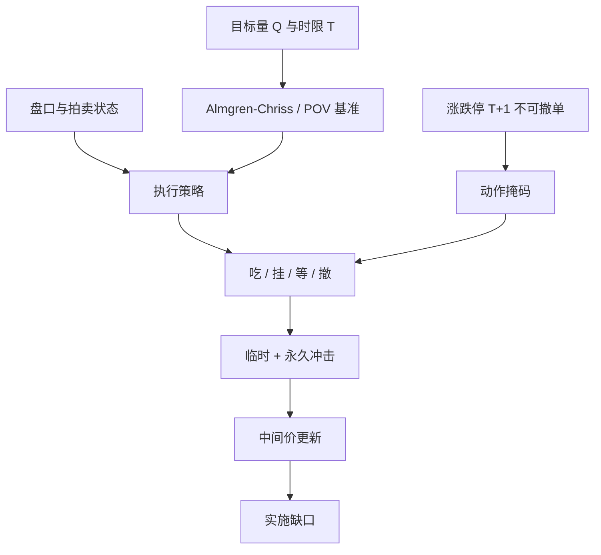

# 执行 RL 与冲击

最优执行要在波动风险与交易成本之间权衡：交易太快付冲击，交易太慢承担价格对着你的库存随机游走。

<footer>—— Almgren and Chriss, Optimal Execution of Portfolio Transactions, Journal of Risk, 2000/2001</footer>

方向性 alpha 决定买还是卖；执行决定这一笔在时间与订单类型上如何切开。Bertsimas 与 Lo（1998）把最优执行写成动态规划；Almgren 与 Chriss 给出带临时、永久冲击的可解轨迹。Nevmyvaka、Feng 与 Kearns（2006）把同一问题交给强化学习：状态是剩余量与盘口，动作是现在吃多少。强化学习有吸引力，是因为冲击与填成依赖状态，凸的确定性轨迹管不到队列与涨跌停。危险是把[模拟器偏差](/quant/sim-to-real-trading)学成「边缘」。本篇把冲击写成奖励的一部分，说明 RL 相对 Almgren–Chriss 多了什么、在 A 股规则下必须少做什么。它不讨论如何隐藏订单以规避监管，只讨论公开订单类型与公开冲击模型。

## 问题

设要在地平线 $T$ 内买入 $Q$ 股。无摩擦时任意轨迹等价。有摩擦时，瞬时吃完付出深度与临时冲击；匀速走完则库存暴露在中间价的布朗风险里。Almgren–Chriss 把成本写成

$$
\mathbb{E}[\mathrm{cost}]+\lambda\,\mathrm{Var}(\mathrm{cost}),
$$

临时冲击随交易速率上升，永久冲击使中间价沿你的方向漂移。最优轨迹往往前快后慢或相反，取决于风险厌恶与永久冲击是否线性。问题在于真实冲击不是确定性函数：同一速率，在开盘集合竞价、在涨停附近、在北向额度紧张时，深度完全不同。限价单还有不成交风险。于是「速率」这一个动作不够，需要在限价、可立即成交限价、等待之间选择，见[订单类型](/quant/order-types)。

强化学习把盘口形状、剩余时间、剩余量放进状态，让策略条件化。它要解决的不是「有没有冲击」，而是冲击的条件分布是否可学，以及学到的动作是否在交易所规则下可提交。无效价、涨跌停、T+1 可卖量，会把动作空间切成与教科书不同的集合。

### 临时冲击、永久冲击与实施缺口

Perold 的实施缺口是决策价到最终成交的差，含延误、部分成交与放弃。Gatheral 要求冲击模型满足无动态套利：你不能通过来回交易从自己的永久冲击里抽钱。线性永久冲击是常见的安全选择；非线性若不当，会在模拟器里出现免费午餐，RL 会拼命去采。临时冲击应在你的成交之后衰减，否则限价提供流动性的奖励被算错。把冲击只写成「成交量 / ADV × 常数」，等于忽略当时[订单簿](/quant/lob-structure)的形状与拍卖机制。A 股开盘、收盘集合竞价的冲击与连续竞价不是同一个函数：集合竞价是一次性出清，连续竞价是沿队列消耗。

Kyle 的 $\lambda$ 是信息被写入价格的斜率，Almgren 的永久冲击是机械的价格位移。两者都叫冲击，识别对象不同。执行模型用的是后者加临时项；把知情交易的 $\lambda$ 直接当滑点，会把信息效应当成你可以选择的成本。

## 方法

先写一个可审计的基准：Almgren–Chriss 或 VWAP / POV 一类参与率规则，用自己的成交回报校准临时冲击系数。强化学习只允许在基准之上学习残差：何时比基准更激进、何时改挂限价。状态包括剩余 $q$、剩余时间、价差、可见深度、队列位置（若有）、是否涨跌停、是否处于不可撤单的集合竞价末段。动作是离散的：市价（或可立即成交限价）吃 $x$、在某档挂 $x$、等待、撤单。奖励是负的实施缺口，可加一项库存风险 $\lambda q^2\sigma^2\Delta t$，与 Almgren–Chriss 的目标对齐，避免智能体为了「平均价格好看」去赌方向。

训练必须在带冲击的模拟器里，且冲击函数应对智能体自己的量有弹性。离线、只在历史成交上模仿当时的市场，学不到自己的额外量。Nevmyvaka 等人的实验是在真实盘口上做模拟撮合，仍然是模拟；部署前要用小规模真实订单做[sim-to-real](/quant/sim-to-real-trading)对照。超参 $\lambda$（风险厌恶）应与投资组合层的风险预算一致，而不是在执行 RL 里另找一个让奖励最大的 $\lambda$。

### 集合竞价与连续竞价要拆成两个策略

开盘 9:15–9:25 是一次性撮合，9:20 后不能撤单，见上交所《交易规则》第 2.4.2、3.3 条。把连续竞价的逐步吃单策略用在开盘，会在不可撤时段留下暴露。方法是：开盘用单独的策略或规则——是否参与集合竞价、报价相对虚拟参考价的偏移——连续时段再用 RL。收盘 14:57–15:00 同理。涨停板上深度是单边的，RL 的「吃对手价」动作无效，应掩码并转为等待或放弃。把全天当同一个 MDP，是在平均两个不同的 $P$。

## 机制

执行 RL 能优于静态轨迹，仅当状态里含有轨迹模型没写的条件信息：某一档突然变薄、队列快速前进、波动上升应加速。机制是状态依赖的速率。若状态只是剩余量与时间，RL 不比把 Hamilton–Jacobi–Bellman 解好多少，却多了过拟合。冲击进入奖励的方式必须让「自己打自己」无利可图：永久冲击提高后续买入成本，智能体才会把量摊开；若模拟器不把永久冲击写回中点，智能体会学会在最后一秒砸全部剩余量。

逆向选择是限价动作的隐藏项。挂在队里看起来节省了半个价差，若随后价格跳开，你被知情者捡走，实施缺口变差。奖励若只在成交时记账、不成交为零，智能体会过度挂单。正确记账是：不成交留下的剩余量，用后续更差的预期成交价估值，这正是实施缺口的延误项。Cartea、Jaimungal 与 Penalva 的算法交易框架把存货与信息不对称放进连续时间控制；RL 是它的离散、可学习版本，不是可以忽略微观结构的黑箱。

参与率约束（不超过当时成交量的某一比例）是容量与合规常用的硬限制。它应做成动作掩码或对 $x$ 的上界，而不是等惩罚来学。否则智能体在模拟器里会用尖峰把整天的量塞进一分钟。

### 规模使环境换档

小单的冲击近线性，大单打穿多层，函数凸。在 1% ADV 上训练的策略，在 10% ADV 上不是「同样动作乘十」。Kyle 深度随知情规模变；机械冲击亦然。方法是把目标量相对深度或 ADV 的比值放进状态，并在训练中采样不同 $Q$。只在一种规模上成功，不能写进容量承诺。A 股小盘与科创板 20% 涨跌幅下，同一参与率对应的价格位移远大于主板 10% 的平均日；分板块校准，不要用全市场一个系数。

## 边界与工程取舍

执行 RL 不创造 alpha，只减少既定方向的实施缺口。若信号在执行地平线内衰减很快，最优可能是更激进、更高冲击，净期望仍可能为负——那是 alpha 不够，不是执行没学好。不要用执行智能体去「择时」方向，那会把组合风险偷运进执行层，审计时无法拆开。不要在无涨跌停、可 T+0、无限融券的模拟器里训练，再接到 A 股主机。

可解释性是执行的约束。经纪商与风控需要速率上限、最差价格、参与率。纯黑箱策略即使模拟器分数高，也难以通过。实务上常见的是：Almgren–Chriss 或 POV 做骨架，RL 或规则只在骨架附近做有界偏离，并且所有偏离可关闭。Obizhaeva 与 Wang 一类限价簿再生模型提供另一组可审计的动态；它们对参数敏感，但比未校准的深度 Q 更容易做压力测试。

冲击校准必须用自己的主动成交，按方向、板块、时段分层。用学术论文里美股大盘的系数给 A 股中小盘做执行，是把别人的深度当成你的深度。

## 小结

- 最优执行权衡冲击与库存风险；Almgren–Chriss 给出可审计的凸基准。
- 临时冲击随速率上升并衰减，永久冲击改写后续价格，模型须满足无动态套利直觉。
- RL 仅在状态含轨迹模型没有的条件流动性时有额外价值，且必须在带自身冲击的模拟器里训练。
- 开盘/收盘集合竞价与连续竞价是不同的 $P$，应拆策略并遵守不可撤单时段。
- 执行层禁止偷做方向择时；规模相对深度必须进入状态。
- 出处：Almgren and Chriss, *Journal of Risk*, 2000/2001；Bertsimas and Lo, *Journal of Financial Markets*, 1998；Nevmyvaka, Feng and Kearns, ICML, 2006；Gatheral 对无动态套利冲击的讨论。
