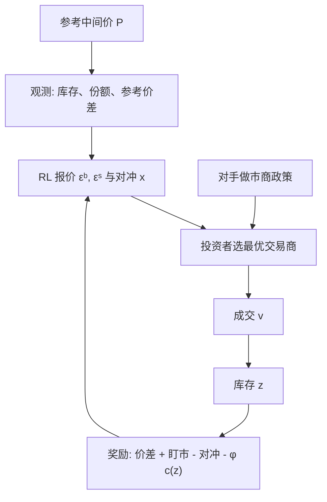

# 强化学习做市

    
在多做市商的交易商市场上，强化学习代理人可以学到对手的定价政策，用买卖不对称的报价管理库存，并在有漂移时主动持有与漂移同向的存货；风险厌恶则必须写进奖励，而不是事后从路径里读出来。

    <footer>—— Ganesh, Vadori, Xu, Zheng, Reddy and Veloso, Reinforcement Learning for Market Making in a Multi-agent Dealer Market, arXiv:1911.05892, NeurIPS 2019</footer>

[Avellaneda–Stoikov](/quant/avellaneda-stoikov) 与 [GLFT](/quant/glft-market-making) 把做市收成强度模型上的随机控制：中间价扩散、成交泊松、指数效用，最优报价围绕无差异价格平移。[Cartea–Jaimungal](/quant/cartea-jaimungal) 一脉把订单流、短期 alpha 与模型不确定写进同一套 Hamilton–Jacobi–Bellman（HJB）语言。解析解漂亮，前提也硬：到达强度对外生、竞争者不进入状态、维度一升高格子方法就失效。Ganesh、Vadori、Xu、Zheng、Reddy 与 Veloso（2019）换了一条路：在**交易商市场**（dealer / OTC）里搭多智能体模拟器，用强化学习训练报价与对冲，对照的是均值—方差风格的自适应做市商，而不是把限价簿上的排队博弈写成可部署的抢单程序。本篇写 RL 做市相对 HJB 改了哪一层对象、奖励如何对应 Cartea 的风险度量，以及模拟器里学到的偏度为什么仍不是生产策略。它是存货与竞争模块，不是延迟套利说明书。

## 问题

连续时间做市的标准叙事是：做市商选择相对中间价的买卖距离，成交按 $\lambda(\delta)$ 到达，库存跳、现金跳，目标是终端财富的期望效用。Cartea、Jaimungal 与 Penalva（2015）的教科书把这条叙事写全——存货风险、执行风险、模型不确定都可以进 HJB。问题在三维以上迅速变钝：多券、多竞争对手、客户按最优报价挑选交易商、对冲还要付交易所价差，价值函数不再有 GLFT 那种小库存闭式。Guéant 与 Manziuk（2019）在公司债篮子上已经指出：高维报价要用 actor–critic 一类数值方法去逼近，而不是再求一阶条件的显式根。

Ganesh 等人面对的市场结构与中央限价簿不同。交易商向投资者**流式报价**，投资者在同一时点比较若干家的买卖价并选最优；各家只看见自己成交的那一腿，加上交易所的参考中间价与参考价差曲线。部分可观测是结构，不是噪声：你看不见对手挂了什么，只能从自己输赢的份额去推断。解析模型若把到达强度写成只依赖自己距离的函数，等于把竞争折进一个外生 $\lambda$，学不到「对手变宽之后你该不该跟」。强化学习要回答的，是在这种不完全信息、多智能体环境里，报价偏度与对冲比例能否从交互中出现，而不是预先假定指数强度。

### 竞争份额改写了到达过程

在 AS / GLFT 里，$\lambda(\delta)$ 是做市商自己的控制函数。在交易商市场上，投资者把订单分给当时最便宜的那一侧，于是到达强度是**相对报价**的函数：你比对手窄，份额上升；你为了减库存把卖价拉近，同时可能把买价推远，两边的份额一起变。Ganesh 把定价动作参数化成相对参考价差的乘数 $\epsilon^b,\epsilon^s$，再加一个对冲比例 $x$，把「多宽、多偏、对冲多少」收成低维动作。这不是为了在交易所里插队，而是为了让策略空间小到样本强化学习还能收敛。随机到达因此变成内生：环境里其他做市商的政策改变你的 $P(s'|s,a)$，这正是[交易 MDP 陷阱](/quant/trading-mdp-pitfalls)里「其他人在适应」那一条。

把 RL 做市理解成「用神经网络代替 HJB」，漏掉了市场结构。Ganesh 的对象是 OTC 流式报价与份额竞争；Cartea 的对象是强度控制与风险度量。两者互补：前者给竞争与部分可观测，后者给奖励里应该惩罚什么。都不是限价簿时间优先的微观博弈。

## 方法

记参考中间价为 $P_t$，做市商库存为 $z_t$。价差收益来自与投资者成交的 $|v|\cdot S_t(v)$；对冲若把一部分库存拿到交易所平掉，支付参考价差；库存的盯市损益是 $(P_{t+1}-P_t)z_t$。Ganesh 把逐步奖励写成这三项之和，这与 Cartea–Jaimungal（2015）把执行与做市的目标写成现金加库存惩罚是同一会计：价差是收入，库存方差是成本，立即对冲是把方差买成确定的价差支出。均值—方差风格的自适应基准则在每一步按当前库存与波动调整 $\epsilon$，作为 RL 的对照政策，而不是当作最优解。

训练协议是受控实验，不是历史回放。模拟器里可以开关：对手是随机报价、固定报价还是自适应做市商；中间价有无漂移；奖励是否加入库存惩罚或下行偏差。Ganesh 报告的可复述结果是行为，不是夏普：代理人学会识别对手的定价水平并调整自己的宽窄；库存为正时卖得更积极、买得更保守，即[库存偏度](/quant/inventory-skew)；中间价有正漂移时愿意持有正库存以赚存货损益。这些都是存货理论已经预言、但在多智能体里需要被「学出来」的定性。

风险厌恶不能靠总盈亏的期望自动出现。纯 $\mathbb{E}[\mathrm{PnL}]$ 会奖励在漂移上押注库存，路径方差可以很大。Ganesh 测试若干风险敏感奖励——对 $|z|$ 或 $z^2$ 加罚、对对冲成本与价差收入做权衡——以得到更不愿堆积库存的政策。这对应 Cartea、Donnelly 与 Jaimungal（2017）把模型不确定写成最坏测度下的控制：解析侧用测度集表达「强度或漂移可能被设错」，RL 侧用奖励塑形表达「我不想要某类路径」。两者都是把风险偏好写成优化目标的一部分，而不是训练完再看回撤。

$$
R_t = \underbrace{|v_t|S_t}_{\text{价差}}+\underbrace{(P_{t+1}-P_t)z_t}_{\text{库存盯市}}-\underbrace{|x_t z_t|S^{\mathrm{ref}}_t}_{\text{对冲成本}}-\underbrace{\phi\,c(z_t)}_{\text{风险罚}}.
$$

$c(z)$ 取 $|z|$ 或 $z^2$ 时，最优政策更接近 GLFT 的终端惩罚逻辑：库存离开零就要付确定代价，偏度会被学出来。$\phi=0$ 时政策更像在赌漂移。

### 奖励塑形对应风险度量，不是对应 alpha

Cartea 与 Jaimungal（2015）讨论用方差、指数效用或期望短跌来「微调」高频策略的风险轮廓。RL 做市若把夏普直接当逐步奖励，信用分配会跨过整个回合，方差项还依赖尚未发生的路径，见交易 MDP 的延迟归因。更干净的做法是：逐步只记可加的现金与盯市，风险用状态里的 $|z|$ 惩罚或用终期 $\ell(z_T)$，与 HJB 的运行成本 / 终端罚同构。不要把「预测下一笔客户方向」塞进奖励——那会把做市训练成方向性交易；Ganesh 的设定里投资者到达是外生过程，知情流与[毒性](/quant/toxic-flow)并未进入。若要叠毒性，应像 Cartea 把短期订单流当作状态的一维，而不是让智能体在模拟器里学抢跑。

## 机制

学到的机制可以对照存货理论逐条读。偏度：正库存时提高买价乘数、降低卖价乘数，使下一笔更可能是卖，库存均值回复——Ho–Stoll / AS 的线性平移在离散动作上的对应。竞争：对手持续更窄时，继续挂宽会丢掉份额，代理人学会跟价或放弃一边；这是 HJB 单代理人模型写不出来的反馈。漂移：正漂移下持有正库存，等价于把中间价的可预测部分当作短期 alpha；Cartea 会把这项显式写进强度或漂移，RL 则从奖励里的库存盯市自己长出来。对冲比例 $x$ 是把「内部化」与「立刻到交易所出清」做连续权衡：内部化省价差、耗时间，对冲买确定性。

这些机制全部发生在**自己的报价相对参考价与对手价**上，不依赖谁先到达撮合引擎、不依赖取消—改价的微秒差。论文标题里的 reinforcement learning 是样本效率与函数近似的算法选择；市场结构是交易商市场的流式报价。把同一套网络接到中央限价簿的排队位置上，状态、动作与合法目标都变了，不能平移结论。

模拟器里「打败自适应基准」只说明在该生成过程上策略更好。投资者选最便宜报价、参考价外生、没有知情者，是一组强假设。换一组客户搜寻规则或把参考价改成被自己成交搬动，政策会坏。这是[模拟到实盘](/quant/sim-to-real-trading)的标准缝，不是调大学习率能补的。

### 多智能体均衡与单智能体最优不是同一个量

若所有做市商同时用 RL 更新，环境非平稳，收敛到的是某种共同学习动态，不一定是纳什，更不是社会福利意义上的最优流动性供给。Ganesh 的主实验是：**一个** RL 代理人对其余固定或自适应政策学习，这是单智能体在非平稳程度较弱的环境里的最优反应，可解释性更好。若干个 RL 同时学，份额与价差可能螺旋收窄，看起来像竞争改善流动性，也可能是共同过拟合模拟器的随机种子。报告时应钉死对手集合是否在训练中冻结。这与解析侧「给定 $\lambda$，求最优 $\delta$」是同一分层：先固定环境，再谈最优；环境若由自己的同类组成，最优必须改口为均衡。

## 边界与工程取舍

本设定不包含限价簿的时间优先、冰山、隐藏量，也不包含共同定位或消息顺序。那些对象属于市场结构与操守规则，不是本篇的控制问题；公开规则对动作集的约束应写成掩码，见交易 MDP 与 [RTS 6](/quant/mifid-ii-rts6)，而不是靠奖励碰运气去「学合规」。强度与参考价在模拟器里是生成的，实盘里是被估计的：估计误差就是 Cartea 所谓模型风险，RL 不会因为是无模型就消失——它把模型误差从方程系数挪到了模拟器假设上。

样本效率差。深度 RL 需要大量轨迹，金融没有物理引擎那种免费的真实互动；用历史逐笔当环境会忽略自己的冲击，用模拟器又引入设定误差。因此 RL 做市更合理的位置是：在 Cartea / GLFT 的低维解附近做残差修正，或在多券、多客户分段等解析解失败的维度上给一个数值政策，再用冻结版本做前瞻。不要用它搜索能稳定赚钱的 alpha，也不要把它的动作空间设计成可构成虚假报价或扰乱秩序的撤单模式——那既不是 Ganesh 的实验对象，也不是可写进公开研究的目标。

风险罚 $\phi$ 与解析模型里的 $\gamma$ 一样，几乎无法从交易数据里诚实识别。实务上它是风险资本的编码：库存限额、亏损闸门、[风控熔断](/quant/trading-kill-switch) 应独立于策略网络，由无权改奖励的人设置。训练时把闸门当可微惩罚，部署时再「拿掉」，是把约束优化成了绕过约束。

## 小结

- Ganesh 等人（2019）在交易商市场的多智能体模拟器里训练 RL 做市商，对象是流式报价、份额竞争与库存，不是限价簿上的时序优势。
- 学到的定性与存货理论一致：偏度减库存、跟价应对竞争、漂移下持有同向存货；风险厌恶必须写进奖励。
- Cartea–Jaimungal 提供解析对照：HJB 写清风险度量与模型不确定，RL 在竞争与高维上补数值。
- 到达过程由相对报价内生，单代理人 HJB 的外生 $\lambda$ 不再成立。
- 模拟器假设（外生参考价、无毒性、对手冻结）决定政策能迁移多远；无模型不等于无模型风险。
- 合规与交易所规则属于动作掩码和独立闸门，不能当作可学习的奖励项。
- 出处：Ganesh et al., arXiv:1911.05892, 2019；Cartea, Jaimungal and Penalva, *Algorithmic and High-Frequency Trading*, 2015；Cartea and Jaimungal, *Mathematical Finance*, 2015；Cartea, Donnelly and Jaimungal, *SIAM J. Financial Mathematics*, 2017；Guéant and Manziuk, *Applied Mathematical Finance*, 2019。
