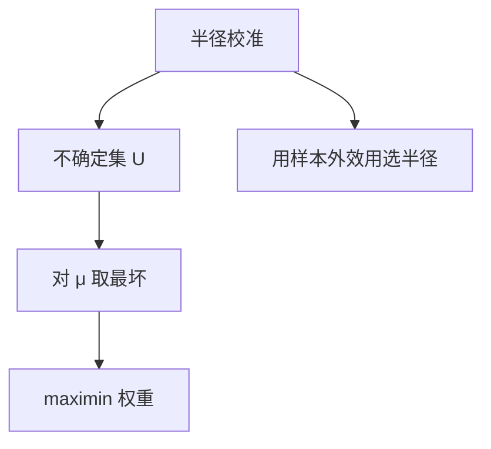

# 稳健优化

不确定集里最坏的 $\mu$ 决定仓位；集合太大，最优变成不交易，集合太小，又回到被估计误差支配的 Markowitz。

<footer>—— Goldfarb and Iyengar, Robust Portfolio Selection Problems, Mathematics of Operations Research, 2003</footer>

[上一课](/quant/bayesian-portfolio)对后验取期望。稳健优化的缺口是**对不确定集取最坏**：$\max_w \min_{\mu\in\mathcal U} w^\top\mu-\frac{\gamma}{2}w^\top\Sigma w$。前沿 [Wasserstein DRO](/quant/wasserstein-dro-portfolio) 是分布鲁棒的一种；本课写经典盒/椭圆不确定集，并接到已有 [CVaR 优化](/quant/cvar-opt)。

## 问题

贝叶斯需要先验。交易员若不愿写先验，仍想避免「历史最佳资产杠杆」，可以把 $\mu$ 限制在样本均值附近的椭圆 $\{(\mu-\hat\mu)^\top\Sigma_\mu^{-1}(\mu-\hat\mu)\le\chi^2\}$，然后做 maximin。问题是 $\chi^2$（集合半径）与贝叶斯先验方差同样是风险偏好：半径按「95% 置信」去填，往往会过度保守，权重接近最小方差。半径应按**样本外效用**校准，不是按名义置信水平。

盒约束 $|\mu_i-\hat\mu_i|\le\delta_i$ 会把权重推向 $\delta$ 小（估得准）的资产，可能过度集中于债券——这也是特征，要检查 $\delta$ 是否只是波动的倒数。

### 最坏情况不是压力测试情景

压力测试指定一个经济情景。稳健集是统计邻域，最坏 $\mu$ 往往是与当前 $w$ 最敌对的方向，没有叙事。两者都要：稳健防估计误差，情景防结构破裂。不要用稳健优化替代 [压力](/quant/stress-reverse-stress)。

$\Sigma$ 也可以进不确定集。只稳健 $\mu$、把 $\Sigma$ 当已知，在高维里仍可能不够；但双线性最坏更难算，实务常只稳健 $\mu$ 并对 $\Sigma$ 收缩。

## 方法

选集合：椭圆（有二次锥表示）或盒。半径用交叉验证或与 BL $\tau$ 对齐。求解：SOCP/QP，见 Goldfarb–Iyengar。输出对照：Markowitz 点估计、贝叶斯后验、稳健 maximin 的权重与样本外。若稳健解接近 100% 现金，说明半径太大或 $\hat\mu$ 相对费用没有边。

DRO/Wasserstein：不确定集是分布的 Wasserstein 球，极限含 CVaR 型惩罚。与本课盒/椭圆是同一精神的不同几何，不在这里重写前沿课。

## 机制

内层 min 把 $w^\top\mu$ 减掉一个与 $\|w\|$ 成正比的罚（椭圆时是 $\sqrt{w^\top\Sigma_\mu w}$）。于是稳健 Markowitz 像在更大的风险厌恶下做，或像在协方差上加了一层。这解释了为何看起来像「再收缩一次」。政策含义：不确定越大，越接近最小方差或均衡，与贝叶斯同向，机制是 min 而不是积分。

## 边界

集合几何选错（盒 vs 椭圆）会改变最坏方向。稳健对「均值附近的对抗」有效，对 2008 那种结构断裂无效。计算上的近似（线性化最坏）可能比点估计更脆。不要把稳健最优当成保证下限——它只对你写的集合保证。

## 小结

- 稳健组合是 maximin：半径是偏好，应用样本外校准。
- 与贝叶斯同向收缩，机制是最坏而不是后验平均。
- 不能替代宏观压力情景。
- 出处：Goldfarb and Iyengar, *Mathematics of Operations Research*, 2003。
