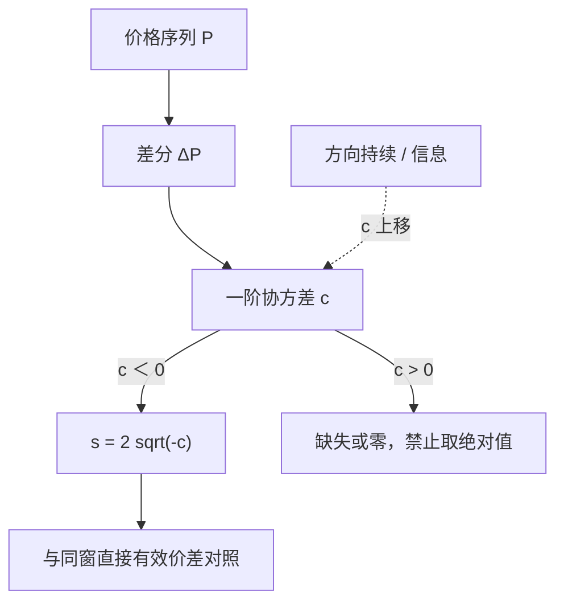

# Roll 有效价差估计

有效价差不必写在报价上：若成交只是在价值两侧弹跳，相邻价格变化的负协方差就已经给出宽度；估计的任务是把这条协方差从样本里稳定地读出来，并承认它何时读不出来。

<footer>—— 据 Roll, Journal of Finance, 1984，及其后作为交易成本代理的估计实践</footer>

[Roll 模型](/quant/roll-model) 把成交价写成鞅价值加买卖弹跳，并导出 $s=2\sqrt{-\mathrm{Cov}(\Delta P_t,\Delta P_{t-1})}$。那一篇写识别假设：价值鞅、方向独立、价差常数。本篇写把它**当作有效价差估计量**时的采样、失败值、以及和报价有效价差的对照。Huang–Stoll 意义上的有效价差是 $2D(P-M)$，有中点就能直接算；Roll 估计是没有中点、甚至没有报价时的隐含测度。两者量纲相同，数据需求与偏误来源不同。不要把模型推导再抄一遍，这里只关心：样本协方差怎样变成一个可进入截面回归或成本模型的数字。

## 问题

直接算法需要同步的成交与 BBO。历史日线、早期场外、部分债券与外汇报价残缺时，只剩价格序列。若用相邻价格的平均绝对变化当价差，价值波动会进去；若用报价价差的日平均，又可能没有报价。Roll 公式把「可预测的负相关」全部归因于弹跳，从而给出一个只用 $P_t$ 的 $s$。

估计问题立刻出现。第一，采样频率：日收盘价的 $\Delta P$ 含隔夜信息，一阶相关不必为负；逐笔成交最接近原意，但方向持续会让协方差变正。第二，正协方差：样本里 $\widehat{\mathrm{Cov}}\gt 0$ 时开方无定义，软件若取绝对值是在伪造弹跳。第三，小样本：一个月的日数据只有约二十个差分，协方差估计极噪，截面排序可以，个股水平不能当高频仪表。问题是给出一套可重复的计算规则，使 $s$ 在「假设大致成立」时接近有效价差，在不成立时报告失败而不是一个假数字。

### 有效价差与报价价差不是同一个靶

报价价差是 $A-B$，可以长期无成交。有效价差度量主动方相对中点实际付了多少。Roll 估的是后者的隐含水平：弹跳幅度对应成交发生在 $V\pm s/2$。若大量成交在价差内部，直接有效价差小于报价价差，Roll 也应更接近有效而非报价。若成交经常打穿，Roll 可能大于报价。用 Roll 去检验「哪个市场报价更窄」是问错对象；应用它去近似「没有中点时成交有多贵」。

日收盘价序列上的 Roll 估计，测的是收盘成交（或官方收盘价）的弹跳，不是全日成交的平均有效价差。把 CRSP 日收益的协方差开方，再解释为「这只股票这个月的平均买卖价差」，采样已经换了对象。

## 方法

在选定的价格序列 $\{P_t\}$ 上计算一阶差分 $\Delta P_t$，样本协方差 $c=\widehat{\mathrm{Cov}}(\Delta P_t,\Delta P_{t-1})$。若 $c\lt 0$，

$$
\hat s = 2\sqrt{-c}.
$$

若价格是对数，先决定要的是对数价差还是价格单位价差；混用会让截面不可比。常用成交事件序列或日历分钟的 last；先聚合成五日再差分，会把多次弹跳平均掉，$|c|$ 变小，$\hat s$ 偏低。窗长与公布频率匹配：月度因子研究用月内日度或月内逐笔再平均到月；高频监控用滚动成交笔数而不是滚动时钟。

$c\gt 0$ 时的处理必须预先承诺：记缺失、记零，或改用贝叶斯收缩（Hasbrouck 把 Roll 状态空间化，用 Gibbs 把价差限制在正数并吸收方向持续）。禁止对 $c$ 取绝对值再开方。报告时同时给出失败比例：若某市场某月一半股票 $c\gt 0$，该月的截面「Roll 价差」已被选择偏差污染——留下来的多半是弹跳仍占主导的冷门股。

### 与直接有效价差对齐的实验

有 BBO 的子样本上，把同窗的平均 $\mathrm{ES}=2D(P-M)$ 对 $\hat s$ 做截面回归。斜率接近 1、截距接近 0，说明弹跳识别在该采样上成立。$\hat s$ 系统性更大，可能是方向持续被忽略、或中点定义与成交时间戳不一致；系统性更小，可能是聚合过度或价格改善使弹跳小于报价宽度。这组对照是估计量的设定检验，不是「再用 Roll 发现一次有效价差」。

方向分类误差会压低直接 ES，却不一定以同样方式压低 Roll——Roll 不用 $D$。因此在分类质量差的数据里，Roll 有时看起来「更稳」，那是因为它回答了更粗的问题，不是因为它更准确。

## 机制

当假设近似成立，相邻成交倾向于买卖交替，价格在价值两侧弹，$\Delta P$ 负相关，$|c|$ 约为 $(s/2)^2$。估计量读到的就是这笔二阶矩。当知情交易让买之后价值上移，相邻 $\Delta P$ 的乘积被推向正，$|c|$ 缩小甚至变号，$\hat s$ 偏低或失败——此时真实有效价差往往更高（逆向选择），Roll 往反方向走。这是作为成本代理最危险的性质：信息越毒，隐含弹跳测度越像在说「价差变窄了」。

存货诱导的中点漂移同样污染 $c$，但方向不一定与信息相同。短暂的同向报价调整会减少负相关；把 $\hat s$ 解释为[价差分解](/quant/spread-decomposition)里的处理成本，会把存货与信息的永久成分漏掉。工程上，Roll 更适合当「无报价市场的宽度代理」或「有报价时的弹跳诊断」，不适合当逆向选择的主度量。

### 频率选择改变的是对象不是精度

把逐笔差分换成分钟 last 的差分，格子内的多次弹跳被净掉，留下的相关更像分钟收益的微观结构噪声。把日收盘连成序列，隔夜信息占主导，弹跳只是收盘那一笔的买卖。没有一种频率是「更精确的同一个 $s$」；每种频率对应一种弹跳。写进研究的应是「事件时间成交的 Roll $s$」或「日收盘的 Roll $s$」，并与同频率的直接 ES 对照。

Harris 讨论交易成本测量时，隐含测度的价值正在于没有报价的市场。有 L1 之后，优先用有效价差；Roll 留下来的工作是设定检验与长历史拼接，而不是替代中点算法。

## 边界与工程取舍

价格离散到一个 tick、大量 $\Delta P=0$，协方差被压低，$\hat s$ 偏小。拆股与分红必须先调整，否则差分里的跳被当成弹跳。多交易所并行时，把所有成交简单按时间排成一条序列，会把同一价值发现的腿间弹跳算进去，也可能把延迟造成的假回跳算进去。应先按主市场或按中点对齐规则过滤。

不要把月度 Roll $s$ 当作 [Pástor–Stambaugh](/quant/pastor-stambaugh) 的 γ：一个是价差宽度，一个是成交额的临时冲击。也不要用 Roll $s$ 去扣动量空头的收益并声称「成本后动量消失」——空头腿往往正是 $c\gt 0$、估计失败最严重的那些股票。与 [Corwin–Schultz](/quant/corwin-schultz) 并列时，应报告两者的相关、失败率，以及隔夜处理是否一致，而不是平均成一个「综合价差」。

理论出处仍是 Roll, *A Simple Implicit Measure of the Effective Bid-Ask Spread in an Efficient Market*, Journal of Finance, 1984。作为估计实践，应同时交代采样、正协方差规则与对照样本。Hasbrouck 的贝叶斯 Roll 是正约束下的另一估计量，不是把负号拿掉。

## 小结

- Roll 有效价差估计把负的一阶协方差开方，是无中点时的隐含宽度，不是报价价差。
- 采样频率决定对象：逐笔、分钟、日收盘不是同一个 $s$ 的精度阶梯。
- 协方差为正时应报告失败；取绝对值会伪造弹跳，且在毒性高时偏误最危险。
- 有 BBO 时用直接有效价差，把 Roll 当对照；成本扣减不要用失败率高的月度截面。
- 出处：Roll, Journal of Finance, 1984；估计纪律见后续交易成本测量文献。
