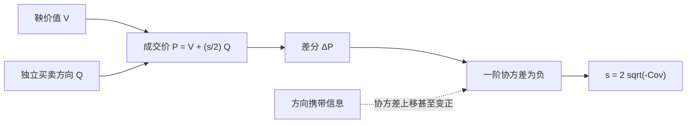

# Roll 模型

若有效市场中的成交只是在固定的买卖报价之间来回跳动，观测到的价格序列应呈现负的一阶序列相关；有效价差可以从这段回跳的协方差里读出来。

<footer>—— Roll, A Simple Implicit Measure of the Effective Bid-Ask Spread in an Efficient Market, Journal of Finance, 1984</footer>

[上一课](/quant/market-fragmentation)把单场所 BBO 收成多场所拼装的 NBBO：有效价差对照哪一个中点，已经是规则输出。本课进入价格形成课序。报价会计仍以[价差分解](/quant/spread-decomposition)为准，这里不再拆三项。缺口换成：没有可靠报价、或跨场所报价对不齐时，怎样只从成交价序列里估计有效价差。Roll 1984 年的答案依赖有效市场：价值是鞅，成交只在价值上下各半个价差处被记下，买卖方向独立。相邻成交倾向于一正一负，一阶协方差为负。它不解释价差从何而来——那是后面 [Glosten-Milgrom](/quant/glosten-milgrom) 与 [Kyle](/quant/kyle-model) 的工作——只在极强假设下给出一个隐含测度。

## 问题

[价差分解](/quant/spread-decomposition)假定你看得见报价。许多市场或历史样本只有成交价，没有可靠的 BBO。报价价差即使存在，成交也可能发生在报价之内。若直接把相邻成交价的平均绝对差当价差，会把价值本身的波动算进去。缺口是一个识别策略：哪一部分差分来自价值，哪一部分来自买卖报价之间的弹跳。

Roll 的回答是：让价值保持有效，把全部可预测的负相关归因于弹跳。问题于是收成两条假设是否成立。第一，除价差外没有可预测性，中间价（价值）是鞅。第二，买卖方向不相关、与价值新息不相关，价差为常数。若知情交易让方向与后续价值同号，协方差会被推向正，弹跳测度失效。若存货让中点缓慢游走，也会污染同一矩。因此 Roll 首先是识别策略，其次才是一个数字公式。

### 观测价格如何写成价值加弹跳

记不可见有效价值 $V_t$ 为鞅，$\Delta V_t$ 均值为零、序列不相关。买卖方向 $Q_t\in\{+1,-1\}$，+1 表示主动买、成交在卖价。有效价差为常数 $s$，则成交价

$$
P_t = V_t + \frac{s}{2} Q_t.
$$

一阶差分 $\Delta P_t=\Delta V_t+(s/2)(Q_t-Q_{t-1})$。价差弹跳全部进入 $(Q_t-Q_{t-1})$。若没有 $Q$ 的数据，只能从 $\Delta P$ 的二阶矩里把 $s$ 解出来。这就是「隐含」的意思：不观测报价，也不观测方向。

$P_t$ 是成交价，不是中间价。把日收盘价或分钟 last 中间价直接代入，等于改写了采样。Roll 的对象是交易价格的弹跳；在 [事件时间](/quant/event-time) 的成交序列上最接近原意。

## 方法

设 $Q_t$ 独立、对称，$\mathrm{P}(Q_t=1)=1/2$，且与 $\Delta V$ 独立，$\mathrm{Var}(Q_t)=1$。则

$$
\mathrm{Cov}(\Delta P_t,\Delta P_{t-1}) = -\left(\frac{s}{2}\right)^2 = -\frac{s^2}{4},
$$

因为 $\Delta V$ 不贡献相邻协方差，而 $(Q_t-Q_{t-1})$ 与 $(Q_{t-1}-Q_{t-2})$ 共享 $-Q_{t-1}$ 这一项。于是

$$
s = 2\sqrt{-\mathrm{Cov}(\Delta P_t,\Delta P_{t-1})}.
$$

样本协方差若为负，开方即得估计；若为正，根号没有实数解，通常报告缺失或记为零，并解读为「弹跳被别的正自相关盖住」。这不是软件问题，是假设失败的诊断。估计应在成交事件序列上进行；先聚合成时钟格子会把格子内多次弹跳平均掉，协方差向零，估计的 $s$ 偏小。

### 与报价价差对照

有 BBO 时，可把 Roll 估计与平均报价价差、平均有效价差对照。一致，说明弹跳主导了成交价的一阶相关；Roll 更大，可能是成交价跳动超过报价（数据错误或延迟）；Roll 更小或失败，说明信息或存货诱导的正自相关在抢同一个协方差。Harris 讨论测量交易成本时，隐含测度的价值正在于没有报价的市场；有报价之后，它的角色变成设定检验，而不是首选测量。

## 机制

机制极其吝啬。价值不因成交而更新，方向不携带关于 $V$ 的信息，流动性提供者每次赚到半个价差、下一次若方向反转再吐出或再赚——从价格路径看就是在 $V\pm s/2$ 之间弹。负一阶自相关是弹跳的签名，不是投资者非理性，也不是均值回复因子。O'Hara 把这类摩擦看成在有效价值过程上叠加的微观结构噪声：噪声有结构（买卖两个点），所以不是白噪声，一阶相关为负。

一旦引入逆向选择，机制就变。成交为买，则 $V$ 的条件期望上升，下一笔即使方向随机，价格的水平已经抬高，$\Delta P$ 的相邻乘积不必为负。Glosten-Milgrom 的报价本身就是条件期望，弹跳与更新缠在一起。Kyle 甚至没有固定的 $s$，价格是订单流的线性函数，相邻成交的协方差由信息揭示路径决定。Roll 公式在这些世界里不再是 $s$ 的一致估计，它变成「若仍按弹跳解释，会被信息偏到哪一侧」的基准。

### 协方差为正时发生了什么

样本 $\mathrm{Cov}(\Delta P_t,\Delta P_{t-1})\gt 0$ 在日内高频并不罕见。可能的机制包括：方向持续（算法把大单切成一串同向成交）、价值新息本身在短窗口内正相关（公开信息逐步写入）、存货压力使中点沿同一方向调整、错误的成交时间戳把一笔拆成多笔同向。无论哪一种，开平方都没有经济含义。应停止报告虚假的 $s$，改描述方向持续性或改用报价数据去算有效价差。把正协方差强行取绝对值再开方，是在伪造弹跳。

Roll 估计的是有效价差的一个隐含水平，不是 [价差分解](/quant/spread-decomposition) 里单独的处理成本。弹跳里可以混有存货的暂时成分；它明确排除的是使协方差变号的永久信息。

## 边界

常数价差、对称独立方向、价值鞅，三条同时成立的市场很少。它更像无信息、无存货或存货被充分对冲、方向被充分打散之后的极限。开盘、公告、有人用市价切片执行时，方向持续，Roll 失效。价格离散到一个 tick、成交长期停在同一价，差分大量为零，协方差被压低。隔夜收益不应与日内相邻成交接在同一条差分序列里。截面上对所有股票套用同一公式，热门股事件多、冷门股事件少，估计精度不可比。

Roll（1984）原文关心的是用日数据等相对低频序列去恢复有效价差，并讨论有效市场。把同一公式无改动地接到毫秒成交上，采样与微观结构噪声的形态都变了：你可能估到的是某一种弹跳，但不自动等于原文的对象。有 L1 报价时，优先用有效价差的直接算法，把 Roll 当对照；只有成交价时，必须报告协方差符号与样本长度，允许失败。它不能给出逆向选择份额，也不能给出 Kyle 的 $\lambda$。

不要把「负自相关所以有价差」因果倒置。有价差弹跳可以产生负自相关；负自相关还可以来自许多别的均值回复。Roll 的识别靠的是把别的来源假设掉，而不是负相关本身证明了价差。

## 小结

- Roll（1984）在价值鞅、常数价差、独立等概率买卖下，用 $\mathrm{Cov}(\Delta P_t,\Delta P_{t-1})=-s^2/4$ 隐含估计有效价差。
- 公式应用在成交事件序列上；时钟聚合会削弱弹跳。
- 协方差为正时应拒绝该测度，而不是取绝对值；那是信息或方向持续的诊断。
- 它测量弹跳所隐含的有效价差，不分解逆向选择，也不替代报价上的有效价差。
- 与 Glosten-Milgrom、Kyle 的差别在于：成交不更新价值，价格不是订单流的反应函数。
- 离散价格、隔夜、切片执行与低频/高频采样构成适用边界。
- 出处：Roll, *Journal of Finance*, 1984；阅读框架见 O'Hara, *Market Microstructure Theory* 与 Harris, *Trading and Exchanges*。
