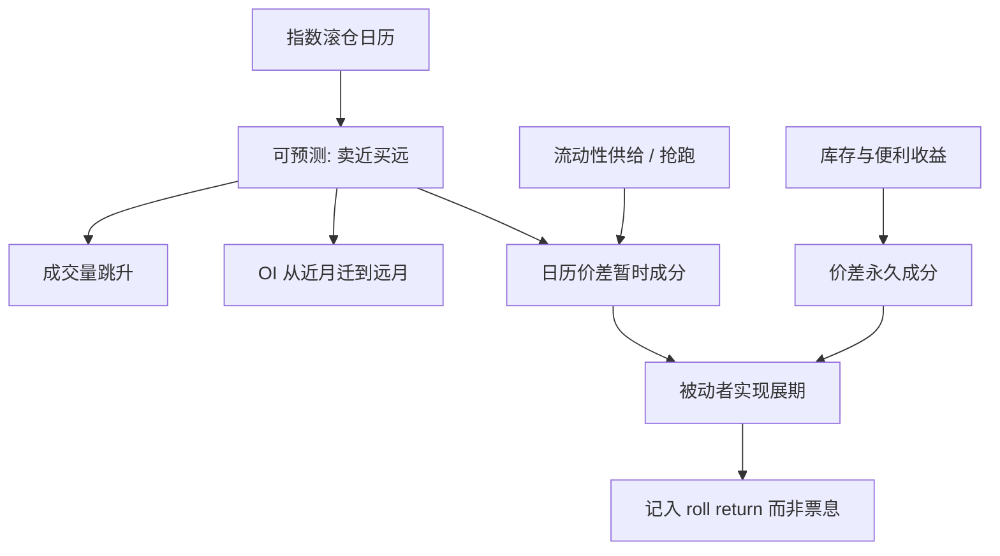

# 展期成交量与持仓

指数与复制产品按公开日历把近月换成远月，成交量与持仓在窗口内迁移；可预测的订单流会改变流动性供给，也会把部分展期收益从被动者转移到抢跑者。

<footer>—— Mou 对 Goldman Roll 的讨论；Bessembinder, Carrion, Tuttle & Venkataraman, Journal of Financial Economics, 2016</footer>

[上一课](/quant/implied-repo)把隐含回购写成债券持有至交割的内部收益率，用于 CTD 排序并与实际回购比较；屏幕 IRR 含交割期权溢价。缺口从单券融资转到商品指数的机械滚仓：近月卖、次近月买的方向事先知道，成交量与持仓迁移在窗口内跳，把量能当成「信息到来」会误读日历。本课钉展期成交量与未平仓：分解指数滚仓、套保换月与价差交易。不重讲 Burghardt 会计。[展期收益](/quant/roll-yield) 是收益分解；这里写它如何被执行。后课库存曲线默认滚仓脚印已经和仓储理论叠在同一条曲线上。

## 问题

隐含回购排序的是单券期现；商品指数滚仓是事先知道方向的流量事件。设近月未平仓为 $OI_1$、次近月为 $OI_2$。滚仓期指数把名义从 $T_1$ 转到 $T_2$，观测上常见 $OI_1$ 下降、 $OI_2$ 上升，成交量在两张合约上都跳。问题是分解：多少是指数机械滚仓，多少是商业套保的月份切换，多少是日历价差交易者在提供或抽取流动性。把成交量跳增当成「信息到来」会误读：窗口内的信息可能只是日历。Singleton、Hamilton–Wu 一类工作讨论流量与石油价格；即便宏观结论有争议，微观上可预测滚仓会移动近远月价差，这一点与仓储理论不矛盾——它是在 Working 的曲线上叠加了一段订单流。

第二层是持仓的公开数据。CFTC 的 COT 把交易商分成商业、非商业、指数等类别（分类随改革而变），滞后且粗。用周频 COT 去「预测」日内滚仓冲击，频率错了。真正约束容量的是窗口内的深度与价差，不是周五公布的分类持仓。第三层是规则差异：有的指数在 5 个交易日均摊，有的更短，有的按流动性提前滚；复制的 ETF 可能再提前一天以降低跟踪误差。你看到的成交高峰可以是复制者之间的竞赛，而不是官方指数日。

### 持仓迁移不等于价格趋势

OI 从近月迁到远月，本身是存量搬家，不是新的多头开仓。若同时有新的指数申购，远月 OI 增加可以超过近月减少。把 OI 增加一律读成看多，会把滚仓写成方向性信号。反向地，到期交割与强平也会消灭 OI，与观点无关。分析滚仓应看配对的近月减仓与远月加仓、以及日历价差的成交量份额，而不是看单合约 OI 的水平。

Goldman Roll 的经典窗口是部分指数在某几个交易日卖近买远。窗口一旦被写入教科书，抢跑会前移，真正的冲击可以出现在「官方日」之前。用官方日起点做事件研究，会低估前置日、高估窗口内的剩余边缘。

## 方法

事件定义要用指数方法论的实际交易日，并单独标记复制产品可能提前的区间。度量：近月与远月的成交量、OI 变化、日历价差的买卖价差与深度、以及相对非窗口日的冲击。Bessembinder 等的框架把可预测流量下的流动性供给写成：做市商在窗口前建立价差仓位，窗口内与被动流成交，之后平仓。交易策略若与指数同向（窗口内卖近买远），是在与被动流抢流动性；反向则是在提供流动性，期望赚冲击，承担仓储与库存信息风险。

容量：被动名义越大，窗口越拥挤，单位冲击越大，指数实现的展期越差。这会反馈到 Erb–Harvey 分解里的 $R_{\mathrm{roll}}$：金融化之后同一条贴水曲线，被动者分到的展期可以少于金融化之前。回测战术「做多贴水」若用收盘价在滚仓日调仓，会把这一冲击算进 alpha 或漏掉，取决于你是否与指数同日。应显式模拟与指数重叠的比例。

### COT、持仓限额与交割月

进入交割月，投机限额收紧，OI 必须下降或转为商业交割意向。滚仓若拖延到这一阶段，近月流动性可以突然变差，成交量高但深度差。持仓限额使大账户更早滚，把高峰前移。COT 的指数持仓可以帮助估计「还有多少被动名义没滚」，但周频延迟意味着你只能做粗的拥挤状态，不能做日内择时。与[跨期套利](/quant/calendar-spread-arb)结合：窗口内价差的均值回归更快、冲击更大，非窗口的仓储模型不能直接用。

## 机制

机械机制：被动规则创造价格弹性有限的需求曲线，在事先知道的时间买 $T_2$、卖 $T_1$。流动性供给者的最优是在此前买入该日历价差（或反向，取决于谁提供），在窗口内与指数成交。Mou 强调在规则公开且名义大时，抢跑可以侵蚀指数。Bessembinder 等指出可预测交易不一定破坏市场质量：若供给充分，窗口可以更厚；若供给不足，价差走阔、冲击持久。经验结果随品种与样本期而变，不能写成「滚仓一定被掠夺」或「一定被完美吸收」。

仓储机制仍在：窗口不能把低库存变成高库存。订单流移动的是价差的暂时成分；库存报告仍移动永久成分，见[库存报告与曲线](/quant/inventory-curve)。金融化文献（Cheng–Xiong 综述）争论的是流量是否改变风险溢价水平；微观滚仓文献争论的是执行价格。两者常被混成「指数推高了油价」。对交易者应分开：水平是风险溢价与库存，窗口是微观结构。

### 破裂：规则更改、挤仓、流动性蒸发

指数方法论修改（滚仓日、合约选择、纳入品种）使历史窗口的事件研究作废。交割月挤仓时，近月不是你能按计划卖掉的腿，OI 迁移失败，被动者被迫在停板或涨跌停里成交。波动跳升、保证金上调时，提供流动性的日历价差账去杠杆，窗口内供给消失，冲击放大。复制产品出现申赎与停牌时，期货滚仓与份额市场脱节，OI 变化不再映射到同一组规则。

用窗口内的正收益当「抢跑策略的夏普」，忽略了你在非窗口承担的曲线风险与库存跳跃。提供流动性的期望利润必须扣掉 EIA、WASDE 落在窗口附近的日子。日历碰巧重叠时，订单流与信息同时到达，分解失效。

## 边界与工程取舍

不要把 OI 当情绪。不要用官方滚仓日的收盘价假设自己能按指数权重成交。不要在所有品种上复制同一套 Goldman Roll 日期——农产品、能源、金属的合约循环与指数权重不同。成本是窗口内有效价差与冲击，容量是被动名义与做市资本的比。与[展期收益](/quant/roll-yield)的会计对齐：被动者的 $R_{\mathrm{roll}}$ 应用实现成交，而不是用窗口前的收盘斜率。Erb–Harvey 的战术价值若用斜率信号在滚仓周加码，会与冲击同向，净边缘可能为负。

报告应分列：窗口前、窗口中、窗口后的价差收益；OI 迁移完成度；与指数重叠率；以及库存事件是否重叠。Stoll–Whaley、Irwin–Sanders 对「指数是否操纵了价格」的宏观检验，不能替代你这张微观执行表。宏观上即使指数不决定价格水平，微观上它仍决定你在那五天里付多少冲击。

Bessembinder 等（2016）的对象是可预测交易，不限于商品指数。把结论写成「商品滚仓永远有免费的反向价差」，超出原文。原文强调理论与证据：供给弹性决定市场质量，而不是日历本身保证利润。

## 小结

- 公开滚仓把成交量与持仓在近月与次近月之间迁移；方向可预测，不等于价格趋势。
- Mou 讨论对 Goldman Roll 的抢跑；Bessembinder、Carrion、Tuttle 与 Venkataraman 研究可预测交易周围的流动性供给与市场质量。
- 被动冲击侵蚀实现展期，金融化改变的是谁分到 Working 曲线上的那一块，而不自动取消仓储基本面。
- 规则修改、交割月挤仓与保证金去杠杆使窗口供给消失，是破裂模式。
- 出处：Mou, Goldman Roll working paper；Bessembinder, Carrion, Tuttle and Venkataraman, *JFE*, 2016；Stoll and Whaley, *Journal of Applied Finance*, 2010；Irwin and Sanders, *Applied Economic Perspectives and Policy*, 2011；Cheng and Xiong, *Annual Review of Financial Economics*, 2014；Erb and Harvey, *FAJ*, 2006。
