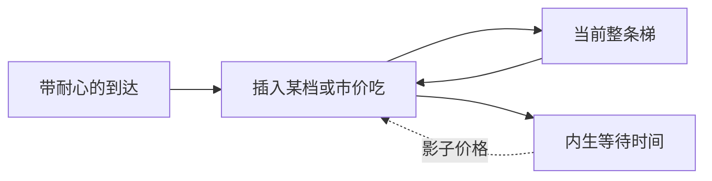

# Roşu 动态限价簿

耐心不同的交易者连续到达，限价簿是一条随时间移动的报价梯：急的人沿梯向下吃，不急的人插进梯里等。价格与深度是等待成本的排序，而不是外生的专家库存。

<footer>—— Roşu, A Dynamic Model of the Limit Order Book, Review of Financial Studies, 2009</footer>

[Foucault](/quant/foucault-lob)在离散期里权衡被捡与价差。缺口是连续时间：到达是流，簿的形状随插入与成交连续演化，均衡策略应给出**挂在哪一档**而不只是挂或不挂。Roşu（2009）用动态博弈构造马尔可夫完美均衡：交易者按耐心排序，更急的人更靠近（或越过）BBO。本课不重写 Parlour 的两档队深转移。

## 问题

离散期模型很难谈「比最优价差一个 tick」或「埋在第三档」——网格与期长绑在一起。连续到达时，状态是整条供给与需求梯。新来者观测簿，选择市价（立刻成交、付即时成本）或在某一价位插入限价（等待随机时间、承担被后来者抢先以及公共信息移动）。问题是存在这样的均衡：报价价差、各档深度与成交强度，都由等待成本分布与价值波动决定，并且随簿的当前形状反馈。

这把 Harris 的 maker/taker 写成耐心的排序：同一人在不同状态下可以切换，因为状态含已有队列。

### 竞争性插入而不是单一专家

与 Ho–Stoll 对照：没有一个人报出双向价，而是一群人各报一侧的一个限价。与 Kyle 对照：没有一个出清 $\lambda$，即时冲击由对方梯的斜率给出——吃得越深，越碰到更不耐烦（或更有信息）的报价。Roşu 的基准版本侧重耐心与执行风险，逆向选择可以加，但不是 2009 年文章的唯一引擎。

Goettler、Parlour、Rajan（2005）用计算均衡处理更富的离散状态。Roşu 提供可分析的连续时间图像。经验校准时两者常一起引用，不要把计算附录当成 2009 年的闭式。

## 方法

交易者带私有等待成本（或私有估值），泊松到达。策略是从当前簿映射到一个限价或市价。均衡要求：给定别人的策略（因而给定自己成交等待时间的分布），自己的选择最优；簿的过程与这些选择一致。结果性态：更有耐心的人挂得更远（提供更厚但更慢的流动性）；急的人吃 BBO 甚至扫多档。价差是最不耐心的挂单者之间的距离。

公共信息跳会使远离价值的挂单立刻变成可被扫的对象，与 Foucault 的被捡同构，但现在扫的是一整条梯的一段。撤单若被允许，均衡还要规定谁来得及改价。

### 等待时间是内生价格

执行等待不是外生参数。你挂得越有攻击性，越快成交，但成交价越差（相对随后的中点）。最优放置是把等待的影子价格与价差节省对齐——后文「最优限价放置」课把这一阶条件单独拿出；本课只需要：动态均衡里这个权衡对每个人同时成立。

## 机制

簿是等待成本的揭示机制。观察深度形状，等于观察有多少资本愿意以多慢的速度提供即时性。急单消耗靠近 BBO 的耐心资本，梯被啃薄，价差暂时变宽，直到新的耐心到达补上——Parlour 的补给在连续时间变成强度。策略噪声若选择在厚的时候来，会进一步内生出 Roşu 状态上的聚集。

价格发现：若到达者还带私有信息，吃梯的方向与深度成为 $y$，冲击沿梯非线性。这是把 Kyle 的线性 $P=\mu+\lambda y$ 换成簿几何给出的 $P(Q)$，而不需要重推单期 $\lambda$。

## 边界

分析均衡通常需对等待成本分布、信息、撤单做强简化。真实撤单率极高，均衡「挂着等」的样本路径与数据里的闪单不同；那是后文撤单博弈。隐藏流动性让可见梯不是真实梯。多市场路由让「当前簿」不是全局状态。均场极限课会问：当到达无穷多、个体无穷小时，形状能否用 PDE 描述。

把 Roşu 当成可以校准十档平均深度的结构模型，会失望。它的用途是定性：耐心排序、等待的影子价格、扫梯的非线性冲击。

## 小结

- Roşu（2009）给出连续时间动态限价簿：耐心排序决定挂在哪一档，等待时间内生。
- 价差与深度是状态，随急单消耗与耐心补给演化。
- 扫梯给出非线性 $P(Q)$，替代单期线性 $\lambda$，但不重推 Kyle。
- 出处：Roşu, *Review of Financial Studies*, 2009；计算均衡对照 Goettler, Parlour and Rajan, *Journal of Finance*, 2005。
