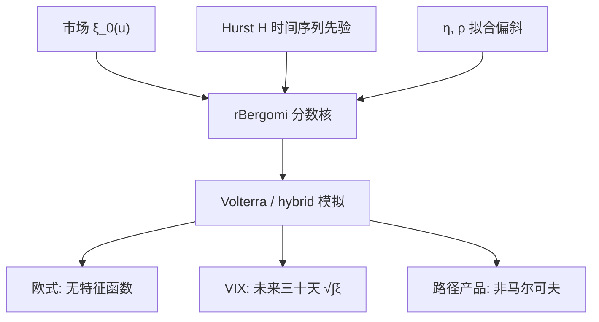

# Rough Bergomi

    
把 Bergomi 远期方差曲线上的指数核换成分数核 $(T-t)^{H-1/2}$，瞬时方差的路径正则性掉到 Hurst 指数 $H$；短端偏斜因此可以很陡，却不必另加跳跃，也不必把长端 vol-of-vol 一起抬高。

    <footer>—— Bayer, Friz and Gatheral, Pricing under rough volatility, Quantitative Finance, 2016</footer>

[粗糙波动](/quant/rough-vol) 写的是经验尺度律：已实现对数波动的增量方差按 $\Delta^{2H}$ 缩放，$H$ 落在 $0.1$ 附近。[Bergomi](/quant/bergomi) 写的是对象：远期方差曲线 $\xi_t(u)$ 对每个到期是鞅，今日曲线从市场填入。Christian Bayer、Peter Friz 与 Jim Gatheral 把二者接到同一条定价规格上——粗糙 Bergomi（rBergomi）：保留曲线对象，只改驱动核。本篇写这一规格、高斯 Volterra 模拟与分层校准，不把 Gatheral–Jaisson–Rosenbaum 的回归再做一遍，也不把两因子指数核的推导重写；[Heston](/quant/heston) 的仿射特征函数在这里用不上。

## 问题

经典一因子 Bergomi 的核 $e^{-k(T-t)}$ 在 $T\downarrow t$ 处有界。要把两周偏斜做陡，只能抬整个曲线的 vol-of-vol，一年方差互换就会被搅过头；两因子把能量按期限切开，但仍是半鞅扩散，短尺度正则性是 $H=1/2$。市场短端偏斜的爆破速度要求更糙的核。问题是：能否在**不破坏**「每个 $\xi_t(u)$ 为鞅、今日 $\xi_0$ 等于市场」的前提下，把核换成分数的，并使欧式与 [VIX 期货](/quant/vix-futures) 仍可计算。

Bayer–Friz–Gatheral 的回答是对数正态 Volterra：用一条分数布朗（Mandelbrot–Van Ness）驱动整条曲线，瞬时方差 $v_t=\xi_t(t)$ 几乎处处只 Hölder-$H$。可交易的价格过程仍是半鞅；非半鞅的是潜在方差路径。于是无套利定价不需要新的测度论，需要的是一条能模拟的高斯过程，以及不把 $H$ 交给香草去自由漂的校准纪律。

### 分数核如何同时服务短端与长端

核 $K(u,s)=(u-s)^{H-1/2}$ 在 $H\lt 1/2$ 时于对角线发散：刚刚发生的冲击对近端 $\xi$ 极度敏感，远端核平方可积、冲击被稀释。同一 $\eta$ 因而可以同时给出陡的短偏斜与相对平静的长方差——这是一因子 rBergomi 相对两因子经典 Bergomi 的结构性优势，不是「少了一个因子却多了一个字母」。Fukasawa 把短端偏斜对 $\sqrt{T}$ 的发散阶与 $H$ 连起来：Heston 有效 $H=1/2$，短端永远嫌不够陡；把 $H$ 放到 $0.1$，阶就对上了。

rBergomi 不是「Heston 加上分数布朗」。Heston 的状态是一维马尔可夫 CIR；rBergomi 的状态是整条曲线加一条非马尔可夫噪声。没有 Riccati，也没有 Feller 条件可检查。把五参数习惯套过来，会把 $\xi_0$ 误当成 $v_0$。

## 方法

令 $\xi_0(u)$ 由市场方差互换或香草条带输入，见 [方差互换复制](/quant/var-swap-replication)。风险中性下

$$
\xi_t(u)=\xi_0(u)\exp\Biggl(\eta\sqrt{2H}\int_0^t (u-s)^{H-1/2}\,\mathrm{d}W_s-\frac{\eta^2}{2}\bigl[u^{2H}-(u-t)^{2H}\bigr]\Biggr),
$$

现货 $\mathrm{d}S_t/S_t=\sqrt{\xi_t(t)}\,\mathrm{d}Z_t$，$\mathrm{d}\langle W,Z\rangle=\rho\,\mathrm{d}t$。指数里的积分是对 Volterra 核的 Wiener 积分：固定 $t$，映射 $u\mapsto\log\xi_t(u)$ 是高斯场，协方差由核的 $L^2$ 内积给出。对角线 $u=t$ 给出瞬时方差；定价欧式只需这条对角线的积分，定价 VIX 还需要未来三十天线的积分。

**模拟。** 一次生成一组基准到期上的高斯向量，Cholesky 或 circulant 嵌入分解协方差，再取指数。Bayer–Friz–Gatheral 给出混合布朗方案：把核在每个时间步拆成「奇性近端」与「光滑远端」，近端用精确的高斯增量，远端用左点或混合 Riemann。后续 Bennedsen–Lunde–Pakkanen 的 hybrid scheme 把这一拆法标准化，弱收敛阶高于朴素 Euler。步长、基准到期与核截断必须与校准规格绑定：香草用细核、障碍用粗核，会制造假的模型风险。

**校准分层。** $\xi_0$ 不参与香草最小二乘。$H$ 优先用已实现方差的尺度律钉住或放在窄先验（例如 $[0.05,0.15]$）；$\eta,\rho$ 拟合偏斜期限结构。把 $H$ 完全交给香草，优化器会把它推向短端过拟合，与时间序列冲突。这与经典 Bergomi「曲线给方差、相关给偏斜」同一纪律，只是多了一个不可自由漂的正则性参数。

### 与粗糙 Heston、经典 Bergomi 的计算分工

粗糙 Heston（El Euch–Gatheral–Rosenbaum）用分数 Riccati 恢复特征函数，欧式可走 [Carr–Madan](/quant/carr-madan) 一类积分，适合要快速重定价的香草账；方差曲线形状被仿射结构锁住，不如 rBergomi 自由。经典两因子 Bergomi 在长端、方差账上仍常用，因为指数核便宜、对冲桶是「短方差 / 长方差」交易员语言。生产折中常见：短端用 rBergomi 或跳解释陡偏斜，长端用经典 Bergomi 或 [局部随机波动](/quant/local-stoch-vol) 补香草残差。不要指望一条 rBergomi 同时取代 Heston 校准速度与 Bergomi 曲线叙事。

## 机制

分数布朗 $W^H$ 的协方差使短间隔增量均方正比于 $|\Delta|^{2H}$。注入 $\log\xi$ 之后，$v_t$ 的二次变差在无穷小尺度上比半鞅更凶。对冲意义上，Gamma 误差不再是经典的 $\tfrac12\Gamma S^2(\sigma^2-\sigma_{\mathrm{imp}}^2)\Delta t$ 加上普通离散项：方差本身的粗糙性要求更短的再平衡，才能达到与 Heston 相同的残差——这与 [Gamma scalping](/quant/gamma-scalping-pnl) 的 PnL 恒等式兼容，只是「已实现」那一侧更噪。聚类（日、周自相关为正）与粗糙（无穷小正则性）不是同一句话；可以同时有糙的短路径与慢的长因子。

无套利要求可交易资产为半鞅。rBergomi 把方差互换曲线写成鞅 $\xi_t(u)$，现货写成 $v_t$ 驱动的积分，价格仍半鞅。攻击的是马尔可夫扩散习惯，不是风险中性定价。这也解释了为何不能对 $W^H$ 本身做 Itô 交易：$H\neq 1/2$ 时它不是半鞅，可交易的是 $\xi$ 与 $S$。

### 模拟规格即模型规格

奇性核的离散化会改变短端偏斜的数值。把 hybrid 的近端窗口、时间步、以及 $\xi$ 在 $T\to 0$ 的正则化当成「实现细节」而不写进模型卡，等于每个引擎各有一个 rBergomi。障碍、cliquet、VIX 凸性对短核尤其敏感：同一组 $(H,\eta,\rho)$ 在两种离散下可以给出不同的路径产品价格，香草却都还能对上——识别再次落在非香草上，与 LSV 的弱识别是同一类病。

$\eta$ 是分数核的水平，不是 Heston 的 vol-of-vol $\sigma$。量纲随 $H$ 变：比较「rBergomi 的 $\eta$ 与 Heston 的 $\sigma$」没有意义，能比的是它们产生的短端偏斜与 VIX 凸性。

## 边界与工程取舍

欧式没有仿射闭式，校准循环比 Heston 重一个数量级。Wiener 混沌、核回归与深度学习代理可以加速，但生产上仍应保留一条可复现的 hybrid 模拟作为对账金标准。物理测度的 $H$ 与风险中性的 $H$ 不必相同，尽管经验上常接近；中间隔着波动率风险溢价。用历史 $H$、定价 $\eta$，要在报告里写清两个测度。

有跳时短端 $\xi_0$ 已混进跳补偿，连续 Volterra 会把跳质量误读成更糙的 $H$ 或更大的 $\eta$。跳跃与粗糙可以叠加，识别必须用路径产品或已实现跳检验，不能单靠香草。分数布朗在 $H\neq 1/2$ 时不能当对冲工具；Delta 对冲的是 $S$，曲线对冲的是 $\xi$ 的桶，与经典 Bergomi 相同，只是核变了。

出处不要写成「Gatheral 2018 发明了 rBergomi」。2016 年 Bayer–Friz–Gatheral 是定价与数值；2018 年 Gatheral–Jaisson–Rosenbaum 是尺度律。Mandelbrot–Van Ness 给出 $W^H$；Comte–Renault 把它接到光滑侧（$H\gt 1/2$）。

用 rBergomi 给 VIX 定价时，标的是未来三十天方差的平方根。分数核对近端凸性极敏感，Heston 均值回复会系统性低估这一凸性——这是引入粗糙核的交易动机之一，而不只是为了贴两周 25-delta。

## 小结

- rBergomi 保留 Bergomi 的远期方差鞅，把指数核换成 $(T-t)^{H-1/2}$；今日 $\xi_0$ 仍来自市场方差曲线。
- 欧式与 VIX 靠高斯 Volterra / hybrid 模拟，没有 Heston 式特征函数。
- $H$ 用时间序列锚定，$\eta,\rho$ 拟合偏斜；把 $H$ 当普通香草参数会与尺度律冲突。
- 一因子分数核可同时服务陡短偏斜与平静长方差，这是相对两因子指数核的结构优势。
- 模拟规格（步长、近端窗口、短端正则化）属于模型定义，须与定价引擎绑定。
- 出处：Bayer, Friz and Gatheral, *Quantitative Finance*, 2016；经验尺度见 Gatheral, Jaisson and Rosenbaum, 2018；曲线对象见 Bergomi；对照 Comte and Renault, 1998。
