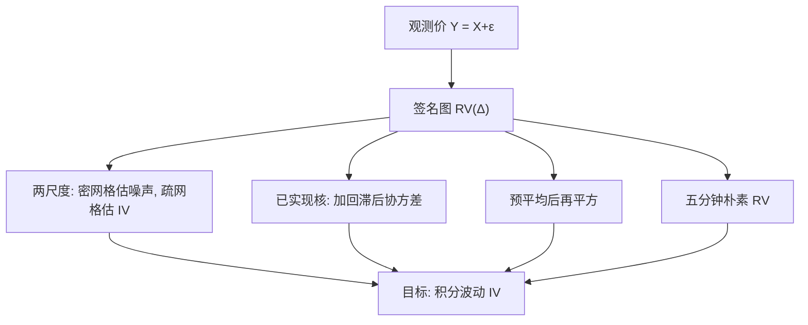

# 已实现波动与噪声修正

    
没有微观结构噪声时，把日内收益平方加总，会收敛到积分波动；有噪声时，同一加总会被采样次数乘以噪声方差带走，必须换估计量。

    <footer>—— Barndorff-Nielsen and Shephard, Econometric Analysis of Realized Covariation, Econometrica 2004；噪声修正见 Zhang, Mykland, Aït-Sahalia 与已实现核文献</footer>

有效价格若是半鞅，二次变差是波动的自然对象。把一天切成很多段，把段收益平方相加，得到**已实现波动**（realized variance, RV）。Barndorff-Nielsen 与 Shephard 给出它在无噪声、充分高频下的渐近理论，并推广到已实现协方差、双幂次变差（跳跃稳健）。一旦承认 [微观结构噪声](/quant/microstructure-noise)，朴素 RV 不再一致。Zhang、Mykland 与 Aït-Sahalia 的两尺度 RV，Barndorff-Nielsen、Hansen、Lunde 与 Shephard 的已实现核，Jacod 等人的预平均，都是在同一问题上换估计量，而不是把数据改成低频就结束。本篇写 RV 的对象、噪声如何破坏它、以及三类修正如何把对象找回来。

## 问题

记有效对数价格 $X$ 在 $[0,1]$ 上的积分波动 $IV=\int_0^1 \sigma_u^2 du$。无跳跃、无噪声时，网格 $\Delta=1/n$ 上的

$$
\mathrm{RV}_n=\sum_{i=1}^{n}(X_{i\Delta}-X_{(i-1)\Delta})^2 \ \xrightarrow{p}\ IV.
$$

观测的是 $Y=X+\varepsilon$。上一篇给出 $\mathbb{E}[\mathrm{RV}(Y)]\approx IV+2n\sigma_\varepsilon^2$。$n$ 越大，偏差越大。实务上的「五分钟 RV」是一种带宽选择：把 $n$ 降到噪声尚未吞噬 $IV$ 的量级，用偏差换方差。它对流动性好的股票大致能用，对 tick 占波动很大的标的、对要拿一分钟信息的人不够。

还要处理跳跃。二次变差含连续部分加跳跃平方和。Barndorff-Nielsen–Shephard 的双幂次变差在有限次跳跃下仍估连续 $IV$，与 RV 之差可检验跳跃。噪声同样会破坏双幂次。问题是：在噪声与可能的跳跃并存时，对哪一个对象（二次变差、连续 $IV$、噪声方差）做一致估计。

### 签名图决定你站在哪一段

横轴用采样间隔，纵轴用 RV。无噪声应大致水平（再加一点有限样本方差）。有噪声则向高频上翘。选择五分钟，等于在签名图上找一个「看起来平」的点，而不是从模型推出的最优 $n$。最优采样依赖于 $IV/\sigma_\varepsilon^2$，会随日、随股票变。固定五分钟是工程默认，不是估计理论的终点。

RV 是方差，不是标准差；年化波动通常再开方并乘 $\sqrt{252}$。比较论文时先看单位：日方差、年化标准差、是否含隔夜。隔夜收益常单独一项加进日 RV，见 [日历效应与隔夜](/quant/calendar-overnight)。混用开盘到收盘 RV 与收盘到收盘波动，会把隔夜风险藏进误差项。

## 方法

**两尺度已实现波动（TSRV）。** Zhang, Mykland, Aït-Sahalia（2005）用一个很密的 RV 估噪声：密网格上 $\mathrm{RV}^{\mathrm{all}}/ (2n)$ 逼近 $\sigma_\varepsilon^2$。再用稀疏网格（或平均多个错开的稀疏网格）得到受噪声污染较小的 RV，然后减去噪声项。稀疏平均降低方差，密网格识别 $2n\sigma_\varepsilon^2$。它要求噪声接近 i.i.d.；相关噪声下减过头或减不够。

**已实现核（realized kernel）。** Barndorff-Nielsen, Hansen, Lunde, Shephard 把 RV 换成收益的加权自相关和，类似 HAC：

$$
K=\gamma_0+\sum_{h=1}^{H}k\left(\frac{h}{H}\right)(\gamma_h+\gamma_{-h}),
\qquad \gamma_h=\sum_i r_i r_{i-h}.
$$

核函数 $k$ 与带宽 $H$ 决定把多强的短滞后协方差——噪声的来源——扣掉。平坦顶核等满足渐近无偏的条件。实务上带宽随噪声水平自适应，数据必须先 [清洗](/quant/tick-cleaning)。

**预平均（pre-averaging）。** Jacod、Li、Mykland、Podolskij、Vetter 等把局部窗口内的 $Y$ 先平均，压低 $\varepsilon$，再对预平均增量平方求和并做偏差修正。直觉：噪声近 i.i.d. 时平均以 $1/k$ 降方差，有效价格在短窗内近似线性。窗长是另一类带宽。

### 跳跃稳健与多元

双幂次 $\sum |r_i||r_{i+1}|$ 对有限跳跃稳健，对噪声不稳健。噪声修正与跳跃稳健可以组合，但渐近更重，有限样本要靠模拟校准。多元时，不同股票不同步成交，朴素已实现协方差还有对时偏差，见 [不等间隔采样](/quant/irregular-sampling) 的 refresh time 与 Hayashi–Yoshida。核与预平均都有多元版本；不要在未同步的价格上直接套一元 TSRV。

## 机制

朴素 RV 把每一笔 $\Delta Y=\Delta X+\Delta\varepsilon$ 平方。交叉项在独立噪声下期望为零，$\Delta\varepsilon$ 的平方和随笔数涨。TSRV 的机制是用两个不同 $n$ 的方程解两个未知数 $IV$ 与 $\sigma_\varepsilon^2$。核的机制是：噪声使相邻收益负相关（Roll 指纹），把 $\gamma_1$ 等滞后项加回去，抵消 $\gamma_0$ 里多出来的 $2\sigma_\varepsilon^2$。预平均的机制是线性滤波先降噪，再当近似无噪声的 RV，并修正滤波给 $X$ 带来的偏差。

三者都在偏差–方差前线上选点。带宽太短（或稀疏网格仍太密）则剩余噪声；太长则把 $X$ 的短时波动也平滑掉，IV 偏低，对开盘那种日内季节性尤其明显。没有「永远最好」的修正，只有与噪声结构匹配的修正。

把采样降到五分钟，也是一种核：矩形核、带宽五分钟。它实现简单、易于复现，所以仍是经验资产定价里最常见的 RV。高频交易研究若关心盘中风险，五分钟会丢掉你恰好想要的分辨率，这时才值得上 TSRV 或核。

### 对象必须写清

报告「已实现波动」应写：是否噪声修正、是否含跳跃、是否含隔夜、采样网格、是否用中点还是成交价。中点 RV 噪声较小，但不是可交易收益的波动。成交价 RV 对应执行路径。用中点估 IV 再拿去给期权对冲，要知道对冲误差来自 $Y$ 而不是 $X$。双幂次剔除跳跃后的 IV 更适合连续对冲假设；总二次变差更适合方差互换一类产品。

## 边界与工程取舍

修正方法假定噪声结构。独立加性噪声下 TSRV 干净；序列相关噪声要用核或预平均，并选对能容纳相关长度的带宽。圆整噪声是离散的，小价格股票上高斯假设差。异常成交未清洗时，任何带宽都会把错价平方进去——先管道，后估计量。

不要把年化后的 RV 标准差直接当期权隐含波动的无偏预测：还要风险溢价、跳跃溢价、隔夜。不要在跨日拼接的网格上做核，把隔夜一个大跳当成噪声滞后。不要用同一带宽打全部股票：流动性差的标的需要更宽的核。计算上，核的 $H$ 随 $n$ 涨，逐日全市场扫描要预算时间；五分钟 RV 仍是横截面的工作马。

Barndorff-Nielsen–Shephard 的渐近分布（RV 的条件正态、可行的标准误）在无噪声或已修正后才能当置信区间用。把朴素一分钟 RV 配上无噪声公式的标准误，区间会假窄，因为主项是噪声而不是 $IV$ 的估计误差。

## 小结

- 无噪声时 RV 一致估积分波动；有 i.i.d. 噪声时偏差 $2n\sigma_\varepsilon^2$，签名图高频上翘。
- 五分钟 RV 是把 $n$ 降到噪声可忍受处；TSRV、已实现核、预平均是在更高频上恢复 $IV$。
- 核用 Roll 型负自相关抵消噪声；TSRV 用双尺度解 $IV$ 与 $\sigma_\varepsilon^2$；预平均先滤波。
- 须写清对象：是否含跳跃与隔夜、中点还是成交价、带宽如何选。
- 先清洗与异常处理，再谈修正；相关噪声与不同步成交要换多元方法。
- 出处：Barndorff-Nielsen and Shephard 关于已实现波动与协变差的工作（Econometrica 2004 等）；Zhang, Mykland, Aït-Sahalia, *A Tale of Two Time Scales*, Journal of the American Statistical Association 2005；Barndorff-Nielsen, Hansen, Lunde, Shephard 已实现核系列。
