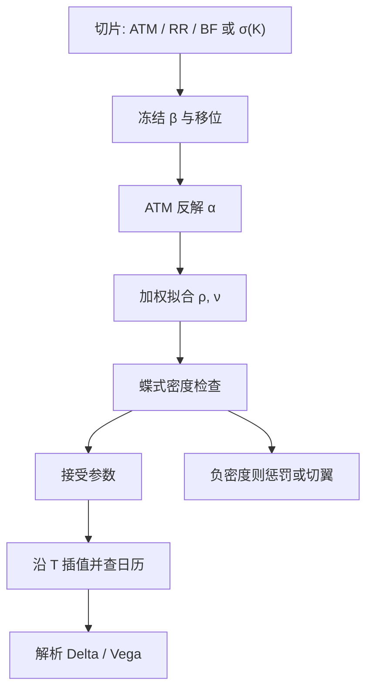

# SABR 校准

    
Hagan 公式把 $\alpha,\beta,\rho,\nu$ 映射成一条到期的 Black 或正态微笑；校准是这条映射的反问题：在识别约束与无套利约束下，从市场切片解出可对冲的参数，而不是再解一遍二维 SDE。

    <footer>—— Hagan, Kumar, Lesniewski and Woodward, Managing Smile Risk, Wilmott, 2002</footer>

[上一课](/quant/cgmy)用四参数 tempered stable 刻画纯跳 Lévy，欧式走傅里叶；独立增量决定了期限结构与无聚类，精细结构估计不能替代 Heston/Bergomi 的动态。[SABR](/quant/sabr) 已经写出 CEV 远期乘随机 $\alpha$ 的摄动公式。缺口是反问题：给定 ATM、风险逆转与蝶式，冻哪些、解哪些、目标用价格还是波动。本课写这一校准，不重推 CGMY 的 $\Gamma(-Y)$，也不替代 Dupire 的整张局部波动表。按到期独立校准后再插值参数，与 Heston 全局五参数不是同一类问题。

## 问题

单到期市场提供的有效方程少于四个自由参数。外汇常报 ATM、25Δ RR、25Δ BF，只有三个数；利率上限/互换期权有时更密，但 $\beta$ 与 $\rho$ 仍然共线——二者都制造偏斜。无约束的最小二乘可以把 $\beta$ 推到 0 或 1 的边界、用 $\rho$ 去补，次日再翻过来，对冲比跟着跳。校准要先变成有约束的识别问题：通常冻结 $\beta$（或按历史回归估一个杠杆），用 ATM 反解今日 $\alpha$，再用 RR/BF 或整条切片拟合 $\rho,\nu$。问题是这套启发式在 Hagan 近似的有效域内是否稳定，以及翼部无套利被破坏时该惩罚参数还是该换公式。

第二个问题是期限：原文摄动针对固定 $T$。每个到期单独校准得到 $\alpha(T),\rho(T),\nu(T)$，再插值。插值必须让日历价差不出现明显套利，且参数路径要光滑到足以算 Vega 桶。这与 Heston 五个全局参数贴整张面不同：SABR 校准默认是「按切片的微笑管理」，不是单一二维扩散的极大似然。

### 为何冻 $\beta$ 而不是冻 $\rho$

$\beta$ 进入 CEV 杠杆 $F^{\beta-1}$，对冲的现货弹性随 $\beta$ 变；$\rho$ 是相关，管的是波动冲击与远期冲击的同时移动。市场惯例（对数百分数 vs 正态 bp）往往已经暗示 $\beta$ 靠近 1 或 0。冻 $\beta$ 等于选定报价坐标系里的骨干，让 $\rho$ 去吸收剩余偏斜，日与日之间 $\rho$ 可比。冻 $\rho$ 而每天重估 $\beta$，骨干每天改，Delta 惯例跟着漂。利率上常见 $\beta=0.5$ 作为折中；外汇上 $\beta=1$ 配移位。识别策略应写进参数日志，否则后验「$\rho$ 的时间序列」不可比。

用 ATM 隐含波动直接当 $\alpha$，等于忽略 Hagan 公式里 $\nu^2 T$ 与 $\rho\nu$ 对 ATM 的修正。$\nu$ 大或 $T$ 长时，$\alpha$ 与 ATM vol 可差一个不可忽略的凸性项。校准应解那一个非线性标量方程，而不是赋值。

## 方法

标准流程：（1）选定 $\beta$ 与模型（Black SABR / 正态 / 移位）；（2）对每个到期，用 ATM 公式反解 $\alpha\gt 0$；（3）在 $(\rho,\nu)\in(-1,1)\times(0,\nu_{\max})$ 上最小化加权误差。权重常用 Vega 或按 Delta 桶：ATM 与 25Δ 权重大，远翼权重小，以免 $\nu$ 被没有流动性的 10Δ 拉爆。目标用隐含波动通常比用价格稳定——深虚值价格接近内在值，绝对价格误差不敏感，波动误差才看得见翼。若坚持价格目标，应除以 Vega 做成近似波动残差。

Hagan 领头项在远翼可能给出向下弯的微笑甚至负密度。校准器应在每次试参数时用有限差分检查蝶式 $\partial_{KK}C$，或用 Gatheral 的密度公式在对数执行价网格上扫。一旦密度为负，该组 $(\rho,\nu)$ 应被罚掉，而不是输出「拟合最好但不可交易」。Obloj、Paulot 或高阶 Hagan 展开可以扩大有效域，但校准流程本身不变：仍是反演微笑，只是正映射换了。

### 跨到期与参数插值

得到离散到期的 $\alpha_i,\rho_i,\nu_i$ 后，沿 $T$ 插值。$\alpha(T)$ 应与 ATM 期限结构一致，不能独立拉一条更光滑的线而让 ATM 错开。$\rho,\nu$ 宜用对 $T$ 缓慢的样条，并检查相邻到期的日历：总方差 $T\sigma_{\mathrm{B}}(K,T)^2$ 对 $T$ 递增（适当定义下）。参数跳得比微笑跳得更凶，说明识别不稳而不是市场真的每天换相关。另一种做法是对 $\rho,\nu$ 做期限结构参数化（指数衰减到长期值），减少每个切片的自由，牺牲单日贴合换稳定性。

移位 SABR：远期换成 $F+s$，负利率下 $s$ 使支撑离开零。$s$ 通常外生（按货币的公认移位），不与 $\alpha$ 同时估，否则与 $\beta$ 三重共线。正态 SABR 直接对 $F$ 做绝对扩散，校准目标改为 Bachelier 波动。不要把 Black 参数未经换算接到正态报价上。

## 机制

正映射是摄动：参数空间的一个点变成一条 $\sigma_{\mathrm{B}}(K)$。校准是局部线性化这个映射的高斯–牛顿或单纯形。Jacobian 里 $\partial\sigma_{\mathrm{B}}/\partial\alpha\gt 0$ 近似平移，$\partial/\partial\rho$ 是斜，$\partial/\partial\nu$ 是凸。共线表现为 Jacobian 的小奇异值：$\beta$ 与 $\rho$ 方向接近时，海森病态，步长必须阻尼。这就是冻 $\beta$ 的线性代数理由。

对冲用的是校准后的参数再对公式求导。若今日用翼部把 $\nu$ 抬高去贴 10Δ，ATM Vega 与 vanna 会被同一 $\nu$ 污染。校准权重其实是在选「哪些希腊字母可信」：重权 ATM/25Δ 等于相信对冲在这些桶，不相信远翼的 $\nu$。这与 Dupire 用整张面决定 $\sigma_{\mathrm{loc}}$ 不同：SABR 校准默认放弃远翼的完全拟合，以保护 ATM 动态。

### 与 Heston 校准不要混目标

Heston 用特征函数对许多到期联合最小二乘，$v_0$ 与 $\theta$ 分担短长端。SABR 每个 $T$ 一套 $(\alpha,\rho,\nu)$，没有跨期的单一 $v$ 过程（除非另建动态 SABR）。把各到期 SABR 参数平均，得不到一个能给奇异产品定价的二维扩散。奇异产品若要用 SABR 动态，必须指定跨期如何把 $\alpha_t$ 连成过程，那超出按切片校准。反过来，不要指望五参数 Heston 在每个外汇 Delta 桶上都达到 SABR 的贴合精度——那不是它的设计目标。

加权最小二乘的权重若随行情每天改（例如按当日成交），参数时间序列会混进权重政策。生产上应固定一套 Delta 权重，另报未加权翼部残差，而不是把政策藏进「今日最优 $\nu$」。

## 边界

领头项公式不是无套利参数化。校准成功只表示在选用的 $K$ 网格上波动误差小，不表示密度为正、不表示可以外推到 5Δ。长到期、大 $\nu$ 时摄动误差本身大于市场买卖价差，这时应降低对翼的权重或改数值 SABR，而不是继续加参数。2002 年论文不讨论负利率；移位与正态是市场后来的工程层。

联合校准所有到期的 $(\beta,\rho)$ 全局唯一，会破坏「每条微笑独立管理」的初衷，也很少稳。SABR 校准的交付是可复现的参数与对冲比，外加翼部与日历的检查表。它不是随机波动的统计估计，参数没有物理测度解释。

Hagan 等人给的是微笑风险的管理框架。校准器输出的 $\nu=150\%$ 若只为了 10Δ，通常意味着模型或流动性已经离开公式的舒适区，应切翼，而不是把它当成 vol-of-vol 的真值。

## 小结

- SABR 校准是 Hagan 映射的反问题：冻 $\beta$，ATM 解 $\alpha$，加权拟合 $\rho,\nu$，并检查密度与日历。
- $\beta$ 与 $\rho$ 共线，冻 $\beta$ 是识别策略，也固定对冲的杠杆惯例。
- 目标用隐含波动（或价格/Vega）保护 ATM；远翼权重要限制，以免 $\nu$ 爆炸。
- 按到期独立校准后再插值参数，与 Heston 全局五参数不是同一类问题。
- 领头项可在翼部破坏无套利；负密度应惩罚或换展开，而不是当最优解输出。
- 出处：Hagan, Kumar, Lesniewski and Woodward, *Wilmott*, 2002；曲面无套利见 Gatheral；移位/高阶展开为后续市场实践。
