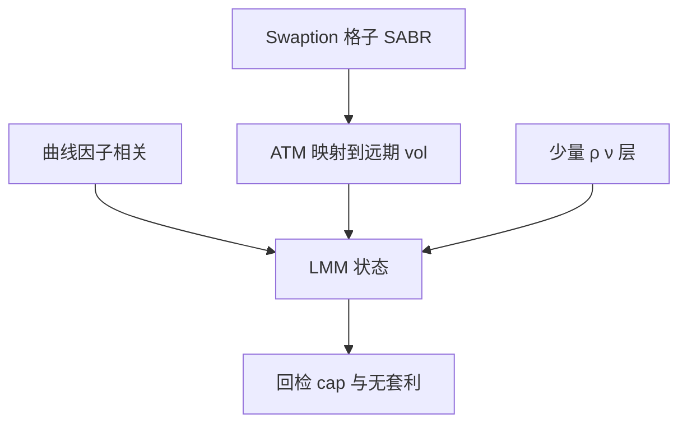

# SABR 对 LMM 校准

每个 swaption 格子一个 SABR，只保证该格子的微笑；LMM 要的是整条远期曲线的动态同时重现这些微笑，而不能破坏远期之间的相关。

<footer>—— Hagan, Kumar, Lesniewski and Woodward, Managing Smile Risk, Wilmott, 2002；Rebonato 对 LMM 校准的论述</footer>

[上一课](/quant/caps-floors-swaptions)给出 cap 与 swaption 两张网。主干 [SABR](/quant/sabr) 与 [SABR 校准](/quant/sabr-calib)、[LMM](/quant/lmm) 已分写。缺口是**把微笑装进 LMM**：不是再推 SABR 公式，而是期限结构模型如何吸收按格子校准的 $\alpha,\rho,\nu$，以及为什么「每个互换一个 SABR」加不起来等于一个无套利 LMM。

## 问题

市场习惯：对每个 $(T_{\mathrm{exp}},T_{\mathrm{tenor}})$ 的 swaption 拟合 SABR，得到该互换率的微笑。LMM 的状态是一向量远期 $L_i$，瞬时协方差决定所有互换率的动态。问题是过度识别：格子数目远大于合理的因子数，精确重现所有 SABR 微笑会破坏无套利或把远期 vol 变成不稳定的尖刺。校准必须正则化——与 [校准正则化](/quant/calibration-regularization) 同一逻辑，对象换成远期 vol 曲线与相关结构。

Rebonato 的近似：互换率波动是远期波动的加权，权重冻结。于是可以把 SABR 的 ATM $\alpha$ 映射成 LMM 的瞬时 vol 函数，再尽量拟合 $\rho,\nu$ 到因子的随机波动或位移。不能把每个格子的 $\nu$ 都当独立状态。

### 相关结构是第一约束

LMM 的因子相关决定曲线形态风险（与 cap/swaption 的差）。若为了拟合翼部而让远期 vol 乱跳，相关校准会跟着重拟合噪声。顺序应是：先因子数与相关（PCA 式的曲线因子），再 ATM vol 期限结构，再微笑（SABR $\rho,\nu$ 或随机 vol 层），每层带隔日罚。

SABR 的 $\beta$ 在利率里常取 0.5 或 0，与负利率移位耦合。$\beta$ 与移位不要同时自由，否则识别崩溃。

## 方法

(1) 用历史或隐含 PCA 定 LMM 因子数与相关。(2) 用 swaption ATM 校准时间依赖的远期 vol，Rebonato 权重。(3) 用 SABR 微笑校准随机 vol 或局部位移参数，只保留少量期限依赖。(4) 检查 caplet 剥离是否在容差内，否则加 cap 权重或承认模型带。(5) 全局搜索只在低维层，局部 LM 在 vol 曲线层，见 [全局优化](/quant/calibration-global-opt)。

对冲仍用市场 SABR 桶（按格子），模型内的远期 vol 敏感度要映回格子，否则交易员无法下单。

## 机制

SABR 是单标的微笑的局部参数化；LMM 是曲线的无套利动态。前者是报价坐标，后者是状态变量。校准是从坐标到状态的反问题，不适定。正则化等于承认曲线只有少数因子，微笑的 $\nu$ 是加在因子上的一层，而不是每个格子一个随机源。

## 边界

精确拟合所有翼部会导致明天校准崩溃。现金交割 swaption、RFR 复合与历史 Libor SABR 网格不兼容。模型风险：换因子数比微调某格子 $\nu$ 对账面影响更大，应进 Cont 区间。本课不发明新的 arXiv 校准算法。

## 小结

- 格子 SABR 是报价；LMM 是无套利动态；二者校准是正则化反问题。
- 先相关与 ATM，再少量微笑参数；对冲映回格子。
- $\beta$ 与移位不要同时自由识别。
- 出处：Hagan et al., *Wilmott*, 2002；Rebonato, *Modern Pricing of Interest-Rate Derivatives*。
