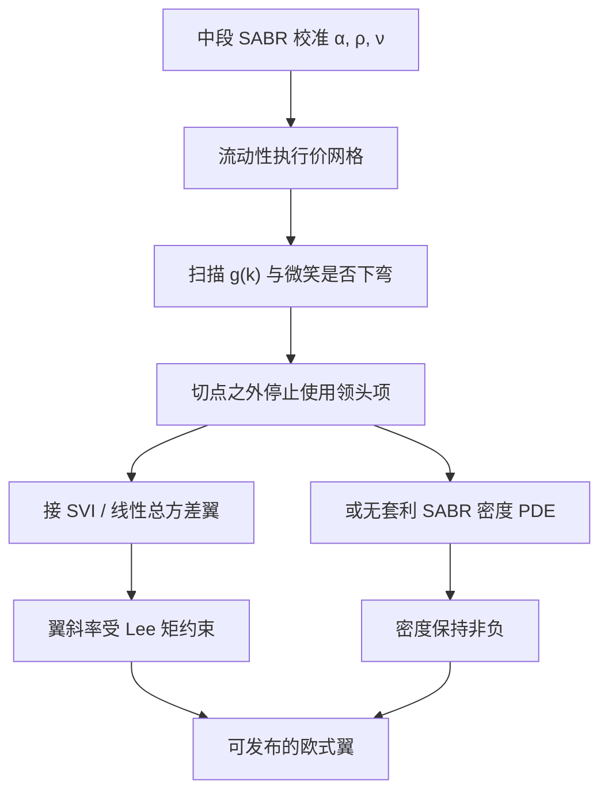

# SABR 翼部外推

    
Hagan 领头项在校准网格上可以很贴，却在远翼给出向下弯的隐含波动甚至负密度；外推因此不是把公式接着往外算，而是换一条落在无套利集合里的翼，或改用无套利密度再积分。

    <footer>—— Hagan, Kumar, Lesniewski and Woodward, Managing Smile Risk, Wilmott, 2002；无套利 SABR 密度见同一作者组后续工作，2014</footer>

[SABR](/quant/sabr) 的交付是固定到期上的摄动微笑，[校准](/quant/sabr-calib) 在 ATM 与 25-delta 附近把 $\alpha,\rho,\nu$ 对齐。交易与风控还要回答网格之外的执行价：数字期权的远翼、方差互换的 $1/K^2$ 积分、以及内部模型需要的宽支撑。Hagan、Kumar、Lesniewski、Woodward 2002 年的领头项在 $|\ln(K/F)|$ 大、$\nu\sqrt{T}$ 大时可以破坏凸性：隐含波动下弯，[Gatheral 密度核](/quant/gatheral-arb-free) $g(k)$ 变负。本篇写翼部为什么不能「接着用公式」、Lee 矩给的斜率上界、以及文献里两类公开修法——切断后接无套利参数化，或解简化的向前方程得到正密度。它不替代整张 [SVI](/quant/svi-ssvi) 曲面，也不把高阶展开当成无套利证明。

## 问题

领头项 $\sigma_{\mathrm{B}}(K)$ 是对真实 SABR 微笑的渐近近似，有效域大致是不太深的翼、不太长的到期、不太大的 vol-of-vol。校准器若只在流动性好的执行价上加权，最优 $(\rho,\nu)$ 可以使这些点的误差小于买卖价差，同时让更远的公式值在数学上非法。非法有两种可观测：$\sigma_{\mathrm{B}}$ 随 $|K|$ 下降以至于价格不再凸；或价格仍正但二阶差分变负。后者就是蝶式套利，对应负的风险中性密度。外推问题是：在公式已经离开有效域之后，如何定义 $\sigma_{\mathrm{B}}(K)$ 或 $C(K)$，使（1）与校准区间内的价格光滑衔接，（2）密度非负，（3）翼斜率不超过 Lee（2004）的矩约束。

直接继续调用 2002 年公式，三项里往往一项都不满足。Obłój 等改进的近似可以扩大一点有效域，但远翼仍不是存在性定理。Paulot 的高阶项同样是摄动，不是凸性保证。因此「更好的展开」与「无套利外推」是两件工作：前者减少校准网格上的偏差，后者保证网格外仍是合法的欧式表面。

### Lee 上界把线性翼钉死

对数货币性 $k=\ln(K/F)$，总方差 $w(k)=\sigma_{\mathrm{B}}^2(k)\,T$。Lee 的矩公式给出

$$
\limsup_{k\to+\infty}\frac{w(k)}{k}\le 2,
$$

左翼有对称陈述。线性增长的 $w$ 是许多随机波动模型的远翼行为，也是 [SVI](/quant/svi-ssvi) 的几何。若 SABR 公式在某 $k$ 之外开始下弯，隐含的 $w/|k|$ 会回头，密度更容易变负。外推的最小合法选择之一，是在某个切点改接一条斜率不超过 Lee 上界的直线（对 $w$），并检查衔接处的 $g(k)$。斜率取满 2 对应极厚的尾，方差互换会变得很贵；实务上常取更小的斜率，等于声明「我们不把全部矩风险标到无穷」。这是模型风险选择，应写进曲面文档。

用常数隐含波动接翼，等价于对数正态尾，矩全存在，但往往与校准区间的偏斜不衔接，蝶式在接头处出现尖刺。接的是 $w(k)$ 还是 $\sigma_{\mathrm{B}}(k)$，凸性含义不同；应在总方差上做线性，再反解波动，而不是在波动上做水平外推还自称无套利。

## 方法

切断加参数化。在流动性执行价上保留 SABR 校准值，在两侧切点之外改用 raw SVI 或 SSVI 切片，约束 $b(1+|\rho|)$ 使 $w$ 的渐近斜率合法，并扫描 $g(k)\ge 0$。接头要用价格或 $w$ 的一阶连续（最好二阶）以免 Delta、Vega 跳。这把「SABR 管可对冲的中段、SVI 管合法远翼」写成明确分工，与做市「中段用 SABR 语言、发布曲面用无套利参数化」的惯例一致。

密度修正。Hagan、Kumar、Lesniewski、Woodward（2014）以及相关的无套利 SABR 工作，把问题收成：在简化的向前 Kolmogorov 方程上求密度，保证正性，再积分得到欧式价格，反解波动。翼部由 PDE 的边界与扩散系数决定，而不是由领头项的代数外推决定。代价是每个到期要解一次一维 PDE，校准循环变重，但交付的是合法密度。Andreasen–Huge 一类方法在局部波动语境里也是「用正的向前方程长出价格」；精神相同，动态不同。生产上若已经用 Dupire 表吃整张面，SABR 只做微笑语言，翼部应交给无套利插值层，而不是再维护一套 SABR-PDE。

### 校准权重与外推不能互相拆台

若校准对 10-delta 给了很大权重，而 10-delta 已接近领头项的破裂区，最优 $\nu$ 会被非法翼拉走，中段对冲比跟着坏。正确顺序是：中段加权校准，翼部降权或干脆不进目标函数，然后**另外**做外推。外推参数（切点、Lee 斜率、SVI 的 $b$）应稳定，不随一日的脏翼报价跳动。报告要同时给出：校准残差（网格内）、接头位置、外推翼的 $g(k)$ 最小值、以及方差互换等对翼敏感的产品相对昨日的变动有多少来自外推规则而不是来自 ATM。

## 机制

摄动展开匹配的是小噪声下的局部几何：ATM 水平、偏斜、弯曲。远翼由大偏差控制，领头项没有义务在那里保持凸。市场报价在远翼稀疏、买卖价差宽，校准器若「看见」几个脏点，会用 $\nu$ 去拟合噪声，把非法性推得更远。外推的机制是承认：中段参数的信息含量到切点为止；切点之外用矩约束与正密度代替市场点。这与 [无套利插值](/quant/arb-free-iv) 的哲学相同，只是输入从离散香草变成了「SABR 中段 + 翼部先验」。

对冲含义。翼部产品的 Vega 桶若落在外推区，其 Delta、Vanna 由外推规则决定，不由 2002 年公式决定。规则一改，P&amp;L 解释就跳。因此翼规则是模型的一部分，版本要冻结，不能每日换切点去贴某个远翼经纪商报价。若远翼真的有可交易的流动性，应把切点外移并改用能在该处保持凸的方法（SVI 或密度 PDE），而不是把领头项的非法值当成市场。

### 正态、移位与右翼零吸收

$\beta=0$ 或移位 SABR 改变的是现货坐标的边界：利率可以非正，左翼的「零」被移走。右翼（极高执行价）的矩约束仍然存在。把 Black SABR 的外推规则原样接到 Bachelier 波动上，会把 Lee 的 $w(k)$ 定义弄错——正态模型的货币性与总方差要按 Bachelier 公式重写。移位参数 $s$ 很大时，左翼在对数坐标里看起来「不那么远」，非法性会改出现在另一侧。外推文档必须写坐标系：Black 的 $k$ 还是正态的 $K-F$。

方差互换、Corridor 方差、数字期权对翼的权重不同。同一条外推对香草可能「看不见问题」，对 $1/K^2$ 积分已经差一个价差。验收外推要用对翼敏感的标准产品，而不是只用 ATM 残差。

## 边界与工程取舍

2002 年论文管理的是微笑风险的中段语言。2014 年前后的无套利 SABR 是对密度正性的修补，不是把摄动变成精确解。SVI/SSVI 在单切片与跨期上更直接地接受 Gatheral 约束，常被用作发布层。选择 SABR 外推还是直接发布 SVI，取决于交易是否仍用 $\alpha,\beta,\rho,\nu$ 对话：利率与外汇做市往往保留 SABR 语言，股票指数香草更常直接 SVI。无论哪种，翼部都不能默认为「公式的自然延拓」。

长到期、高 $\nu$ 时，有效域可能缩到比 25-delta 还窄，此时应降低对该到期的 SABR 信任，改数值方法或换模型，而不是把切点越推越近还继续对外称 SABR 曲面。Obłój、Paulot 改善的是近似质量，验收仍以 $g(k)$ 与日历为准。

自动把负密度的执行价「删除」再校准，会让参数依赖删除规则，翼外推变得不可复现。应保留点、降权，并把删除规则写成配置，而不是当成数据清洗的隐形步骤。

## 小结

- Hagan 领头项的有效域在中段；远翼下弯或负密度时，外推必须换函数，而不是继续调用同一公式。
- Lee 矩给出总方差翼斜率的上界；在 $w$ 上线性衔接是最小合法先验之一。
- 实务两条路：切点接 SVI/线性翼，或用无套利 SABR 密度 PDE；校准权重不应包括已经破裂的翼。
- 翼规则影响方差互换与数字期权，必须版本化，并用对翼敏感的产品验收。
- 出处：Hagan, Kumar, Lesniewski and Woodward, *Wilmott*, 2002 与 2014 年无套利 SABR；Lee, *Mathematical Finance*, 2004；对照 Gatheral SVI 与 Obłój 等改进展开。
