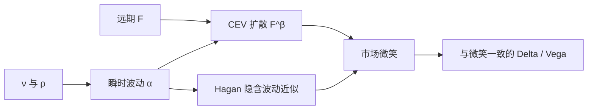

# SABR 模型

    
用随机波动率乘在远期的 CEV 扩散上，再对 Black 隐含波动率做奇异摄动，得到的显式近似足以管理微笑风险，而不必每次都解二维 PDE。

    <footer>—— Hagan, Kumar, Lesniewski and Woodward, Managing Smile Risk, Wilmott, 2002</footer>

利率与外汇的经纪商报价不是随机波动率的五个参数，而是每个到期的一条隐含波动率微笑，再加对冲用的 Delta 与 Vega。Patrick Hagan、Deep Kumar、Andrew Lesniewski 与 Diana Woodward 在 2002 年 *Wilmott* 的「Managing Smile Risk」里提出 SABR（Stochastic Alpha Beta Rho）：远期服从常弹性方差（CEV），瞬时波动率本身再做几何布朗运动，二者相关。模型的关键交付不是转移密度的傅里叶公式，而是一套对 Black（或 Bachelier）隐含波动率的渐近展开，使交易员能用 $\alpha,\beta,\rho,\nu$ 直接标记微笑，并一致地计算对冲比。它与 [Heston](/quant/heston) 同属随机波动，但 SABR 针对的是「给定到期、盯住远期」的微笑管理，而不是股票香草的全局曲面闭合定价。

## 问题

若每条微笑用独立的三次样条去插值，相邻执行价的对冲比会跳，日历价差与蝶式的无套利难以监控，参数也没有动力学含义。局部波动率能拟合一条微笑，但 Hagan 等人强调：局部波动率对冲时，微笑会朝与市场相反的方向移动——现货上涨，模型里的微笑往下掉，而市场往往一起上移。随机波动率可以纠正这种动态。需要的是尽量少的参数、对每个到期单独校准、以及不必数值求解就能从参数读出 Black 波动率。

CEV 已经能用 $\beta$ 在对数正态（$\beta=1$）与正态（$\beta=0$）之间选择杠杆；再让瞬时波动 $\sigma_t$（常记为 $\alpha$ 的过程）随机，并用 $\rho$ 产生偏斜、$\nu$ 产生弯曲，一条到期的微笑就有了交易语言。问题收成：在小波动、不太长的到期下，隐含波动率对状态的展开是否足够准，准到可以当报价公式用。

### 远期而不是现货

SABR 写在远期 $F_t$ 上。对给定到期 $T$ 的欧式，远期在定价测度下是鞅（忽略凸性调整与多曲线细节时），漂移为零，只剩扩散。这与利率上限、互换期权、外汇 RR/BF 的市场惯例一致：报价的是该到期的微笑，标的是对应远期。股票指数期权有时也按远期 SABR 来标记单到期，但跨到期必须另做期限结构，不能假设同一个 $\alpha$ 过程服务所有 $T$——原文的摄动是对固定 $T$ 的。

$\alpha$ 是今日的瞬时波动水平，不是 Black 隐含波动本身。ATM 附近二者接近，翼部由 $\beta,\rho,\nu$ 推开。把经纪商 ATM vol 直接当成 $\alpha$ 而不做 Hagan 公式反演，是常见的数量级错误。

## 方法

远期与瞬时波动满足

$$
dF_t = \sigma_t F_t^\beta\,dW_t, \qquad d\sigma_t = \nu\sigma_t\,dZ_t, \qquad dW\,dZ=\rho\,dt,
$$

今日 $\sigma_0=\alpha$，$F_0$ 为对应远期。$\beta\in[0,1]$ 常被冻结：利率上 $\beta=0.5$ 一类选择很常见，外汇上 $\beta=1$ 更接近对数正态。Hagan 等人用奇异摄动得到 Black 隐含波动率 $\sigma_{\mathrm{B}}(K)$ 的近似，领头项在 ATM 为

$$
\sigma_{\mathrm{B}}(F) \approx \frac{\alpha}{F^{1-\beta}}\left(1+\left(\frac{(1-\beta)^2}{24}\frac{\alpha^2}{F^{2-2\beta}}+\frac{\rho\beta\nu\alpha}{4F^{1-\beta}}+\frac{2-3\rho^2}{24}\nu^2\right)T+\cdots\right),
$$

对 $K\neq F$ 还有 $z/\chi(z)$ 一类因子，其中 $z$ 正比于 $\nu\alpha^{-1}\ln(F/K)$ 的 CEV 修正。正常模型（Bachelier）报价有平行的展开。交易员用这套公式从市场微笑解 $\alpha,\rho,\nu$（$\beta$ 给定），再对任意 $K$ 插值、外推。

### 参数与微笑形状

$\alpha$ 上下平移水平；$\beta$ 同时影响 ATM 杠杆与偏斜，与 $\rho$ 共线，故常固定 $\beta$ 只放 $\rho$；$\rho$ 管偏斜方向；$\nu$（vol-of-vol）管翼部弯曲。负 $\rho$ 让低执行价波动更高。到期 $T$ 进入展开的高阶项，因此同一套 $(\alpha,\rho,\nu)$ 不能自动服务另一个到期：每个期权到期通常单独校准，再把参数沿期限光滑，这是「SABR 曲面」的拼法，不是单一二维扩散的全局解。

## 机制

Hagan 公式的吸引力在于：对冲比可以对近似公式求解析导数，而不必对 PDE 做伴随。Delta 是否包含微笑随现货的移动（sticky strike / sticky delta / SABR 预测的 sticky 行为）会导致不同的对冲量。原文的论点正是：用与模型一致的动态去算 Delta，才能「管理微笑风险」，而不是把微笑当静态带子。SABR 预测的是：波动的随机部分让微笑有随远期平移的成分，CEV 杠杆又让水平依赖 $F^{\beta-1}$。

摄动是渐近，不是恒等式。极端翼部、很长到期、很大的 $\nu$，近似会变负或非单调，必须切翼、改用更好的展开（后来的 Hagan 高阶、Obloj、Paulot 等）或改回数值求解。负概率、无套利破坏出现在近似层，不一定出现在原始 SDE 里——原始 SABR 在 $\beta<1$ 时也能到达零，吸收性质另当别论。把市场翼部的无套利责任全部推给 2002 年领头项公式，是误用。

### 与 Heston 的使用场景差异

Heston 有仿射特征函数，适合股票香草曲面、方差相关产品、需要特征函数校准的场景。SABR 几乎没有好用的特征函数闭合（一般 $\beta$），却有交易员要的隐含波动率显式近似，适合利率/外汇按到期标记。二者都有相关与 vol-of-vol，但 SABR 的 $\beta$ 把局部杠杆从相关里拆出一截。不要用 Heston 的 $\sigma$ 去对 SABR 的 $\nu$ 做无换算比较，也不要把 SABR 单到期参数解释成能给奇异路径产品唯一价格——那需要指定完整的动态与测度，单到期微笑不够。

固定 $\beta$ 再校准 $\rho$，是识别策略，不是说 $\beta$ 在经济上不重要。$\beta$ 改变对冲的现货杠杆：$\beta=0$ 更接近正态点差，$\beta=1$ 更接近对数百分比。互换期权与上限的 Delta 惯例不同，要把报价惯例与 $\beta$ 一起声明。

## 边界

原文针对单一远期、单一到期的欧式。互换期权的底层是互换利率，上限是 LIBOR/期限利率，折现与投影在 [多曲线](/quant/multi-curve-ois) 下不是同一条；SABR 仍可标记投影远期的微笑，但定价要用正确的折现。CMS、障碍、美式提前行权超出领头项公式的担保范围。2008 年后负利率使对数正态 SABR 不适，市场改用移位 SABR 或正态 SABR，这是对原公式的扩展，应单独引用后续文献。

校准若放任 $\nu$ 极大去拟合远翼，ATM 的时间衰减与对冲会坏掉。翼部应用无套利密度检查：隐含密度为负说明近似或外推失败。Hagan 等人（2002）贡献的是微笑参数化与对冲哲学，加上一套广泛使用的摄动公式；它不是全局随机波动率的估计程序，也不是波动率曲面的无套利定理。

Wilmott 杂志论文不是期刊定理。公式被全市场采用，是因为它在报价速度与可微性上赢了；精度边界要靠后续数值与高阶展开来补，不能靠引用次数自动成立。

## 小结

- SABR（Hagan et al., 2002）在远期 CEV 上叠加对数正态随机波动，用 $\alpha,\beta,\rho,\nu$ 标记单一到期的微笑。
- 交付物是 Black/Bachelier 隐含波动的奇异摄动近似，便于插值与解析对冲，而不是 Heston 式特征函数。
- $\beta$ 与 $\rho$ 都影响偏斜，实务常冻结 $\beta$；$\nu$ 管弯曲，$\alpha$ 管水平。
- 近似在远翼与长到期会失效；负利率需移位或正态版本。
- 局部波动率的微笑动态与市场常相反，是原文主张随机波动对冲的动机。
- 出处：Hagan, Kumar, Lesniewski, Woodward, *Wilmott*, 2002；随机波动对照见 Heston, *RFS*, 1993；产品与希腊字母语境见 Hull。
