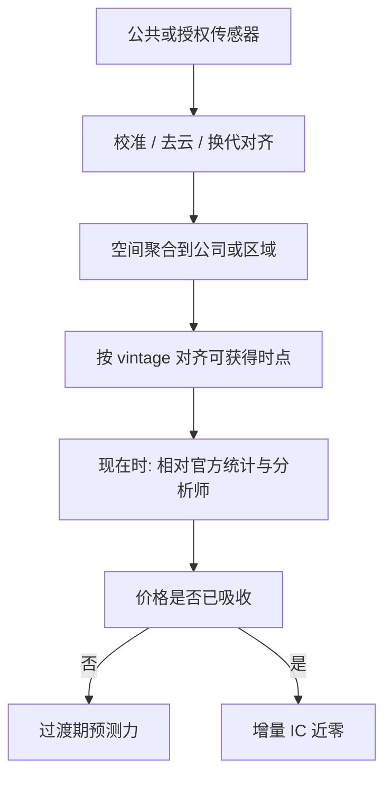

# 卫星与地理

夜灯强度在地面统计缺失或不可信时，仍与经济活动相关；它不是 GDP 的替代定义，而是从轨道上看到的、带测量误差的代理。

<footer>—— Henderson, Storeygard and Weil, Measuring Economic Growth from Outer Space, American Economic Review, 2012</footer>

[上一课](/quant/corporate-action-engine)把公司事件做成可回放流水。缺口换成场外观测：卫星与地理不是公司行动，是稀疏宏观代理。卫星与地理数据进入资产价格研究，靠的不是「从天上看到了秘密」，而是把本来稀疏、滞后的宏观与产业活动，变成更高频、可空间对齐的代理。Henderson、Storeygard 与 Weil（2012）用夜灯拟合经济增长，处理的是国民账户质量问题；Chen 与 Nordhaus（2011）在更宽的国家样本上讨论灯光作为经济统计代理的误差。Donaldson 与 Storeygard（2016）把卫星在经济学中的应用写成综述：农业、城市、冲突、环境与基础设施，共同点是**空间分辨率换时间分辨率**，以及必须处理云层、传感器更换与夜间灯光饱和。金融里的延伸——零售停车场、油罐阴影、农田 NDVI、港口与工厂热异常——是同一研究传统下的资产定价问题：代理是否在财报与官方统计**之前**进入价格，还是只是把已公开信息重新包装。本篇把卫星当研究输入来写：公开传感器与文献中的识别，而不是采集或再识别个人的路径。

## 问题

上市公司披露是低频、经过会计选择的；卫星是高频、带物理测量误差的。要把后者变成前者的预测，必须回答三件事。第一，代理的经济学：停车场车辆数为何对应零售同店、油罐浮顶高度为何对应库存、NDVI 为何对应单产。第二，测量：重访周期、云覆盖、分辨率、传感器世代（DMSP 到 VIIRS）是否使序列不可比。第三，信息集：信号在 $t$ 日对基金是否可获得，对市场是否已通过分析师、USDA、EIA 或同业渠道进入价格。Hong、Li 与 Xu（2019）表明气候风险在某些市场定价缓慢；Engle、Giglio、Kelly、Lee 与 Stroebel（2020）则从新闻构建气候对冲组合——卫星是物理侧，文本是叙事侧，二者都可能只是[宏观状态](/quant/macro-state-variables)的嘈杂观测。

地理单元与证券的映射不是一一对应。一家零售商的同店来自全国门店，停车场样本若偏向郊区大盒店，代理有选择偏差。油田与上市主体的权益结构、产量分成、对冲头寸会使「油罐满了」与股票收益脱节。问题是构建**可审计的空间到证券映射**，并承认映射误差是特征噪声，不是 alpha 的来源。

### 夜灯、NDVI 与设施影像不是同一种数据

夜灯（DMSP-OLS、VIIRS）适合区域活动与城市化，时间长、空间粗，饱和与溢出（blooming）已知。NDVI / EVI 适合植被与农业，受物候与灌溉管理驱动，和商品期货、农机与化肥产业链相关。高分辨率商业影像适合点状设施（停车场、矿山、港口堆场），频率与覆盖由供应商决定，研究中应把它当作**有授权的面板**，其样本期、修订与生存偏差必须写入论文式备忘录。Donaldson–Storeygard 强调：传感器更换会产生水平跳动，任何「从 2000 年到现在」的长样本都要做交叉校准，否则体制变化来自卫星而不是经济。

把停车场计数直接当营收预测，忽略了电商渗透、配送中心替代门店、恶劣天气改变停留时间。代理的结构断点往往发生在被预测变量之前，这是测量失效，不是市场无效。

## 方法

**公开宏观代理。** 夜灯与夜间灯光增长率可对齐到国家或区域，用于新兴市场、地方债与出口链的宏观因子，而不是单名微观 alpha。Henderson–Storeygard–Weil 的回归是灯光对增长，金融应用应把灯光当现在时（nowcast）输入，再问现在时误差是否预测债券利差或汇率，而不是直接横截面选股。

**农业与气候。** 作物带上的植被指数、土壤湿度与温度异常，对照 USDA WASDE、FAO 与期货期限结构。Addoum、Ng 与 Ortiz-Bobea（2020）用美国经营场所的温度冲击看销售额，说明气候物理量可以对齐到公司而不是只对齐到国家。识别应利用天气相对于单个公司决策的外生性，而不是利用「我们先看到了卫星」。商品研究里，Gorton 与 Rouwenhorst（2006）提醒期货溢价来自风险转移，不一定来自库存的高频观测；卫星库存若已被期限结构与 EIA 周报吸收，增量 IC 接近零。

**设施活动。** 文献中对零售与能源库存的卫星研究，核心设计是：空间聚合到公司 → 控制分析师预期与季节性 → 看财报窗口的超额收益或营收意外。Katona、Painter、Patatoukas 与 Zeng 讨论另类数据进入资本市场后的分配效应：买到高分辨率数据的机构相对未买到的机构处于信息优势，这会改变知情交易强度，而不是保证买方获得正的净 alpha——价格更快吸收会缩短[衰减](/quant/factor-decay-turnover)。正确的研究问题是「数据使价格更有效了多少」，其次才是「谁在过渡期获利」。

### 修订、延迟与可交易时钟

卫星产品有处理延迟：轨道下行、云剔除、算法修订。研究必须用**当时可得的版本**（vintage），不能用事后重新处理的「最终」栅格去回测。这与宏观 nowcast 的实时数据库是同一原则。地理编码到门店或设施，应使用公司自己披露的地址与公开地理编码服务，并在聚合层输出，避免把高精度轨迹或车牌一类对象写进特征。金融研究的合法对象是设施活动的统计量，不是个体行踪。

云层不是随机缺失：雨季、季风与港口繁忙季相关。把缺测当成零活动，会系统性地在最重要的月份低估吞吐量。缺失机制要建模，或把缺测日从标签对齐中拿掉。

## 机制

若代理 $x_{i,t}$ 是公司 $i$ 基本面 $y_{i,t+h}$ 的测量，$x=y+u$，预测力取决于 $u$ 与定价误差的协方差。若分析师已把 $y$ 的条件期望写进一致预期，卫星只减少 $u$，超额收益来自预期差的收敛，持有期对齐财报日。若 $u$ 含有与收益相关的遗漏因子（例如天气同时打击销售与情绪），回归会把风险溢价当成 alpha。Hong–Li–Xu 对气候与市场效率的检验，本质是问物理信息进入价格的速度；卫星研究应报告相对于公开天气与农业报告的增量 $R^2$，而不是只报告原始 IC。

空间相关使横截面标准误失效：同一云带、同一作物带上的公司误差同向。应按区域聚类或空间 HAC，不能把一千个门店当成一千个独立观测。这与[重叠标签](/quant/label-horizon-overlap)叠加时，t 值会严重膨胀。

拥挤是机制的第二部分。停车场数据一旦成为标准化供应商产品，多空组合会同步，容量变成冲击函数，见[因子拥挤](/quant/factor-crowding)。另类数据的 alpha 往往是过渡租金：从「少数人有图」到「价格已含图」。

### 与货运、消费的分工

卫星看的是物理活动的空间切片；[信用卡](/quant/card-spending)看的是支付意愿的样本；[货运](/quant/supply-chain-alt)看的是体积与运价。零售基本面同时出现在三处时，应做现在时组合并正交化，而不是把三个供应商的 z-score 相加——共线性会把样本内 GBDT 的重要性撑得很好，样本外一起失效。公开研究里更干净的做法是预先指定主代理（例如农业用 NDVI、宏观用夜灯），其余作稳健性。

## 边界与工程取舍

不要把商业影像的营销案例当成可复制溢价。不要在研究设计中描述如何抓取、如何识别车辆或人脸；特征应停留在授权产品的聚合输出与公共传感器的科学数据记录。法律与伦理边界是：设施统计可以研究，个人移动性不可以作为持仓依据。覆盖偏差（只对大国、大店、无云区有数据）会使因子变成「晴天大市值」组合，必须在[市值中性](/quant/size-neutral)与地理覆盖中性之后再谈 IC。

传感器换代会产生伪动量：校准后灯光水平跳升，横截面 rank 大变。任何长样本卫星因子都要在换代日做断裂检验，否则「alpha」来自 NOAA 的算法公告。

把卫星当另类数据的正确态度是计量：代理、误差、信息集、修订。态度若是「我们看到了别人看不到的停车场」，研究已经结束，剩下的是供应商销售材料。

## 小结

- 卫星与地理数据是带空间结构的经济代理；Henderson–Storeygard–Weil（2012）与 Chen–Nordhaus（2011）的夜灯研究是宏观测量，不是选股公式。
- Donaldson–Storeygard（2016）强调传感器、云层与换代；金融回测必须用当时可得 vintage，并报告相对 USDA/EIA/分析师的增量。
- 映射误差、空间相关与覆盖偏差会制造虚假 IC；气候与物理冲击的识别见 Addoum–Ng–Ortiz-Bobea（2020）、Hong–Li–Xu（2019）。
- 高分辨率设施数据改变的是信息分配与价格吸收速度（Katona 等），过渡租金会随拥挤消失。
- 出处：Henderson, Storeygard and Weil, *AER*, 2012；Chen and Nordhaus, *PNAS*, 2011；Donaldson and Storeygard, *JEL*, 2016；Addoum, Ng and Ortiz-Bobea, *RFS*, 2020；Hong, Li and Xu, *JFE*, 2019；Engle, Giglio, Kelly, Lee and Stroebel, *RFS*, 2020；Gorton and Rouwenhorst, *Financial Analysts Journal*, 2006。
