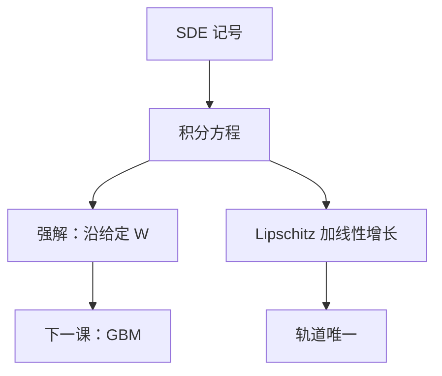

# 随机微分方程的含义

SDE 不是把 $\mathrm d X=\mu\,\mathrm d t+\sigma\,\mathrm d W$ 当作轨迹上的常微分方程；它是伊藤积分方程的简写。

<footer>—— 据 Øksendal, Stochastic Differential Equations, 第 6 版, 2003, 第 5 章；Shreve, Stochastic Calculus for Finance II, 2004, 第 4–5 章整理</footer>

上一课[伊藤引理](/quant/ito-lemma)给出对已知过程的微分法则。缺口是反过来：若我们**指定**漂移与扩散，要的对象是哪一个过程。把 $\mathrm d W/\mathrm d t$ 写成白噪声再当 ODE 来解，路径不可微，式子没有意义。本课只把 SDE 读成积分方程，并留下存在唯一的 Lipschitz 接口，供下一课写出 GBM。

## 问题

布朗路径几乎必然不可微，$\dot W$ 不存在。因此「$\dot X=\mu(t,X)+\sigma(t,X)\dot W$」不是本课程的对象。需要一个不依赖路径导数的定义：把 $\mathrm d t$ 项写成普通积分，把 $\mathrm d W$ 项写成伊藤积分。缺口是承认这是定义，而不是写法偏好。

没有存在唯一，后面的定价 PDE、蒙特卡洛离散化都没有「那个」$X$ 可指。本课不把证明写全，只把条件说成后课默认的正则性。

### SDE 的解不是「每条路径上的 ODE」

强解是：在给定的 $W$ 上，存在适应过程 $X$，使积分方程几乎必然成立。弱解只匹配分布，可以换一个更大的空间另造一个布朗。定价算期望时弱解往往够用；对冲要沿给定 $W$ 复制时，需要强解。本课先以强解为默认对象，避免把「解」理解成逐条轨迹上的牛顿迭代。

Euler–Maruyama 是把积分方程按左端点切开，不是把 $\dot W$ 换成 $\Delta W/\Delta t$。后课蒙特卡洛用的就是这一离散，不是 ODE 求解器。

## 方法

记号 $\mathrm d X_t=\mu(t,X_t)\,\mathrm d t+\sigma(t,X_t)\,\mathrm d W_t$ 定义为

$$
X_t=X_0+\int_0^t\mu(s,X_s)\,\mathrm d s+\int_0^t\sigma(s,X_s)\,\mathrm d W_s.
$$

$\mu$ 叫漂移，$\sigma$ 叫扩散。适应：$\sigma(s,X_s)$ 在 $s$ 时刻已确定，才能作为伊藤被积过程。若 $\mu,\sigma$ 对 $x$ 全局 Lipschitz、线性增长，则强解存在且轨道唯一。线性增长挡住有限时间爆炸；Lipschitz 挡住分叉。金融里常用的 GBM、Vasicek、CIR（在参数允许时）被当作满足或局部满足这些条件的模板。

解是马尔可夫过程时，Itô 公式里的漂移算子 $\mathcal A$ 就是无穷小生成元。后课 Feynman–Kac 把这个算子接到 PDE，本课只指出接口：SDE 决定 $\mathcal A$，不决定边界条件。

## 机制

伊藤积分的被积过程不能偷看未来的 $\Delta W$。这把「策略必须适应信息流」写进方程本身：扩散系数若依赖未发生的增量，积分无定义。漂移积分是有限变差，不贡献二次变差；全部二次变差来自 $\int\sigma\,\mathrm d W$。因此后课写 $[X]_t=\int\sigma^2$，不必再对 $\mu$ 操心。

时间齐次时，从 $x$ 出发的解的分布只依赖 $t$ 与 $x$，这是定价函数写成 $V(t,S)$ 的理由。非齐次、带随机系数时，状态要扩维；本课不展开，只提醒：SDE 的状态是你写进 $\mu,\sigma$ 的那个向量。

## 边界

本课不证 Yamada–Watanabe，不讨论弱解的鞅问题，不引入跳 SDE。随机波动率把 $\sigma$ 本身再写成一个过程，主干定价先用常数或确定性 $\sigma$。后课默认：看到 $\mathrm d X=\mu\,\mathrm d t+\sigma\,\mathrm d W$，即积分方程；存在唯一时默认 Lipschitz 模板。下一课[几何布朗运动](/quant/geometric-brownian-motion)给出金融里最常用的强解。

## 小结

- SDE 是伊藤积分方程的简写，不是带白噪声的 ODE。
- 强解沿给定 $W$；Lipschitz 加线性增长给出轨道唯一。
- 漂移不进二次变差；扩散系数决定 $[X]$。
- Euler 离散对准积分方程的左端点。
- 出处：Øksendal 第 5 章；Shreve SDE II 第 4–5 章。
