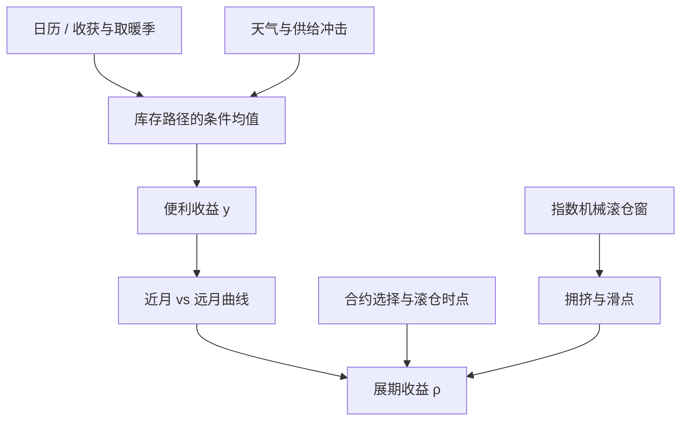

# 季节性展期

仓储理论把基差写成库存的函数；农业与能源的库存路径本身随收获、取暖季而弯折，于是展期收益也按日历重复，而不是一条平坦的期限溢价。

<footer>—— Working, The Theory of Price of Storage, American Economic Review, 1949；库存与溢价见 Gorton, Hayashi & Rouwenhorst, Review of Finance, 2013</footer>

[上一课](/quant/inventory-curve)把库存（尤其是可交割、交割地库存）写成曲线形状的核心状态；交易的是意外而非水平，总库存与仓单不是同一 $I$。缺口是月份选择：机械地滚「最近的那张」会在收获前、取暖季、驾驶季上系统性地买贵卖便宜，平均展期收益不是给定日历周该不该持有近月。本课钉季节性展期：合约月份与滚仓时点一起选。不重讲 WASDE 修订。后课跨品种价差默认指数展期日历是为容量，不是为最大化展期收益。

## 问题

库存报告更新的是对 $I$ 的信念；机械滚最近合约会把季节性的曲线形态平均掉。完全抵押的期货超额收益，习惯上拆成现货收益与展期收益。展期收益的符号由曲线形态决定：近贵远贱（backwardation）时多头展期赚钱；近贱远贵（contango）时多头展期亏钱。Gorton 与 Rouwenhorst（2006）强调，商品作为资产类别的长期超额，很大一块来自这条展期，而不是现货本身一路上涨。问题是：曲线形态不是常数。玉米在北美收获前库存最低、新作上市后骤增；取暖油与天然气在北半球冬季抽库；汽油在夏季驾驶季走强。同一品种在一年里可以既出现深度 backwardation，也出现陡峭 contango。把所有月份的展期平均掉，得到的是指数的「平均滚仓」，不是你在给定日历周该不该持有近月。

第二层问题是交割与流动性。近月进入交割窗口后，持仓限制、仓单、地点升贴水会让价格暂时脱离库存叙事，机械滚仓若撞上这一窗，滑点与逼仓风险会盖过季节性信号。季节性展期必须同时选择**合约月份**与**滚仓时点**，而不是只在现成的「近月 vs 次近月」价差上加季节哑变量。

### 收获、取暖与交割窗不是同一类季节

农业季节绑定生物周期：播种、授粉、收获，库存的条件期望随 USDA 报告修订。能源季节绑定气候与炼厂检修：天然气与取暖油的冬季峰值、汽油的夏季规格切换（RVP），以及秋季炼厂检修造成的中间馏分紧张。畜产品还有压栏与能繁母猪周期，长度往往超过十二个月，严格说是准季节。把这三类塞进同一个月份哑变量，是把不同状态变量当成同一个日历。正确对象是「距收获的月数」或「相对五年同期的库存分位」，日历月份只是它们的粗糙代理。

指数的展期日历（如高盛商品指数传统上的第五至第九个工作日）是为了可复制与容量，不是为了最大化展期收益。Mou（2011）记录过指数滚仓窗口被抢跑的证据。季节性展期若仍挤在同一窗口里换月，等于把季节信号交给拥挤的流动性冲击。

## 方法

先在品种内部定义日历价差。对活跃的两个到期 $T_1<T_2$，基差或展期收益率可写成

$$
\rho_t=\frac{1}{T_2-T_1}\ln\frac{F(t,T_1)}{F(t,T_2)}.
$$

正的 $\rho$ 对应近月升水。把 $\rho_t$ 对季节状态回归：月份哑变量、距收获周数、或 EIA / USDA 公布的库存相对五年均值的分位。Fama 与 French（1987）已经说明，基差含有对未来现货的预测成分，且在农产品上更强——这与仓储理论一致：能储存的商品，库存高时便利收益低，曲线偏 contango。季节性展期把这一预测用在**持哪张合约**上：当模型给出的 $\rho$ 显著为负且库存高，多头应避开近月、持有更远的活跃月，或把滚仓提前到曲线尚平坦时完成；当收获前库存分位极低，$\rho$ 转正，近月的展期收益值得付交割邻近的流动性代价。

跨品种时不要平均日历。玉米与小麦的收获窗不同，WTI 与布伦特的交割机制不同，伦敦金属与 COMEX 黄金几乎没有农业式季节。组合层面的「季节性展期因子」应先在品种内做状态依赖的合约选择，再等权或按流动性加权；直接对所有商品的近月—次近月价差做同一个一月哑变量，会把金属的噪声塞进农产品的信号。

### 合约选择与滚仓规则

可操作的规则通常有三层。第一，基准是流动的主连或指数滚法，用来定义「什么都不做」。第二，允许的合约集合：只在同一品种的前三、四个流动性月份里选，避免滑到远月薄成交。第三，触发：库存分位或季节价差的 z 分数越过阈值，才从近月换到次次近月（跳过即将交割或即将进入拥挤滚仓窗的那张）。能源上还要处理合约规格：汽油夏季与冬季配方不是同一商品，把两者当连续近月展期，是把品质升贴水写成了虚假季节。

## 机制

机制来自仓储，而不是来自「市场记错了月份」。Working（1949）把现货升水与库存反向联系起来：库存低时，持有实物的便利收益高，足以抵消仓储与利息，现货与近月相对远月升水。收获后库存重建，便利收益下降，曲线恢复到反映仓储成本的 contango。Gorton、Hayashi 与 Rouwenhorst（2013）在三十一品种、数十年库存上验证：便利收益是库存的递减非线性函数；基差、既往收益与波动都能代理库存状态，并预测期货溢价；期货账户的净持仓并不能额外预测溢价——他们拒绝把凯恩斯式套保压力当作一阶机制。季节性只是库存路径的可预期部分：你提前知道第三季度北美玉米将收获，不等于你提前知道今年干旱与否；可预期的是「库存的季节均值」，不可预期的是「相对季节均值的冲击」。展期策略赚的是前者在曲线上的定价，以及后者出现时基差的凸性（低库存时曲线对冲击更敏感）。

与 [商品便利收益](/quant/convenience-yield)、[库存与曲线](/quant/commodity-inventory) 是同一套语言的不同切片：便利收益是瞬时的 $y$，库存是状态，季节性是该状态的条件均值如何随日历走。与 [商品展期 alpha](/quant/commodity-roll-alpha) 的差别在于：后者跨品种做多 backwardation、做空 contango，季节性展期是**同一品种内部**改到期选择。

凯恩斯（1930）的正常 backwardation 与希克斯（1939）的套保需求，说的是风险溢价的符号，不是季节。把「冬天天然气该 backwardation」写成套保压力，会与 Gorton–Hayashi–Rouwenhorst 的检验对着干。先写库存与便利收益，再视套保持仓为可能的二阶项。

### 可预期季节与意外库存

把展期收益对「十年同期平均基差」回归，拟合部分是可交易的季节溢价；残差是 WASDE、EIA 周度库存、飓风、罢工带来的冲击。交易账本应分开：季节仓位是慢变量，报告日附近的仓位是事件风险。用同一套阈值既做季节配置又做报告日方向，会把两种信息混成一个滑点数字，事后无法归因。

## 边界与工程取舍

气候变迁与种植带北移会缓慢改写农业季节；页岩气改变了美国天然气的季节振幅；新冠与炼厂关停改过中间馏分的季节。季节性展期的样本内月份效应，必须在制度断点后重估，不能把 1990 年代的玉米季节原样搬到 2020 年代。指数化商品投资本身会改变近月的季节流动性：拥挤的滚仓窗里，季节信号的执行价不等于信号计算用的结算价。

不要用连续主连价格序列计算展期。主连在换月时已经把价差缝掉或留下跳空，再在其上算「季节性收益」是循环论证。应在单独的合约价格上按规则换月，把展期盈亏记为显式现金流。也不要把期货季节与现货季节当成同一张图：现货地点、品质、升贴水使现货季节更尖，期货是交割标准品在交割月的预期，已被仓储期权熨平一层。

气象预报改善会压缩收获前的风险溢价，也会让季节性曲线更早被交易。边缘不来自「知道八月是夏天」，而来自库存分位相对市场已定价的曲线是否仍便宜。没有库存或仓单数据、只靠月份哑变量的回测，样本外很容易消失。

## 小结

- 季节性展期是同一品种内部按库存季节选择合约月份与滚仓时点，不是把所有商品的近月平均再乘一个月份因子。
- 仓储理论下，基差是库存的递减函数；农业收获与能源取暖使库存路径可部分预期，展期收益因而有日历结构。
- 计算必须在单合约价格上显式换月；主连连续行情已经处理过换月，不能用来回测展期。
- Gorton、Hayashi 与 Rouwenhorst（2013）显示库存与基差预测溢价，期货净持仓并不额外预测；季节叙事应优先绑库存，而不是绑套保压力。
- 指数滚仓窗口的拥挤（Mou, 2011）是执行问题：季节信号若仍在同一窗里成交，alpha 会被冲击成本吃掉。
- 与便利收益、库存—曲线、跨品种展期 alpha 互补：本篇管「何时持哪张合约」，那些篇管「y 是什么」以及「持哪些品种」。
- 出处：Working, *American Economic Review*, 1949；Fama and French, *Journal of Business*, 1987；Gorton and Rouwenhorst, *Financial Analysts Journal*, 2006；Gorton, Hayashi and Rouwenhorst, *Review of Finance*, 2013；Mou, 指数滚仓与抢跑, 2011。
