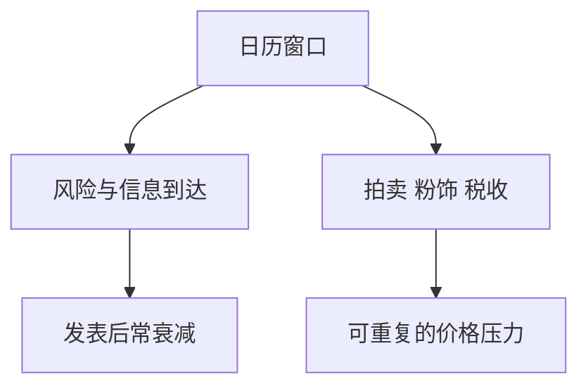

# 季节性与日历异象

日历把交易日切成假日、月初、年末窗口；其中一些均值差异在统计上反复出现，经济上却往往是样本、微观结构与税收窗口，而不是可无限加杠杆的第三因子。

<footer>—— Lakonishok and Smidt, Are Seasonal Anomalies Real? A Ninety-Year Perspective, Review of Financial Studies, 1988</footer>

[上一课](/quant/factor-timing-feasibility)的择时用估值与宏观状态。季节性的缺口是**用日历当信号**：一月、月末、假期、Sell in May。主干 [日历效应与隔夜](/quant/calendar-overnight) 已写周末、隔夜与制度时钟。本课只放策略地图：哪些日历效应还像可交易边缘，哪些已被费用与拥挤吃掉。

## 问题

Lakonishok–Smidt 用很长样本问：一月效应、周末效应是否经得起子样本。许多「日历 alpha」在发现后衰减，或只存在于小盘、低价、不可交易的一端。问题是识别：效应来自风险（假日窗口的信息到达）、来自微观结构（收盘拍卖、窗口粉饰）、还是来自税收与基金考核日。Heston–Sadka 的截面季节性（同月动量）与指数层面的 Sell in May（Bouman–Jacobsen）不是同一个对象，不能收成一个「日历因子」去和 HML 做马赛克。

与因子择时：日历信号的广度同样接近 1（对给定市场每年就那几次）。IR 必须按事件数而不是按交易日数来算。

### 隔夜不是季节性

隔夜溢价是交易时段切分，见日历课。把它加进「月初效应」会重复计数。策略若声称吃季节性，应排除隔夜与开盘拍卖的冲击模型，否则赚的是微观结构，应归入执行课。

窗口粉饰与税收损失卖出能制造年末到年初的截面，但可预测部分往往被借券与冲击抵消。回测用收盘价在 12 月 31 日调仓，通常不可执行。

## 方法

清单：周末/假日、月初月末、财年与税收窗、商品与天气季节（那是曲线，不是股票日历）。检验：子样本、发表前后、市值分层、成本后。事件研究式标准误，见 [事件研究](/quant/event-study)。若只在小盘一端显著，容量按小盘算，不要按指数期货名义算。

## 机制

制度时钟集中了再平衡、考核与信息发布，需求在特定日子倾斜。若倾斜可被灵活资本无成本抵消，效应消失；若必须在收盘拍卖完成（指数、基金），价格压力可重复，那是后课被动流的亲戚，不是神秘月度魔法。

## 边界

本课不把占星或农历叙事当因子。加密与 24 小时市场的「日历」要重写，不能抄美股周末效应。后课财报期是公司事件簇，不是同一张月度虚拟变量。

## 小结

- 季节性要按事件数检验，发表后多数衰减。
- 制度窗口的价格压力与「一月魔法」分开。
- 隔夜、拍卖不要算进季节性 alpha。
- 出处：Lakonishok and Smidt, *RFS*, 1988；Bouman and Jacobsen, *AER*, 2002；截面季节见 Heston and Sadka。
