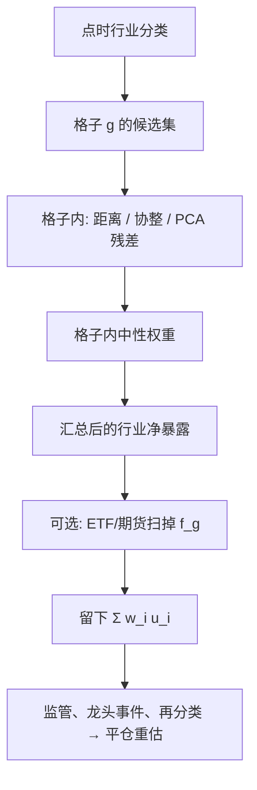

# 行业内相对价值

    
把相对价值限制在同一行业的可比较公司之间：共同的需求、成本与估值锚使价差比跨行业伪近更像经济对象，也把行业轮动从残差里拿掉，代价是分散更差、事件更集中。

<footer>—— GGR 以行业内配对作稳健性，RFS 2006；行业动量见 Moskowitz & Grinblatt, Journal of Finance, 1999；中性化工程对照行业因子文献</footer>

跨行业的两只股票可以因为同指数、同因子而走在一起，[距离法](/quant/distance-pairs) 仍会把它们选成对；交易期一次风格切换，价差裂开。行业内相对价值（sector relative value）事先把候选集限制在同一分类格子里，再在格子内做配对、协整篮子或 [PCA 残差](/quant/pca-residual-basket)。[GGR](/quant/ggr-pairs) 把行业内配对当作稳健性，发现利润仍在，这是本策略的历史锚点之一。它与 [行业中性](/quant/industry-neutral) 不同：后者是因子组合上把行业暴露钉住；前者是**在行业内部寻找可交易的相对定价**，行业暴露可以故意留下，也可以在组合层再对冲掉。本篇写可比性、分类、以及行业内事件如何让「最近的邻居」一起失效。

## 问题

相对价值需要「谁和谁应该像」的先验。全市场 SSD 或全市场 PCA 把先验交给数据，数据会把共同因子当成像。行业分类把先验交给产业：同一需求曲线、同一投入品、同一监管，长期估值倍数有锚，短期可以因库存、订单流、特异新闻偏离。问题是分类既粗又时变。申万一级把银行与保险分开或合并，会改写整个格子的共同因子；公司转型使代码还在旧行业里，经济上已经不是同伴。格子太粗，行业内仍有子行业轮动（银行里的城商行对国有行）；格子太细，只数不够，PCA 与分位都不稳。

Moskowitz–Grinblatt 表明动量很大一块是行业动量。行业内相对价值若在信号里不小心留下行业方向——例如只做多格子里「便宜」的一侧、空头开不出——就会重新变成行业赌注。A 股 [融券约束](/quant/cn-short-constraint) 下这是默认风险：行业内 RV 退化成行业内价值或反转多头。

### 可比公司不是相关系数最高的两只

会计口径、杠杆、上市年限、是否含有大块非主业资产，都会让「同行业」不可比。配对若在行业内仍用纯 SSD，会把一只高杠杆的与一只净现金的选在一起，形成期标准化价格贴得很近，对冲比经济上无意义。更干净的先验是：同一子行业、市值同一档、杠杆同一档，再在剩余集合里用距离或协整。这会减少配对数、提高平均质量，也会把策略变成「只做最像的那几对」，容量更差。GGR 的行业内版本没有做这么细的会计过滤，复制时若加上，不能再引用他们的超额。

行业 ETF 是格子的可交易因子。用 ETF 对冲行业、用成分股做相对价值，残差是相对 ETF 的，不是相对格子内 PCA 的。两种「行业内」不可互换引用绩效。

## 方法

**候选集。** 每个再平衡日用当时的分类（点时，不是最新修订后的历史回填）确定格子，剔除停牌、不可融、形成期有效交易日不足的名字。点时分类避免用未来的行业归属去选过去的对。

**格子内信号。** 三条常见路。(1) 距离配对：格子内 SSD，GGR 规则，见距离法。(2) 协整篮子：格子内 $p$ 只流动性最好的名字，Johansen 选秩再取一条价差，见 [协整秩选择](/quant/coint-rank)。(3) 残差多空：格子内 PCA 或对行业 ETF 回归，交易 s-score，见 AL 与篮子 PCA。三条可以在组合层并存，但资金分配必须事先规定，不能看哪条当月赚就加哪条。

**组合层行业暴露。** 若每个格子内部中性，汇总组合对行业近似中性。若某些格子空头缺失，汇总就会出现行业净暴露。应报告各格子的净权重，并决定是否用行业期货或 ETF 把净暴露扫掉。扫掉之后，剩下的才是「纯」行业内 RV；不扫，收益里有一块是格子间配置，与 Moskowitz–Grinblatt 的行业动量可能同向或反向，必须分开归因。

$$
r_{\mathrm{port}}=\sum_g w_g f_g + \sum_g \sum_{i\in g} w_i u_i.
$$

行业内 RV 要的是第二项。第一项应被约束或被单独当成另一种策略。

### 事件、成分股与再分类

行业内最大的同步冲击往往是监管、共同宏观（油价对化工）、以及指数在该行业的集中调整。这些会使格子内「所有相对价值」一起走扩，分散失效。公司事件（并购、商誉）则使某一只相对同伴永久改定价，旧对冲比断裂，见 [时变对冲比断裂](/quant/hedge-ratio-break)。再分类日应强制：被调出的名字平仓，不得用新行业标签去解释旧价差的回归。

执行上，同行名字常在同一时段被一起交易（ETF、主动基金按行业下单），开仓时流动性的相关性高：你要买的便宜腿与要卖的贵腿可能同时变差。同步约束与 [SOR](/quant/smart-order-routing) 的多腿路由在这里比跨行业配对更硬。TCA 应用格子价差当基准，而不是分腿 VWAP。

GGR 行业内配对仍然等权、仍用形成期 $2\sigma$。把格子改成「只做银行对银行」却把开仓改成滚动 20 日 Z-score，已经不是 RFS 2006 的稳健性表能覆盖的对象。

## 机制

行业内 RV 的经济机制比跨行业更具体：均值回归可以来自相对估值锚（同伴倍数）、来自共同冲击下的过度特异反应、来自客户与分析师的比较交易。跨行业距离近则更常是因子巧合。这也是为什么行业内版本被 GGR 拿来当稳健性：若利润完全来自跨行业伪近，行业内应显著更弱；他们发现并非如此，于是至少有一部分利润像相对价值。Engelberg 等人的事件分解在行业内同样成立：同伴对共同新闻的反应速度不同，利润集中在信息日。把行业内 RV 写成「无信息的会计套利」仍然过强。

失败机制也更集中。格子内一只龙头可以定义该行业的定价，其余是卫星。PCA 第一主成分变成龙头，$\beta$ 近似对龙头的回归，残差是卫星相对龙头。龙头若发生永久事件，整格子的相对价值定义被改写。跨行业配对很少出现「一条腿定义了因子」这么极端的识别。容量上，格子内 ADV 高度相关，不能把各对的容量加总——它们在抢同一块行业流动性。

### 与行业动量、残差动量的边界

行业动量买强势格子、卖弱势格子，对象是 $f_g$。行业内 RV 在格子内买相对弱、卖相对强，对象是 $u_i$，符号常与短期反转一致。残差动量则是要**保留**特异动量，与 AL 要剥掉并反向交易的对象相反。文档必须写清：你在行业内做的是反转还是动量。两者都能叫「相对价值」的口号，期望符号相反，拥挤时会互相当对手盘。

## 边界与工程取舍

不要用最新行业分类回填二十年再报告行业内 RV 的夏普。不要在格子只数少于某阈值时仍做分位多空——三五只的「多空」是一对名字的赌注。不要把行业中性因子组合的绩效写成行业内 RV，或反过来。A 股一级行业市值极度不均，等权格子会把小行业的噪声放到与银行格子相同的权重上；市值加权格子则几乎是几个大行业的故事。权重方案是规格，不是细节。

成本与借券按格子报告：有些行业几乎不可空，RV 只能做半边。涨跌停在同行业里高度相关，形成期 SSD 会在板块集体一字时假小。任何声称「我们只做行业内所以更安全」的表述，必须配上格子内残差相关的压力测试，以及龙头事件的情景。相对价值的边界从来不是分类表，而是冲击到来时同伴是否还承认那条锚。

分类方案有申万、中信、GICS、交易所行业，彼此不可比。换分类等于换策略。稳健性应报告两种点时分类，而不是挑一个样本内更好的格子系统。

## 小结

- 行业内相对价值用分类先验限制「谁和谁像」，把行业轮动从残差里拿掉；它是 alpha 构造，不是因子组合上的行业中性约束。
- GGR 的行业内稳健性支持「利润不全是跨行业伪近」，但不覆盖更细的会计过滤或改过的开仓规则。
- 组合层必须报告并处理格子净暴露，否则策略混进行业动量。
- 格子内流动性与事件高度相关，容量不能按对加总；龙头可以定义局部因子。
- 出处：Gatev, Goetzmann and Rouwenhorst, *RFS*, 2006；Moskowitz and Grinblatt, *JF*, 1999；对照 [行业中性](/quant/industry-neutral) 与 [篮子 PCA 残差](/quant/pca-residual-basket)。
