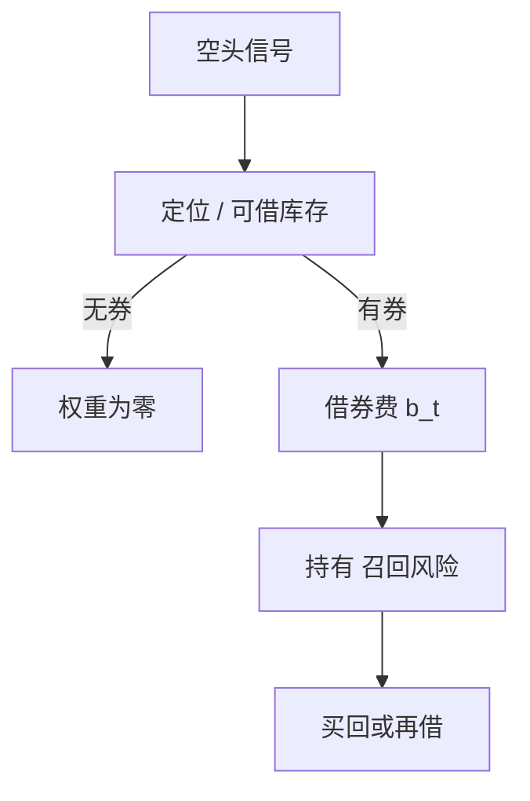

# 证券借贷与做空成本

空头不是符号取负：必须先有可借的券。借券费、召回与特殊券把「纸面空头溢价」收成一条时变的供给曲线。

<footer>—— Duffie, Gârleanu and Pedersen, Securities Lending, Shorting, and Pricing, JFE, 2002；D'Avolio, The Market for Borrowing Stock, JFE, 2002</footer>

[上一课](/quant/settlement-fails)把缺券写成 fail 的来源。本课的缺口是**借券市场本身**：出借人、中介、费率、召回与抵押。Duffie、Gârleanu 与 Pedersen（2002）把可借供给与搜寻写进定价；D'Avolio（2002）描述股票借贷市场的制度与特殊券。A 股实现见[融券约束](/quant/cn-short-constraint)，本课不重写前端检查与转融券暂停，只给一般机制，后课中国进阶会把转融通当制度续篇。回购是相邻的融资市场，下一课单独写。

## 问题

学术多空用收盘价建立对称空头。可交易空头要求：定位（locate）或已借、抵押、费率 $b_t$，以及召回使持有期随机结束。一般抵押品（GC）费率接近无风险减一个小利差；特殊券（special）费率可以高到吃掉全部纸面 alpha。问题是把 $b_t$ 与召回强度当作点-in-time 输入：同一股票在财报前、指数调入前、或流通紧缩时，供给曲线上移。用全样本平均借券费去扣，会在真正贵的名字上系统性高估空头利润——而这些名字往往贡献了多空的空头腿。

出借供给来自指数基金、托管行客户、做市库存。被动基金增长增加了部分供给，同时指数调仓使特定券更特殊。召回：出借人可以收回券，空头必须买回或再借。持有期因此不是策略参数，而是随机停时。把空头当成无限期负仓，期限结构错了。

### 定位成功 ≠ 交收成功

美股 Reg SHO 的定位要求降低裸卖空，不保证交收日有券。A 股前端检查更硬：无券不得报。无论哪套规则，研究都要分「信号日可空」与「持有期维持可空」。名单调出、暂停转融通、出借人召回，都会把已有空头变成强制覆盖。覆盖冲击是负的 alpha，不是噪声。

借券费数据有供应商与场外询价两套，覆盖与延迟不同。回测必须用当时可知的费率，不能用事后成交的最低费。点-in-time 原则与基本面课相同。

## 方法

空头腿的净边缘：$\mu_{\mathrm{short}}-b_t-$ 召回导致的冲击 $-$ 失败交收罚金。可行集 $\mathcal{F}_t$ 为当日可定位且费率低于阈值的名字。报告两个组合：无约束学术多空，与 $\mathcal{F}_t$ 约束后的多空，差额是制度缺口。容量按可借库存与集中度限额估，不按 ADV：ADV 大但可借为零，容量仍为零。

抵押与折算：借券通常要现金或高质量券抵押，折算率随波动调整。现金抵押有再投资；证券抵押有错配。杠杆空头同时吃借券费与保证金，见 CCP 课。公司行为（分红、配股）期间借券合约的补偿条款必须进入收益：空头要支付等价补偿，否则「分红因子」会把空头写成白捡。

### 特殊券是截面变量

把借券费当截面特征：高特殊性预测什么，是微观结构问题，不是自动的做空信号。高费往往伴随高意见分歧与低供给，价格可以更持续高估（Miller），也可以已经因拥挤空头而过度低估。策略必须把费率当成本，把拥挤当风险，而不是当同一个 alpha。

## 机制

搜寻与匹配使借券市场不是瓦尔拉斯拍板：同一时刻不同中介报价不同。供给紧张时，费率上升、召回上升、fail 上升，三者同源。定价上，持有成本把预期收益改写为要求更高的正股下跌，才能让空头打平。指数套利、可转债对冲、期权做市同时需求同一只券时，特殊性是结构性的，不是短噪。

与[限价簿](/quant/lob-structure)的关系：提价规则、卖空标记、可卖量检查在进入簿之前就把一部分意图滤掉。重建簿看不见被拒的空头意图；毒性与不平衡会因此偏。模拟器应记录被定位失败拒绝的单，否则执行质量被高估。

## 边界

不提供寻找灰色券源、规避定位或裸卖空的方法。各国规则不同，以现行公开规则为准。合成空头（总收益互换等）把借券转到经销商簿，成本仍在，只是换了科目；不要当成无约束空头。

## 小结

- 空头成本是费率、召回与交收的联合过程，不是符号。
- 报告无约束与可借约束两套组合；容量看库存不看 ADV。
- 特殊券截面既是成本也是拥挤，不能直接当 alpha。
- 出处：Duffie, Gârleanu and Pedersen, *JFE*, 2002；D'Avolio, *JFE*, 2002。
