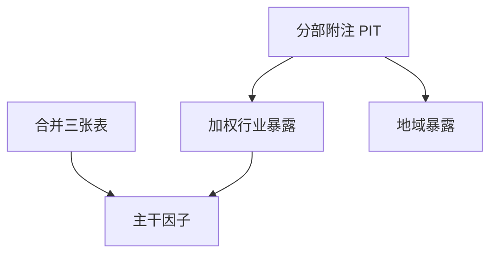

# 分部与地域

合并报表把多元业务加总成一个账面和一个利润；分部披露把加总拆开，但可用日期更晚、口径更不稳，且同样存在 PIT 与幸存者。

<footer>—— 据 SFAS 131 / IFRS 8 经营分部；Penman 对分部分析的讨论整理</footer>

上一课[基本面因子从哪张表来](/quant/fundamental-factor-source)把因子指回合并报表字段。多元化公司的总部行业代码只是一个标签：利润可能来自完全不同的业务与法域。本课补分部与地域披露能改什么、不能改什么。不重画因子索引，不为宏观国别配置开新课。

## 问题

合并利润表给出一个 ROE、一个应计。若公司一半是高应计制造、一半是现金奶牛金融，合并应计是加权平均，行业中性也救不了——因为它被放进了错误的行业桶。分部收入、分部经营利润、地域收入提供拆分。缺口是这些数字的可用日期通常随年报附注，细于合并主表的字段更少、时间序列更短、管理层可重组分部切割。用今天的分部结构回填十年，是又一次 restatement。

地域还带来税率与货币：上一课有效税率在跨国合并里已经被配比扭曲；地域披露只是让扭曲可被定位，不是自动给出各国法定税率因子。

### 分部利润不是独立公司的净利润

分部经营利润通常不含全部共同费用、利息与税，也不能加总还原成合并净利润而不做调节。用分部经营利润去除合并账面，或把分部当成可空头的上市实体，口径错误。本课把分部当**合并字段的拆分信息**，当不了另一套三张表。

SFAS 131 按「管理层视角」切分部，公司一改内部报告，历史分部就不可比。PIT 要保留当时切割，不要用新切割重做旧年。

## 方法

优先用合并主表做可复制因子；分部用于：（1）修正行业归属（按收入或利润加权映射到多个行业，而不是单一总部代码）；（2）识别单一分部主导 vs 真正多元；（3）事件研究里对暴露某地域或某业务线的公司分组。全部使用附注的可用日期，通常不早于年报公告。不要用分析师对分部的事后拆分回填——那是另一层预期库，且常不存在 PIT。

缺失分部的公司（单一业务或不披露）应留在样本并标记，而不是删掉造成幸存者。

分部加权行业暴露只用于修正总部代码明显错配的多元公司，例如收入一半来自完全不同的 GICS 一级。权重来自当时附注，下次年报前不变。不要把分部经营利润加总当合并净利润去算 ROE，共同费用与税不在分部里。地域收入地图不能拿去空一组国家 ETF，除非你另有可交易工具且声明不是本课方法。

## 机制

分部把「不可比」从行业代码推进到业务构成。对价值因子，多元公司的账面是各业务账面之和减去共同项，市值是一个数，倍数被混合业务折中。对惊喜因子，合并 EPS 意外可能来自某一个分部，窗口回报却记在整个代码上——这不是错误，是证券定义；只是解释 alpha 时不能把它当成该分部可单独交易。后课租赁与少数股东会进一步改合并口径，分部无法替代这些调整。

地域收入常按客户所在地而非风险所在地。用它当国家风险因子要非常克制，否则只是把销售地图当成暴露。

主干因子仍用合并 PIT 字段。分部只用于暴露：按当时附注的收入或经营利润加权到行业或地域，权重在下次年报前保持，除非公司发布明确的分部重组。不要用卖方事后拆分的分部盈利回填。缺失分部的观测留在样本并打标签，删掉它们会让多元公司从价值截面消失，造成另一种幸存者。地域收入不当成可空头的国家指数。

## 边界

不写分部会计准则逐条，不做国家风险教科书。指数与行业配额仍用证券级分类，除非你明确改用分部加权暴露。后课默认：主干因子仍来自合并 PIT 字段；分部只作暴露修正，且附注可用日期更晚。

后课租赁与 NCI 仍在合并层修正，分部不能替代。年报附注的可用日期通常等于年报公告，日频因子不要在季报日抢用尚未披露的分部。管理层重切分部时，保留旧切割的历史权重直到新附注可用，这是 PIT，不是「保持可比」的重述。

后课默认主干因子仍来自合并 PIT 字段，分部只作暴露修正，且附注可用日期通常不早于年报公告。

分部重组当年，新旧切割并存时只使用当时附注给出的那一套，不要为了时间序列光滑而用新切割重做旧年收入。这与 restated 财报是同一类前视，只是发生在附注层。

## 小结

- 合并字段是因子主干；分部是拆分信息，不是第二套报表。
- 分部切割会改，必须按当时附注 PIT，不能新切割回填。
- 分部利润通常税前、未分摊共同费用，不能当独立 EPS。
- 可用日期往往等于年报公告，日频信号不要抢跑附注。
- 不披露分部的公司要留在宇宙并标记。
- 出处：SFAS 131 / IFRS 8；Penman 分部分析。
