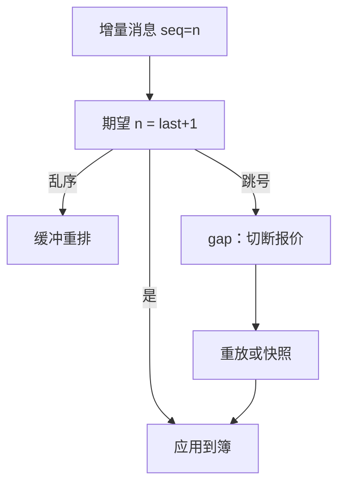

# 序号缺口与丢包

时间戳告诉你事件贴了什么钟；序号告诉你事件有没有少一截。时钟对齐之后仍可能丢包，缺口会把队列、成交与撤单变成另一个市场。

<footer>—— 据交易所 ITCH / 订单簿馈送对 sequence number 的公开规格；对照 Hasbrouck 对完整逐笔记录的要求</footer>

[交易所 vs 经纪商时钟](/quant/exchange-vs-broker-ts)选定了撮合主键。本课的缺口是完整性：馈送与订单回报几乎都带单调序号。序号跳号、重复、乱序，表示丢包、重放或你读错了会话。L2/L3 重建若在缺口上继续，簿是错的，后续所有价差与队列研究都是错的。本课写检测、停机、重放与对账，不写如何利用丢失的行情去交易。后课公司行动引擎处理的是经济事件缺口，不是传输缺口。

## 问题

ITCH 一类增量馈送是「在序号 $n$ 的簿上应用消息 $n+1$」。丢掉 $n+1$，本地簿与交易所真簿永久分叉，直到快照重置。症状可能像：负深度、交叉的 BBO、成交价远离你的买一。若只用价格过滤把这些当异常成交删掉，你在删真市场，因为缺口后的打印相对你的错簿看起来像错价。问题是把序号当成一等公民：任何增量行情会话都必须监测 `seq` 连续性，缺口时进入「簿不可用」，而不是继续提供假 BBO 给策略。

订单回报同样有序号。丢掉成交回报，库存会少一笔，做市会重复卖。丢掉撤单回报，会以为自己还在队列里。时钟再准，缺事件也比乱序更致命——乱序至少还能缓冲重排，缺事件必须重放。

### 乱序、重复与缺口是三种病

乱序：后发先至，缓冲按序号重排即可，预算消耗的是延迟。重复：重传，应按序号去重，否则成交翻倍。缺口：中间的序号永远不来，必须向重放服务要 $[n+1, n+k]$ 或拉快照。把三者都叫「丢包」，处理会错。网络 UDP 行情尤其要把这三种分开。

A 股有的行情源不提供可用于重建簿的序号，只提供快照。此时不存在「增量缺口」，存在的是快照间隔内的不可观测。不要假装用快照差分当 L3。

## 方法

会话状态机：`synced` / `gap` / `recovering` / `stale`。进入 `gap` 立即切断该场所的可交易报价（风控见闸门课），允许策略转到其他场所或停止做市。恢复：优先增量重放，失败则快照 + 追上增量，直到序号再次连续。恢复期间的本地 PnL 用「不可用」而不是用旧 BBO 估值——旧 BBO 在缺口后没有定义。

对账：把交易所官方成交文件（带序号）与本地成交集合做差。只出现在官方的，是丢回报；只出现在本地的，是重复或错会话。与经纪商账单的差，回到上一课的时钟主键。统计应报缺口次数、缺口长度分布、恢复时长——这是系统可靠性，不是 alpha。

### 研究样本里的缺口

历史数据库若在缺口处把簿「平滑」过去，回测会含有不存在的深度。正确做法是给时间段打 `data_quality` 标志，策略回测默认剔除或降权。高频体制对缺口敏感；低频日度 bar 若由错簿合成，开盘价也可能坏。质量标志必须沿用到因子研究，不能只给做市看。

## 机制

增量馈送把市场状态压缩成事件流。完整性是状态可恢复的前提。缺口的经济后果是：你以为的价差、深度、队列位置全部是另一个随机场。用它估实现价差或 lambda，估计的是你的 bug。Hasbrouck 要求逐笔记录完整，不是为了吹纳秒，是为了状态有定义。

重放本身消耗延迟预算。频繁缺口等于把高频策略的延迟分布加上长尾。工程上应把馈送冗余（主备序号独立）当成延迟预算的一部分，而不是当成「多买一路行情」。

加密 websocket 经常无可靠序号或重连后无缝隙快照。状态机更应保守：重连即 `stale` 直到完整快照。不要把股票 ITCH 的假设搬过去。

### 快照重置之前禁止用旧簿估值

缺口恢复期间若继续用上一口 BBO 做盘中 PnL，会把假深度写成真敞口。状态应是「该场所不可用」，估值改用备用源或标缺失。宁可少一个数字，不要一个错数字。

## 边界

本课不覆盖应用层业务拒绝（价格、权限），那是拒单监控。公司行为导致的合约代码变更，看起来像「品种消失」而不是 seq 跳号，下一课处理。跨所没有统一序号，不能用一个全局 seq 去对全国簿。

研究库若在缺口处平滑深度，低频日 bar 也可能被污染。质量标志必须传到因子样本，不能只给做市看。

## 小结

- 序号连续性检验的是完整性；时钟检验的是对齐。两者都要。
- 缺口时簿不可用，必须切断报价并重放，不能把错簿当异常价格洗掉。
- 乱序、重复、缺口处理不同。
- 历史样本要打质量标志，否则回测吃进假深度。
- 恢复时长进入延迟预算的尾部。
- 出处：各交易所 ITCH / 订单簿协议对 sequence 与 snapshot 的公开文档；Hasbrouck 对完整微观结构记录的要求。
