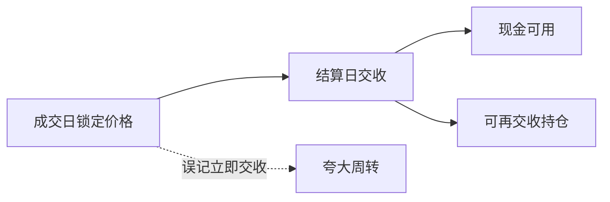

# 结算周期

成交日你锁定了价格，交收日才换券与钱。回测若在成交日就把现金与持仓同时更新，会低估在途占用，也会把尚未交收的券拿去再卖。

<footer>—— 据 DTCC / 交易所结算规则；SEC 将美股周期改为 T+1 的实施说明整理</footer>

上一课[中央对手清算](/quant/ccp-clearing)把清算保证金做成每日现金。证券现货还有交收周期：T+1、曾经的 T+2/T+3。本课补成交日与交收日的差。资金成本课会把在途与融资利率乘起来；本课先禁止「成交即持有、成交即现金」的记账。不重写 CCP 初始保证金。

## 问题

日频回测通常在收盘信号、次日开盘或同日收盘成交，然后立刻更新持仓与现金。真实流程是：成交日（T）锁定交易，结算日（T+$n$）交付。卖出所得现金在结算日前不可无约束地再投资；买入的券在结算日前可能不可再交收卖出或不可用于出借。缺口是状态机拆成**交易账**与**结算账**。把 T+1 当成 T+0，换手策略会多出一天的资金周转，年化收益被放大。

各国与产品周期不同：股票、公司债、国债、基金申赎不是同一个 $n$。用今日 T+1 回填 2010 年美股 T+3 时代，是制度前视。

### 结算失败不是价格回报

失败（fail）产生罚息、买进补救或强制措施，损益不一定等于价格变动。回测把失败当成「没成交」或当成「照常持有」，都会错。本课把失败标成资金与交收事件，不把它写成 alpha。

除权日、股东记录日与结算周期互动：谁有权拿分红取决于记录日与交收是否完成。总回报课已要求加回分红；这里补的是你是否在记录日已经是登记股东。

## 方法

每笔成交写入：成交日、结算日、应付/应收现金、应付/应收券。现金可用余额 = 账户现金 − 未结算应付 + 按规则可预支部分（若券商允许，要声明）。持仓分「已成交未结算」与「已结算」。卖空建立还要叠加借券资格，通常需要可交收的券。周期规则按当时市场：$n_t$ 是时间序列，不是常数。

周转约束：当日卖出所得若不能用于当日买入，回测就不得用「先卖后买、现金净额为零」的日内轧差，除非声明同一托管下允许。很多纸面再平衡假设了这种轧差。

T+2 世界里，周一买、周二卖，周二晚上你可能仍欠着周一的应付资金，同时周二的应收还没到。纸面净值把这两笔轧成零占用，实盘要垫一天。回测至少对换手策略加「未结算占用」状态变量。周期切换日（T+3→T+2→T+1）分段执行，把后来的快周转送给早期样本，是制度前视。

## 机制

周期拉长占用，缩短释放占用。T+3 到 T+1 的制度变迁提高了周转速度，历史回测必须用当时 $n$，否则把后来的效率送给过去的策略。事件日两侧的交易尤其敏感：公告日买入、次日卖出，在 T+2 世界可能两笔都未结算完，资金双占用。这与财报窗口的「隔夜 alpha」叠在一起时，纸面收益含不可用的现金。

CCP 的变动保证金按营业日；现货结算按 T+$n$。同一账户两条时钟，危机里两边同时要现金。

每笔成交拆成成交日与结算日两行账。可用现金不含未结算应收，除非声明券商预支规则。$n_t$ 用当时市场：美股 T+3/T+2/T+1 分段，不要全样本 T+1。日频再平衡若依赖「先卖后买当日轧差」，必须声明同一托管允许，否则买入腿要等到卖出结算或动用额外现金。除权记录日与交收是否完成对齐，避免把未结算买入当成已登记股东去收分红。

## 边界

不写各国结算系统架构，不估计 CSD 失败率模型。下一课[资金成本作为 alpha 底](/quant/funding-cost-floor)把占用 × 利率收成硬约束。后课默认：持仓与现金按结算日可用；周期用当时规则，不用今日 T+1 回填。

后课资金底把在途占用乘上利率。本课先禁止成交即持有。周期 $n_t$ 分段 PIT。先卖后买的日内轧差不是默认权利。失败按交收事件处理，不把它的罚息写进价格 alpha。分红归属看记录日与交收是否完成，与财务课的除权三时点接上。

后课默认持仓与现金按结算日可用，周期 $n_t$ 用当时规则；今日 T+1 不得回填 T+3 年代。

卖空建立通常需要可交收的券，未结算的多头不一定能拿去交收空头。状态机把「已成交未结算」与「已结算可交收」分开，避免同一张股票被同时当成多头库存与空头交收来源。

## 小结

- 成交锁定价格，结算才换券与钱。
- 立即更新现金与持仓会夸大换手策略的周转。
- 周期 $n$ 是制度时间序列，必须 PIT。
- 未结算券不一定能再卖或出借。
- 失败是交收事件，不是价格 alpha。
- 出处：DTCC 与交易所结算规则；SEC T+1 实施说明。
