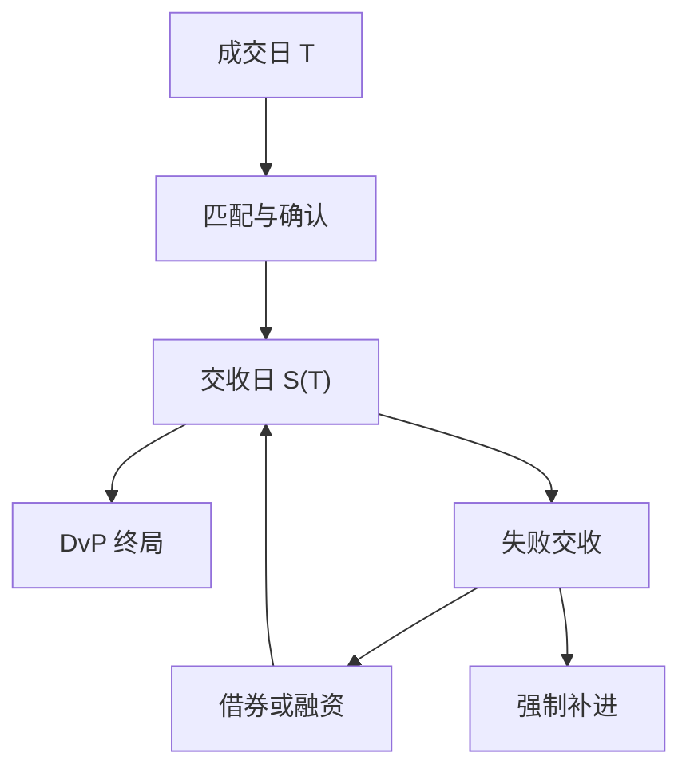

# 结算周期与失败

撮合确认的是契约，结算完成的是证券与资金的终局交付。周期缩短压缩对手方窗口，也压缩修复匹配错误的时间；失败交收于是从后台例外变成策略状态。

<footer>—— Fleming and Garbade, Explaining Settlement Fails, FRBNY Current Issues, 2005；DTCC 关于失败交收与 T+1 的公开材料；SEC Rule 15c6-1 采用公告</footer>

[上一课](/quant/ccp-default-waterfall)把信用停在 CCP 瀑布。[美国 T+1](/quant/us-t1-settlement) 已写美股法定周期。[A 股 T+1](/quant/cn-tplus1) 写的是交易侧不可回转。本课的缺口是**交收周期与失败（fail）作为一般机制**：国债、股票、跨境、以及「契约日 ≠ 资金日」时策略库存如何分列。后课借券与回购是 fail 的常见解药与来源。

## 问题

记成交日 $T$，标准交收日 $S(T)$。在 $T$ 与 $S(T)$ 之间，市场风险已在，法定所有权未移。失败交收指 $S(T)$ 未能完成券或款的交付。Fleming 与 Garbade（2005）说明美国国债 fail 在某些时期可以很高：券被锁在空头链或运营卡顿里，罚金若低于融资收益，fail 会被「理性地」维持——直到监管与市场惯例提高罚金。问题是把 fail 写成随机状态：确认未完成、券源不足、外汇未备妥、对手运营错误，各有不同的可预测性与成本。

周期从 T+3 到 T+2 再到 T+1，修复窗口消失。匹配错误从前一天可修，变成直接 fail。量化若只在日终持仓上记账，永远看不见 fail：纸面仓位已经「有了」。必须有交收状态机：`traded / matched / affirmed / settled / failed`。A 股股票的交易限制与结算周期叠在一起，但 fail 的会计仍独立：即使可卖量按交易规则锁定，结算失败也会打乱会员备付。

### 券 fail 与款 fail 不对称

缺券时，买方资金可能被保护，卖方要去借券或买单。缺款时，融资与外汇管道被压。国债市场的 fail 常是缺券；跨境股票常是确认与外汇。ETF 申赎把成分券 fail 放大成篮子 fail。回测应分类型计价：借券费、罚金、强制补进的冲击、以及延迟到账导致的再投资缺口。

中国结算对 A 股证券 T+1 交收、资金清算有自身时间表；不要把 DTCC 夜盘截止套过来。本课给的是状态机，时钟以各 CSD 公告为准。

## 方法

库存按交收日记账，同时保留成交日风险。营业日函数用结算日历，不是交易日历：债券假日、半日市、跨境节假日会使 $S(T)$ 跳跃。机构交易的分配–确认–申认（ACA）在 T+1 制度下必须在成交日完成，见美国规则课。研究账户若拿不到确认时间戳，至少应用「未确认则 fail 概率升高」的情景，而不是 100% 夜盘成功。

度量：fail 率按名义、按券、按对手。与借券利率、特殊券（specialness）一起看：特殊券既贵又易 fail。策略容量在「可交收量」上估，不是在 ADV 上估——可借库存为零时，空头腿的 ADV 不相干。

### 周期缩短是制度冲击，不是 alpha

T+1 改革对所有人同时生效，改变的是运营可行集。把「改革后隔夜异象变强」当因子，须先剔除 fail 与借券成本的机械通道。跨市场篮子按各市场自己的 $S(\cdot)$ 分别记账，避免用美国周期去推伦敦或香港腿。

## 机制

结算是 CSD 与支付系统上的交付对支付（DvP）或变体。CCP 净额减少交收笔数，但不消灭净额失败。失败使空头链延长：A 欠 B，B 欠 C，罚金与召回沿链传播。Garbade–Fleming 的价格含义是：fail 高时，特定券的融资与定价脱离一般抵押品利率。对股票多空，fail 表现为空头建立失败或多头晚到账，因子实现缺口增大。

与撮合的关系：引擎可以成交一张你交收不了的卖单（若前置检查未拦住）。前置检查（A 股前端、美股定位）试图把 fail 挡在撮合前；挡不住的进入本课。研究应声明模拟器实现了哪一层检查。

## 边界

不提供故意 fail、滚动交收以占用对手券源的方案。罚金与强制补进规则以 CSD/CCP 现行办法为准。加密链上最终性、即时支付不在本课周期语言里。

## 小结

- 成交、清算、结算是三态；fail 是 $S(T)$ 上的合法状态，须进库存。
- 周期缩短压缩修复时间；券 fail 与款 fail 成本不同。
- 容量按可交收与可借，不按无约束 ADV。
- 出处：Fleming and Garbade, FRBNY, 2005；DTCC；SEC T+1 采用公告。
