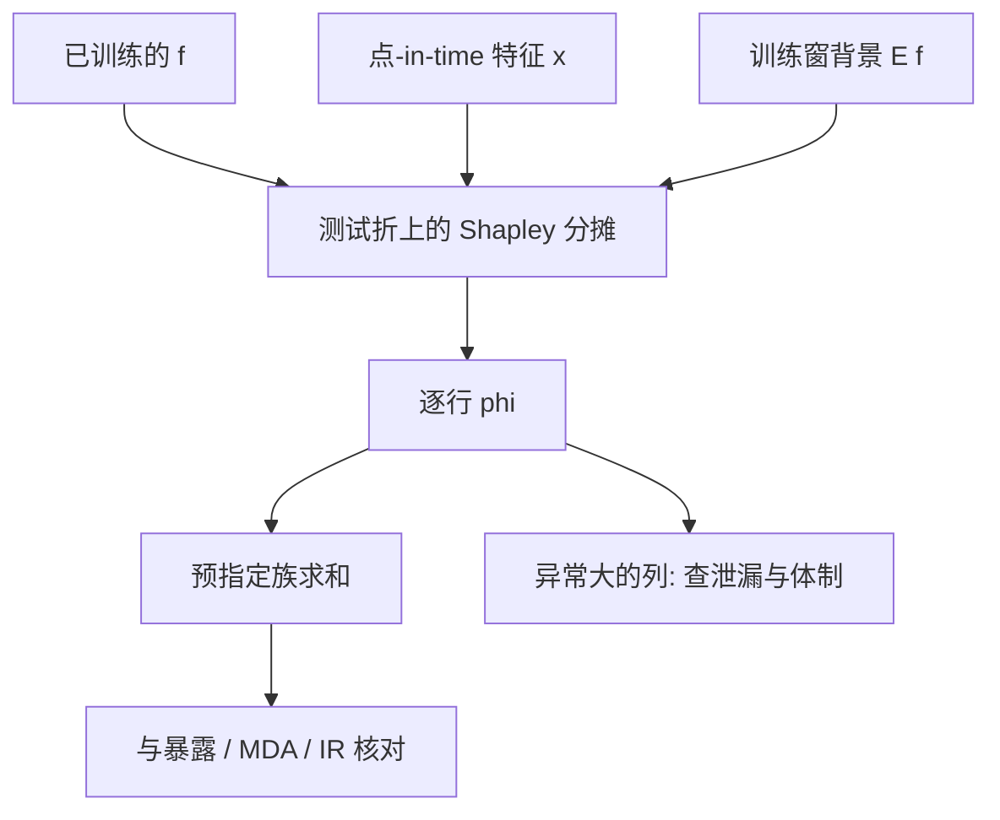

# SHAP 因子归因

    
一类加性特征归因满足局部精度、缺失性与一致性；在这些公理下，解释必须是 Shapley 值，而不能是任意一种重要性分数。

    <footer>—— Lundberg and Lee, A Unified Approach to Interpreting Model Predictions, NeurIPS, 2017</footer>

树与网络把截面收益映射成一个分数之后，投研仍要回答：这笔预测或这笔已实现损益，是价值、动量还是微观结构状态撑起来的。线性风险模型有现成的乘法表 $x^\top f$，见[因子归因](/quant/factor-attribution)。非线性模型没有这一表。Lundberg 与 Lee 把若干事后解释方法收进 SHAP：用合作博弈的 Shapley 值，把 $f(x)- \mathbb{E}[f]$ 分摊到每一列。它是对**当前这个 $f$** 的局部会计，不是对风险因子的识别，也不是因果。与 [MDA](/quant/mda-importance) 的差别是：MDA 打乱一列看损失升多少，给全局重要性；SHAP 给每一行一个分摊向量，可再聚合成「因子族贡献」。本篇写公理、树路径算法、以及把 SHAP 误当成 Brinson 或 DML 时会错在哪里。

## 问题

设模型 $f$ 在点-in-time 特征 $x\in\mathbb{R}^p$ 上输出预测收益、残差或分类分数。需要一个向量 $\phi(x)$，使

$$
f(x)=\phi_0+\sum_{j=1}^p \phi_j(x),
$$

其中 $\phi_0=\mathbb{E}[f]$，$\phi_j$ 是第 $j$ 列在本行上的贡献。任意一种「把增益记在先分裂的列上」的启发式都不保证：同样的列，换一种编码或换一棵相关树，贡献会跳。Lundberg–Lee 证明，若要求局部精度（上式）、缺失性（缺席的特征贡献为零）与一致性（模型更依赖某列时其归因不降），则 $\phi$ 必须是 Shapley 值：对所有特征子集平均该列的边际贡献。

金融里 $p$ 很大且共线。Shapley 值把共线族的贡献按联盟博弈分摊，单列 $\phi_j$ 会变小、族和仍在。若把单列拿去写「发现了新因子」，会低估家族、高估偶然先被命名的那一列——与 MDI 的病同类，只是分摊规则更明确。

### 干预型与条件型不是同一个 $\phi$

计算 Shapley 时要回答：特征不在联盟里时，$f$ 看什么。干预型（interventional）把缺席列换成边际分布的样本，对应 $do(X_S=x_S)$ 的期望，破坏特征依赖。条件型用 $X_{\bar S}\mid X_S=x_S$，保留依赖。TreeSHAP 默认的路径依赖更接近条件期望，在共线的价值族上会把贡献沿相关列「传」开。解释风险暴露时，干预型更接近「若我把价值列改成中性、其余按边际」；解释「模型实际用了哪些相关输入」时，条件型更近。必须在报告里写明，不能混着比不同论文的 beeswarm 图。

SHAP 的 $\phi_j$ 单位是 $f$ 的单位：预测收益、logit、或概率。它不是因子收益 $f_k$，也不是主动暴露 $x_{a,k}$。把 SHAP 加总当成 Brinson 配置项，量纲已经错了。

## 方法

**TreeSHAP。** Lundberg 等人（2020）利用树的路径把精确 Shapley 从指数降到多项式。对 [GBDT](/quant/gbdt-alpha) 这是默认实现。输入必须是训练时同一套点-in-time 变换：截面 rank、缺失指示、行业哑变量。在测试折上算 $\phi$，不要在训练行上算——训练 SHAP 会把记住的噪声也分摊得很好看。

**族归因。** 预先把列分成价值、动量、质量、微观结构、另类数据等族，报告 $\sum_{j\in G}\phi_j$。这与 López de Prado 对 [MDA 簇置换](/quant/mda-importance) 的要求平行。族的定义必须先于看图，否则会把高 SHAP 的列临时升格成一族。对线性基准，SHAP 还原成 $(x_j-\mathbb{E}x_j)\beta_j$ 一类项，可与因子归因的 $x_{a,k}f_k$ 对照：只有在 $f$ 就是风险模型本身、且 $\beta$ 是暴露时，二者才可比。

### 从逐行 SHAP 到一段样本的「因子贡献」

对组合在 $t$ 的预测 $\sum_i w_{it} f(x_{it})$，贡献可按权重对 $\phi_j(x_{it})$ 求和，得到「模型分数里各列的组合级分摊」。这解释的是**预测分数的来源**，不是已实现 P&amp;L 的来源。已实现损益还要乘上真实收益；若把 SHAP 直接加总当 P&amp;L 归因，等于假定 $f$ 等于已实现，残差被藏起来。正确的两张表是：模型分数的 SHAP 表，与持仓对风险模型的因子归因表。二者应当可对照（价值分数高时价值暴露是否真高），但不应合成一张。

核 SHAP 对神经网络可行，但对日频全宇宙成本高。应在分层抽样的测试日上算，并报告不同日之间 $\phi$ 的稳定性。若某列只在 2020 年 3 月贡献巨大、其余时间为零，它是体制事件，不是稳定因子。

背景分布 $\mathbb{E}[f]$ 若用全样本，会把未来体制的平均分数写进 $\phi_0$。背景应取训练折或当时可得的历史窗口，与[前视](/quant/look-ahead-bias)纪律一致。

## 机制

Shapley 值对每个子集 $S$ 计算 $f$ 在 $S$ 上的期望输出，再看加入 $j$ 之后的增量，按子集大小加权平均。一致性公理保证：若模型在所有联盟上对 $j$ 的依赖不减，则 $\phi_j$ 不减。这就是为什么随意的增益会计会被换掉——它们不满足一致性，共线时可以任意记到先分裂的列。

局部精度使逐行 $\phi$ 可加总到 $f(x)$，于是可以像会计一样横加、纵加。这是相对部分依赖图的优势：部分依赖是全局平均曲线，加总回单笔预测时对不齐。缺点也来自同一加总：人们会把 $\phi_j$ 读成「去掉 $j$ 后预测会变多少」，这只在干预型且其余列可独立改时近似成立；条件型里改一列意味着相关列一起变，叙事要改成「在观测到的依赖下，该列所代表的信息」。

### 不是因果、不是风险价格

SHAP 不估计 $\mathbb{E}[Y(1)-Y(0)\mid x]$，见[因果树](/quant/causal-tree-heterogeneity)；也不估计 $\lambda$，见 [Fama–MacBeth](/quant/fama-macbeth)。一个对市值高度敏感的模型，会把大量 $\phi$ 记在规模上，即使规模没有溢价——因为 $f$ 用了它来拟合噪声或拟合流动性。检查方法是：在测试年把该列在截面上中性化后再预测，看组合 IR 是否下降；SHAP 大而 IR 不降，说明模型依赖了与标签共线但不增加排序价值的信息，或依赖了不可交易的代理。

与 MDA 同时报告是有用的核对：MDA 高、SHAP 族和也高，依赖较可信；SHAP 高、置换后损失几乎不变，可能是共线分摊或基线选择问题。不要只发 beeswarm。

## 边界与工程取舍

依赖破碎的时间序列上，「缺失一个特征」的期望没有唯一的因果版本。报告应把 SHAP 定位为模型审计：找泄漏列（未来成交量、未来波动若混进 $X$，SHAP 会诚实地点名它们——这是优点），找体制漂移（族贡献在测试年变号），找与风险模型暴露不一致的隐藏风格。它不能替代 [点-in-time](/quant/point-in-time) 审计，也不能替代扣费后的组合评估。

对深度 [LOB 模型](/quant/deeplob-cnn-lstm)，输入是档位矩阵而不是命名因子，SHAP 仍可在通道或档位上算，但解释变成「第几档的量」而非「价值」。此时更应警惕泄漏：若模型主要用到本应不可见的未来一档，SHAP 会显示出来，但前提是你把该通道当成独立特征去归因。交互 SHAP 的计算更贵，且在共线下不稳定，不宜作为发现交互的主证据；交互应回到分样本 IC 与预指定分区。

把每年平均 SHAP 最大的列轮流加进因子库，是用解释工具做逐步回归。多重检验与过拟合不会因为分数叫 Shapley 就消失。

## 小结

- Lundberg–Lee 的 SHAP 在局部精度、缺失性与一致性下把模型输出分摊为 Shapley 值，是非线性模型的局部会计，不是因果识别。
- TreeSHAP 使 GBDT 上的精确计算可行；必须写明干预型还是条件型，背景分布必须来自当时可得窗口。
- 组合级应报告预指定特征族的 SHAP 和，并与风险模型因子归因、MDA 对照；它解释分数来源，不自动解释 P&amp;L。
- 高 SHAP 列可能是泄漏、共线代理或不可交易信息；要用中性化与样本外 IR 复核。
- 出处：Lundberg and Lee, *NeurIPS*, 2017；Lundberg et al., *Nature Machine Intelligence*, 2020（TreeSHAP）；Shapley 值的博弈论定义见 Shapley 1953。
