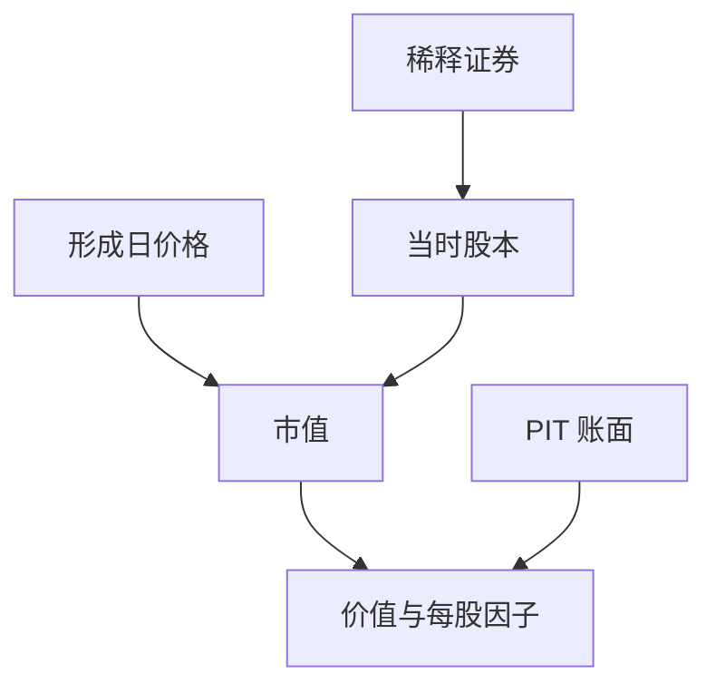

# 股份稀释

每股盈余和每股账面随股本变；股本变了却仍用旧股数去除市值或利润，因子分母就在比较两个不同的要求权。

<footer>—— 据 Penman 对每股计算的讨论；Fama–French 用 CRSP 股本与 Compustat 权益匹配的构造惯例整理</footer>

上一课[账面价值与无形资产](/quant/book-intangibles)把账面当成价值因子的分子。分母是市值，市值 = 价格 × 股本。股本会因期权、可转债、增发、拆分而变。本课补稀释：什么时候用基本股本，什么时候用稀释股本，以及回测如何与价格复权对齐。不重讲账面定义。

## 问题

基本面数据库常同时给普通股股数、稀释后股数、加权平均股数。价格序列通常已对拆分复权。若市值用复权价乘未调整股数，或用期末股数去除期间加权利润，每股量与总量会打架。Fama–French 风格的组合用总量账面与总量市值，看似避开每股，但仍要把 CRSP 的股本与 Compustat 的权益对上同一证券、同一时点。缺口是**要求权的份数**必须与价格、与权益同一 PIT 切片。

员工期权与可转债在价内时，稀释后股本大于基本股本。用基本股本算市值会低估稀释后要求权，让公司显得更便宜或每股更赚。

### 加权平均股数不是时点股数

利润表上的 EPS 用期间加权平均股数；资产负债表上的账面是时点权益。用时点股数去除期间净利润，或用加权平均股数去除时点权益，都会造出假的每股变化。总量因子应尽量用总量；必须用每股时，分母要与分子的期间/时点类型一致。

拆分会同时改价格与股数。复权价已经把拆分除进去了，股数就要用拆分调整后的口径，否则市值翻倍或腰斩。

## 方法

市值：形成日价格 × 当时已发行普通股（CRSP 一类价量库的股本），并决定是否对稀释证券加回。账面：用同一证券的 PIT 权益。每股信号（EPS、BPS）单独锁定：EPS 配加权平均或稀释加权平均，BPS 配时点稀释后股数。增发、配股发生在形成日之后的，不得写回形成日股数——那是前视。

期权稀释可用 treasury stock 法的近似，但要用当时的行权价与当时股价，不能用样本期末的价内状态回填历史稀释。

形成日核对三件事：价量库股本、财务库期末股数、拆分调整因子是否指向同一发行。对不上时以价量库市值字段为准，避免自己用复权价乘股数。员工期权的稀释只在当时价内且有公开行权价时计入；用样本期末股价判断早年是否价内，等于把后来的上涨写进历史市值。多类股与 ADR 先映射再算，否则 HML 的分母会漂到错误的那一类。

## 机制

稀释改变的是「每一单位市值对应多少会计权益、多少利润」。忽略稀释，等于把或有要求权留在表外，价值端会混进期权沉重的公司。回购下一课会减少股本，方向相反，但同样必须用事件后的股本，而不是年报封面的「最新股数」回填全年。PIT 对股本与对利润同样适用：后来的拆分调整因子可以用于价格序列，不能把后来才发行的股份写进过去的市值。

后课分红与回购会改股本与现金。本课先保证股数与价格成对；现金与留存收益的变化下一课再闭合到三张表。

最低实现：市值 = 未复权价 × 当时已发行股数（或 vendor 已对齐的市值字段），不要自己用复权价乘当前股数。EPS 类信号锁定稀释/未稀释与加权平均，并与分析师库口径同一行声明。增发、可转债转股、期权行权按披露日更新股本，不得在财年开始就把年末股数摊进去。拆分调整因子只作用于价格序列的连续性，不创造历史上不存在的股份。

## 边界

不写股份支付准则全文，不给期权定价。可转债的稀释与期权行权交给制度课的[期权行权与交割](/quant/option-exercise-settlement)。后课默认：市值与每股量声明股本口径；拆分与 PIT 股本已对齐。

后课回购会减股本，本课先保证形成日股本与价格成对。ADR、多类普通股要映射到同一发行再算市值，否则账面在 Compustat、价格在其中一类，价值被拆开。期权稀释用当时价内状态，样本期末才价内的不得回填。来源卡上写清：总量因子用总量，每股因子用匹配的股数类型。

后课默认市值与每股量都已声明股本口径，拆分只调整价格连续性，不把后来发行的股份写进过去的形成日。

可转债与员工期权在形成日是否进入稀释，只看当时公开条款与当时价格，不看它们后来有没有转股。后课回购减股本时，也按同一 PIT 切片更新，避免全年共用一个年末股数。

## 小结

- 账面是分子，股本决定市值分母与每股量。
- 基本股本与稀释股本比较的是不同要求权。
- 加权平均配期间量，时点股数配时点权益。
- 后来才价内的期权不得回填历史稀释。
- 回购减股本，方向相反，下一课闭合现金。
- 出处：Penman；Fama–French 与 CRSP/Compustat 匹配惯例。
