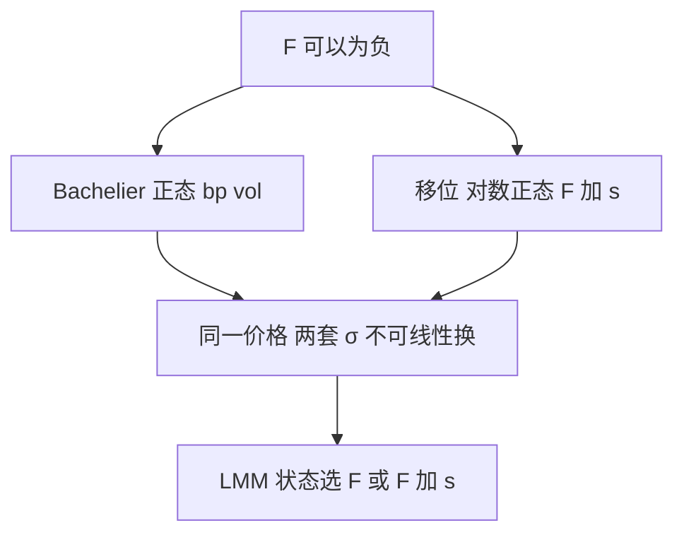

# 负利率与移位模型

对数正态在零处有吸收壁；利率一旦可以是负的，Black 公式与 SABR 的 $F^\beta$ 都要先平移，或改用正态 Bachelier。

<footer>—— Bachelier, Théorie de la Spéculation, 1900；移位对数正态见利率市场在 2014–2015 年后的报价惯例</footer>

[上一课](/quant/sabr-lmm-calib)的 SABR-LMM 还默认远期为正。2014 年后欧元、日元互换率进入负值，lognormal Black 的 $\ln F$ 与 $\alpha/F^{1-\beta}$ 崩溃。本课缺口是**坐标再换一次**：Bachelier 正态波动（bp vol）与移位对数正态 $F+s$。这是衍生品进阶最后一课；下一课程从组合的 Merton 实现接上。

## 问题

Black-76 要求 $F\gt 0$。$F\le0$ 时 ATM caplet 仍在交易，市场改报 normal vol $\sigma_N$，使价格等于 Bachelier 公式。移位模型用 $\ln(F+s)$，把壁移到 $-s$。问题是：两套报价并存，转换依赖模型（同一价格对应的 $\sigma_N$ 与 $\sigma_{LN}$ 不是常数比）。校准必须先锁定惯例，见 [报价惯例](/quant/quoting-conventions)，再谈 SABR。

移位 $s$ 是参数：太小，负利率一深又撞壁；太大，微笑形状被扭曲，$\beta$ 的含义改变。$s$ 应相对历史最低与期权翼部来选，并隔日稳定，不要每天当自由参数——否则又是校准多峰。

### 正态不是「零利率的极限」那么干净

$F\to0$ 时 lognormal vol 爆炸，normal vol 仍有限。但这不表示动态真是算术布朗：长期正态允许利率任意负，概率质量在很负的区域过大。移位对数正态在 $-s$ 有壁，更像「有下界的正变量」。选择是模型风险，应报两套对冲比。

股权可以忽略移位；FX 即期为正也不需要。只有利率（及部分通胀、价差）才把移位当默认。不要把本课写成权重量化或神经网络量化。

## 方法

内部价格用 Bachelier 或 shifted SABR（Hagan 公式的移位版）。网格：swaption 的 ATM 用 $\sigma_N$ 或 shifted $\alpha$。LMM：对 $L_i+s$ 建对数动态，或对 $L_i$ 建正态动态（Bachelier LMM），相关校准对象跟着变。对冲：bp DV01 与 bp Vega 是交易员语言；内部 AAD 应对移位后的状态，再映回 bp。

负利率下 floor 不再是「几乎无价值的下侧」，虚值 floor 可以很贵。这改变结构票据里的利率保底腿。

## 机制

几何布朗在 0 不可达或吸收（视参数），不能生成负值。市场要负值，就必须换扩散的状态变量：$F$ 本身（正态）或 $F+s$（移位）。微笑的 $\rho,\nu$ 在新坐标下重新解释：同样的风险反转，在 $\sigma_N$ 与 $\sigma_{LN}$ 里数字不同。PCA 与桶必须在同一惯例下做，混用会造出假的倾斜因子。

## 边界

$s$ 的改变会移动所有希腊值，属于模型变更，要走模型风险流程。深度负值与高 vol 下正态模型的利率可以负到没有经济意义，应截断并承认截断对 cap 的影响。RFR 复合后的有效 $F$ 仍可为负。本课结束利率微笑坐标；组合课不再假设你可以随时用 lognormal 债券期权。

## 小结

- 负利率迫使 Bachelier 或移位对数正态；Black 的 $\ln F$ 不能用。
- $\sigma_N$ 与 $\sigma_{LN}$ 不可常数换算；$s$ 应稳定少动。
- LMM/SABR 的状态与对冲桶都要在同一惯例下。
- 出处：Bachelier, 1900；移位 SABR 与 bp vol 为 2014 年后市场惯例。
