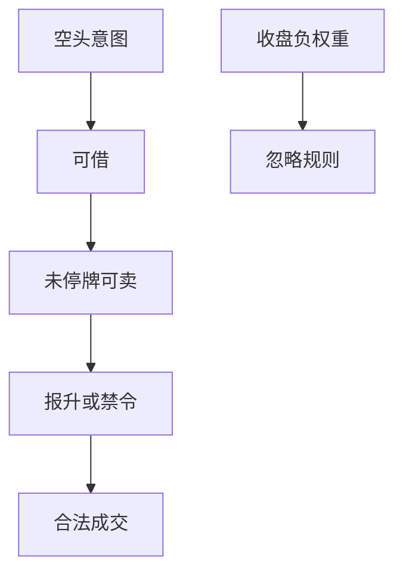

# 做空规则与报升

可借且未停牌，仍可能不能按你想要的方式卖空：报升、融券限制与临时空头禁令把空头腿从「负权重」变成受规则约束的委托。

<footer>—— 据 SEC Regulation SHO；Diether, Lee and Werner 对报升的研究；Beber and Pagano 对空头限制的讨论整理</footer>

上一课[停牌与涨跌停对回测](/quant/halt-limit-backtest)给出可成交集合。做空还要过交易规则：报升（uptick）、价格测试、裸卖空限制、以及危机中的临时禁令。本课补空头委托如何合法发出。借券资格已在融券课；本课是成交方式。不把 SHO 写成法条注释。

## 问题

纸面多空每天按收盘把权重写成负数，隐含你总能以收盘价卖空。Regulation SHO 一类规则要求空头在全国最优买价之上或以买价且满足条件成交，危机中还有过更硬的报升。禁令期间某些金融股不能新开空头，只能回补。Beber–Pagano 讨论空头限制对流动性与价格发现的影响；回测要的是更窄的一句：当时若禁止或限制，纸面空头收益不可得。缺口是给空头委托一个**规则过滤器**，与可借、未停牌并列。

用今日已废止或已放宽的规则回填历史，或反过来用历史上的硬报升约束今天的美股回测而不声明，都会错。规则是时间序列。

### 报升不是借券费

借券费是持有成本；报升是成交约束，可能让你在急跌时无法按市价开空，只能排队或放弃。急跌恰好是纸面空头想成交的时刻。把报升当成多付几个基点，会低估：它改的是能否成交，不是费率表。

裸卖空限制要求先借到或定位到券再卖。这把融券课的资格与本课的委托顺序绑在一起：没有 locate 就不能发单。

## 方法

开空前检查：当时规则是否允许、是否需报升或价格测试、是否在禁令名单。不允许则当日空头增量视为零，已有空头按规则或可回补。回测成交价不得劣于规则允许集；若日线无法模拟测试，至少在下跌日对空头开仓施加惩罚或禁止市价开空。禁令名单必须 PIT：用事后「曾被禁」的股票集合回填整个样本，会把未禁时期也当成不可空。

空头回补（买开平）通常不受报升限制，但受涨跌停与停牌限制。不要把开空规则套到回补上。

价格测试在下跌日绑定：你最想开空的时候规则最紧。日频回测无法逐笔模拟时，保守做法是下跌日禁止新开空、只允许持有或回补，并报告因此损失的纸面收益。这比假装以收盘价空出更接近可实施集合。临时禁令按名单与生效日过滤，未列入的名字保持可空，不要把整个金融行业在禁令年一律删掉。

## 机制

空头限制在下跌日绑定：价格发现变慢、反弹时挤压更猛，纸面空头在限制日「成交」的那一段往往最不可实施。与质量、PEAD 空头叠加时，三次过滤（可借、可成交、可报升）之后，剩余截面偏向大盘 GC 券，异象衰减。这不是要你放弃空头，而是禁止把未过滤的空头收益写成可交易 alpha。

下一课期权行权会创造临时空头（指派）；规则同样适用于因行权产生的股票空头，不能只过滤主动开空。

开空增量过三道门：可借、可卖、当时价格测试或禁令。禁令名单按生效日 PIT。下跌日若无法模拟逐笔报升，至少禁止空头市价开仓或施加成交惩罚。回补不受报升约束，但受涨跌停约束。规则参数按历史时段切换：SHO 实施前后、临时禁令期、现行替代规则不得混用一个过滤器。过滤前后空头收益差要报告。

## 边界

不对照各国空头禁令年表做监管综述。期权与期货的空头规则不同，下一课起分产品日历。后课默认：负权重先过当时做空规则；规则参数按日 PIT。

后课期权指派可能被动制造股票空头，同样过这三道门。本课规则参数按时段 PIT。下跌日纸面空头最不可实施，过滤差必须报告。回补与开空不对称。禁令名单不得用「曾被禁」回填未禁时期。

后课默认负权重先过当时做空规则，规则参数按日 PIT；回补与开空的约束不对称。

locate 与报升是顺序关系：没有 locate 不能发空单，有 locate 仍可能过不了价格测试。回测把两道门写成短路逻辑，不要合成一个「空头摩擦基点」去减收益——那会在下跌日假装已经成交。

因期权指派被动产生的股票空头，同样要过可借与报升两道门，不能只过滤主动开空。

## 小结

- 可借、可成交、可合法报空是三道门。
- 报升约束成交方式，不是又一项借券费。
- 禁令与测试规则是时间序列，禁止用现行规则回填。
- 下跌日的纸面空头成交最不可实施。
- 回补与开空的规则不对称。
- 出处：SEC Regulation SHO；Diether, Lee and Werner；Beber and Pagano。
