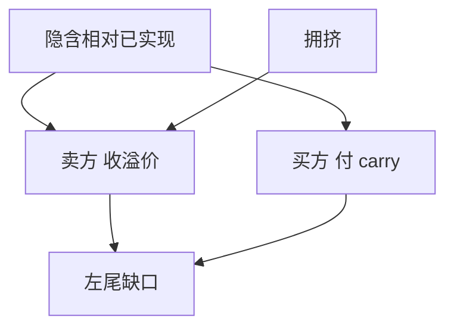

# 波动率卖方与尾部

卖出隐含相对已实现的差额，平均能收到波动风险溢价；同一笔仓位在左尾是杠杆空头凸性，不是「稳定的类债券息票」。

<footer>—— Bakshi and Kapadia, Review of Financial Studies, 2003；方差定价见 Carr–Madan 与方差互换课</footer>

[上一课](/quant/capital-structure-arb)的跨要求权残差里已经混着隐含波动。本课把**波动率卖方**单独放到策略地图上：卖方差、卖跨式、卖 VIX 期货曲线，以及对称的**买尾部**。主干 [方差互换与 VIX](/quant/variance-swap-vix)、[Gamma–Theta](/quant/gamma-theta-tradeoff)、[VIX 期限结构](/quant/vix-term-structure-trade) 已写合约与希腊字母。本课只补策略族：溢价从哪来、何时该当成 ARP、何时只是拥挤的空头凸性。

## 问题

期权隐含波动平均高于随后已实现，delta 对冲的多头期权期望为负（Bakshi–Kapadia）。卖方把这块叫做「波动风险溢价」。问题是路径：溢价在多数月份像收息，在少数月份像缺口。把卖方净值的夏普当产品承诺，等于用正偏的抽样误差卖左尾。买尾部（OTM 看跌、VIX 看涨、方差上端）是反向：长期负 carry，危机凸性。地图必须把两者分开记账，不能在「另类收益」里只报卖方。

与宏观、RV：短波动常被当成无关的第三条腿。2018 年 volmageddon、2020 年 3 月说明短波动与风险平价、趋势的去杠杆可以同步。

### 不要把 Theta 当 alpha

持有空 Gamma 每天收 Theta，这是会计，不是预测力。公平溢价已经在隐含里。只有隐含相对随后实现的偏差超出融资与缺口补偿时，才有可卖的边缘，见 [净边缘](/quant/net-edge)。杠杆 ETF 的每日重置是另一条 Jensen，见 [杠杆与波动拖累](/quant/leverage-volatility-drag)，不要和卖方差混成同一个「波动产品」。

尾部对冲的失败模式是「买了但不在该在的行权价与期限上」。指数看跌的最贵处往往是拥挤的 5%–10% 一个月，真正的缺口可能更左或更长。

## 方法

卖方：方差互换、delta 中性跨式、看跌价差、VIX 期货展期。买方：OTM 看跌、看跌价差、VIX 凸性。预算：用情景缺口（实现波动跳到 $x$）而不是历史 VaR。容量：场内期权冲击与做市商对冲流会反噬，见拥挤课。报告：分开「收溢价月份」与「付凸性月份」的贡献。

## 机制

风险厌恶与做市商库存使隐含 > 实现的均值。卖方提供保险，买方付保费。拥挤的卖方把保费压薄，剩下缺口风险。尾部买方若只买拥挤行权价，付的是他人的库存转移，不是自己的凸性。

## 边界

本课不写未对冲的裸卖出作为「增强收益」建议。个股短波动还有借券与跳跃违约。评价必须含最坏月份，不能只报扣掉危机后的夏普。

## 小结

- 短波动收的是波动风险溢价，付的是左尾凸性；二者必须分报。
- Theta 是会计，不是 alpha。
- 与风险平价、杠杆重置不是同一产品。
- 出处：Bakshi and Kapadia, *RFS*, 2003；复制与 VIX 见 Carr–Madan 及方差互换课。
