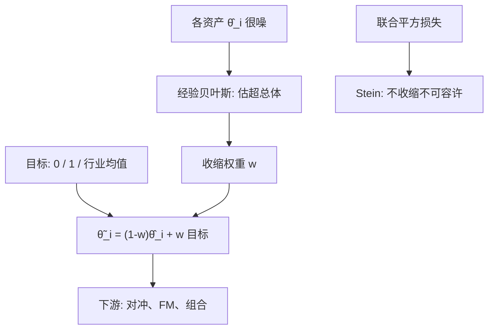

# 收缩与实证贝叶斯

把许多平行的均值各自用样本均值去估，总风险可以高于把它们一起拉向共同中心；经验贝叶斯用数据估这个中心与拉近的强度。

<footer>—— Stein, Inadmissibility of the Usual Estimator for the Mean of a Multivariate Normal Distribution, 1956；金融里 beta 收缩见 Vasicek, Journal of Finance, 1973</footer>

[上一课](/quant/bayesian-factor-comparison)用边缘似然比较整套因子模型，惩罚只拟合样本 $\alpha$ 的额外因子。实践里更常面对的是两千个 $\beta_i$、两千个 $\alpha_i$，每个都噪声很大。Stein 证明 $N\ge 3$ 时各维样本均值作为联合估计不可容许；Vasicek 把同一思想用在 $\beta$。本课缺口：从模型胜负落到单个参数的收缩。[协方差收缩](/quant/cov-shrinkage) 已处理 $\Sigma$；这里对象是回归系数、alpha、均值。不重写边缘似然与因子夏普约化。下一课处理收缩仍吃不消的离群点。

## 问题

观测 $y_i=\theta_i+\varepsilon_i$，$\theta_i$ 来自超总体。样本 $\hat\theta_i$ 对单个 $i$ 无偏，但对损失 $\sum(\hat\theta_i-\theta_i)^2$ 过大：极端 $\hat\theta$ 多半是噪声。收缩

$$
\tilde\theta_i=(1-w)\hat\theta_i+w\bar\theta
$$

引入偏差、降低方差。经验贝叶斯用截面估 $w$（噪声方差 vs 真离散）。问题是选收缩目标（总均值、行业均值、CAPM $\beta=1$）以及承认异质噪声（薄股票 $w$ 更大）。

资产定价里：Vasicek $\beta$ 是默认；$\alpha$ 收缩决定「有没有特异收益可做」；均值收缩是 Black–Litterman 与组合的入口。对象不是再比较模型后验，而是给出可用于下游的点。

### 与惩罚回归的关系

岭回归、[正则化线性 alpha](/quant/regularized-linear-alpha) 是同一偏差–方差的计算形式。经验贝叶斯给 $w$ 一个分层概率解释，并允许从数据估超参。LASSO 做选择（点质量在零），James–Stein 做均匀拉近。因子载荷多、且你相信多数真 $\alpha$ 接近零时，选择式先验（spike-and-slab）更接近上一课的包含概率。

收缩不是「把 t 不显著的变成零」的事后手续。先看 t 再收缩，用了两次数据，覆盖概率坏。应预先声明目标与公式，或用分层模型一次算出后验。

## 方法

**Vasicek $\beta$。** 先验 $\beta\sim N(\beta_0,v_0)$，似然方差来自时间序列。后验均值是精度加权。$\beta_0$ 常用 1 或行业均值；$v_0$ 用截面残差减平均估计方差（经验贝叶斯）。薄股票、短窗，权重大幅向 $\beta_0$。

**alpha / 均值。** 把 $\hat\alpha_i$ 向 0 或向截面均值拉。若目标是组合，向零收缩 $\alpha$ 等于缩小主动权重。Efron–Morris 给出经验贝叶斯的经典实现。注意：$\hat\alpha$ 相关（共同因子残差），独立正态公式会收缩不够或过度；应先滤因子，或对残差用多元分层。

**协方差。** Ledoit–Wolf 向单位阵或常相关目标拉，见已有课。本课不重复特征值公式，只强调：均值与 $\beta$ 的收缩不能代替 $\Sigma$ 收缩，优化器两头都噪。

### 超参不要样本内调到最大夏普

用同一段收益既估 $w$ 又评组合，会挑出过小的 $w$（看起来主动很强）。应时间序列交叉验证估超参，或用封闭的经验贝叶斯矩（不直接瞄夏普）。这与预测回归的样本外纪律相同。

## 机制

平方损失下，后验均值是最优点估计。经验贝叶斯用边际分布估先验方差：截面看到的离散 = 真异质 + 估计噪声，减去噪声得到 $v_0$，再得 $w$。机制是**借强度**：每个 $i$ 用其他 $j$ 的信息。Stein 的不可容许是联合损失下的定理；对单个预先指定的 $i$，无偏 $\hat\theta_i$ 仍可更可取——所以对「这一只股票的 $\beta$ 要不要收缩」取决于你的损失是组合级还是个案级。

与 Fama–MacBeth 生成回归量：收缩 $\beta$ 再进截面，能减轻衰减（attenuation 的反向是噪声 $\beta$ 把 $\lambda$ 拉向零）。Vasicek 之后再 FM，是工程上常见的两步；贝叶斯层次可一次完成，但报告更难。

向 1 收缩 $\beta$，会让高 $\beta$ 股票的 $\beta$ 下来、低的上去，市场中性组合的残差风险下降，但也削弱了「赌 $\beta$」的暴露。目标必须与策略一致：做 BAB 不应把 $\beta$ 全拉到 1。

### 何时不收缩

$N=3$ 的货币对、明确的结构参数（久期、合约乘数）、以及你要对单一事件做无偏描述（事件 CAR）——收缩会把案例拉向总体，掩盖正是你想看的异常。事件研究的平均 CAR 已经是一种借强度；再把每个 CAR 向零拉，是另一个问题。

## 边界与工程取舍

肥尾下正态分层会把危机当成「真 $\theta$ 极大」，收缩不够；应 t 分层或先 winsor。生存偏差让存活公司的 $\alpha$ 截面右偏，经验贝叶斯目标被污染。国际样本的超总体是否共同，值得按市场分层。

工程：个股 $\beta$ 默认 Vasicek 或行业分层；协方差走 Ledoit–Wolf；$\alpha$ 收缩超参用样本外。不要对已经 [IPCA](/quant/ipca) 结构化的载荷再随便 James–Stein 一层而不声明。不要把收缩后的 $t$（用未收缩标准误）当推断——标准误须与估计器匹配，或改报后验区间。下一课：离群让均值与 $\beta$ 的高斯分层一起坏掉。

## 小结

- 多参数联合损失下，把估计拉向超总体中心，往往优于各估各的样本矩。
- Vasicek 的 $\beta$ 收缩是金融默认的经验贝叶斯；权重由估计噪声对真截面离散决定。
- 超参须样本外或用边际矩，不能对同一夏普调 $w$。
- 收缩改点估计，推断要用匹配的后验或适当标准误；与协方差收缩分工。
- 出处：Stein, 1956；James and Stein, 1961；Vasicek, *Journal of Finance*, 1973；Efron and Morris 的经验贝叶斯；协方差一侧见 Ledoit and Wolf。
