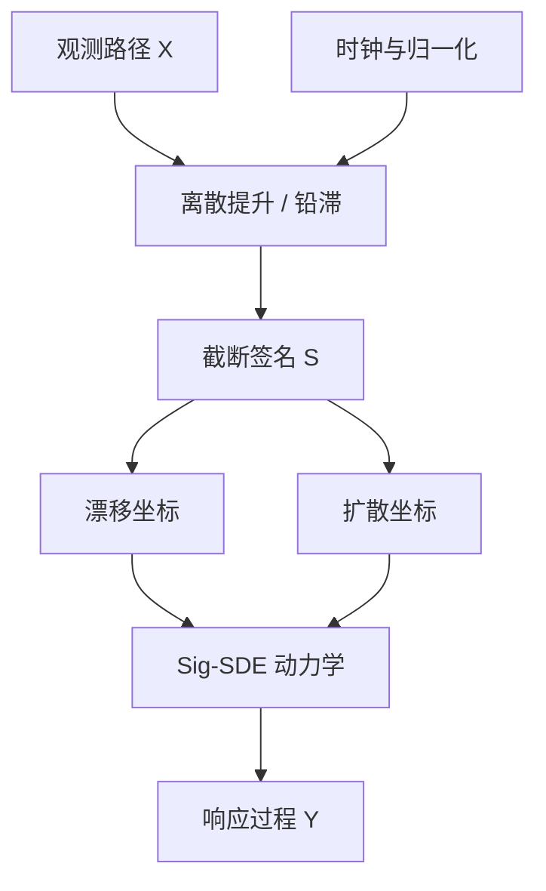

# Sig-SDE

    
一条路径的签名是它的迭代积分塔：在适当正则条件下，签名决定路径的形状，并把非线性泛函变成签名坐标上的线性读数——于是随机微分方程的响应，可以被写成对驱动路径签名的回归。

    <footer>—— 据 Lyons 粗路径理论；Chevyrev, Lyons, Oberhauser 等对签名特征的论述；Kidger 对神经微分方程的综述</footer>

金融里的「状态」往往不是一个向量，而是一段已经走出来的路径：波动率轨迹、订单流累积、利差的粗糙样本。把路径切成固定窗口再喂给普通回归，会丢掉次序与高阶交互。[粗糙波动](/quant/rough-vol) 已经表明，对数波动的增量接近 Hurst 远小于 $1/2$ 的分数布朗，经典 Itô 系数函数未必是正确的建模对象。签名随机微分方程（Sig-SDE）把粗路径签名当作状态的充分统计，用它对漂移与扩散做仿射或多项式展开，使模型既保留路径依赖，又保持可校准的线性结构。本篇写签名是什么、Sig-SDE 如何把 SDE 写成签名坐标上的动力学，以及截断与样本频率带来的偏差。它是表示与估计架构，不是一组可直接下单的信号配方。

## 问题

经典扩散

$$
\mathrm{d}X_t = b(X_t)\,\mathrm{d}t + \sigma(X_t)\,\mathrm{d}W_t
$$

假定未来增量只依赖当前点 $X_t$。市场里常见的却是对整段历史的依赖：同一点位，若刚刚经历一串同向冲击，后续的条件漂移与条件波动都不同，见 [Hawkes 成交](/quant/hawkes-trades) 与传播核对订单流记忆的讨论。把历史压成若干滞后项，维数随窗口线性涨，交互却仍是人为指定的。

粗路径给出另一条路。对一条有有限 $p$-变差的路径 $X$，其签名 $S(X)_{s,t}$ 是张量代数里的元素，第 $k$ 级是 $k$ 重迭代积分。Chen–Lyons 的唯一性表明：在树约化（tree-like）等价类的意义下，签名决定路径。泛函 $f(X|_{[0,t]})$ 若充分正则，可被签名的线性泛函逼近。问题于是变成：如何把这一特征映射嵌进 SDE，使系数对路径的依赖是可估计的，而不是一个无限维黑箱。

### 签名作为路径的基

一维路径的签名从增量、再到对增量的积分、再到更高重积分。多维时还包含不同坐标之间的交叉积分，它们编码面积、次序与「先涨后跌」和「先跌后涨」的差别——这正是普通矩和滞后相关会抹平的信息。对数签名把级数里的冗余（陈恒等式）除掉，使截断后的坐标更接近一组独立特征。实务上截到 $N$ 级：级越高，对高频抖动越敏感，样本需求也按阶乘级上升。

签名不是对价格做傅里叶变换。它是对路径本身的基展开，时钟必须先声明：墙钟、成交时钟还是波动时钟。同一条价格轨迹在不同时钟上的签名不可比，正如实现波动在不同采样下不可比。

## 方法

Sig-SDE 的典型写法是让状态 $Y$ 的系数成为驱动路径签名的线性（或低阶多项式）函数。若 $S_t$ 表示 $X$ 到 $t$ 的截断签名，则

$$
\mathrm{d}Y_t = \langle \ell_b, S_t\rangle\,\mathrm{d}t + \langle \ell_\sigma, S_t\rangle\,\mathrm{d}W_t,
$$

其中 $\ell_b,\ell_\sigma$ 是待估的张量坐标。这样，$Y$ 对 $X$ 的响应自动包含路径依赖，而未知量仍落在有限维线性空间里。估计可以是矩匹配、特征函数回归，或把签名坐标当作因子、对增量做线性回归。神经 SDE / 神经 RDE 把同一思想换成用神经网络读签名或用对数签名驱动受控微分方程，表达力更强，识别则更依赖正则与样本切分，见 [金融交叉验证泄漏](/quant/cv-leakage-finance)。

数据侧，签名对时间重参数化部分不变、对平移的处理取决于是否先做铅化（lead-lag）或是否加入时间坐标。金融实现几乎总把日历时间作为额外一维，否则停牌与午休会把变差结构扭曲。离散观测下，迭代积分用 Young 或粗路径提升（如混合铅滞）来近似；采样越稀，高阶签名的偏差越大。这与 [不规则采样](/quant/irregular-sampling) 是同一工程问题的代数版本。

### 截断、铅滞与离散提升

截断误差有理论界，但界对金融粗糙路径往往偏松。实践是：先固定时钟与归一化（例如对增量除以局部波动），再在验证段上看 $N=2,3,4$ 的样本外误差，而不是把 $N$ 调到训练集最优。铅滞提升把路径与其滞后拷贝并成二维，使签名能看见二次变差类的信息；对半鞅这近似于把 $[X]$ 写进特征。不要在已经包含成交量时钟的路径上再叠一套未声明的铅滞，否则特征共线，回归系数会在样本间乱跳。

数值上，签名可用 Horner 式或核方法（签名核）计算，避免显式张量爆炸。核方法把 $\langle S(X),S(Z)\rangle$ 收成可递归的标量，适合样本间比较；显式坐标适合写成因子、再与别的截面特征拼接。选择取决于你要的是「两条路径有多像」还是「哪一级面积项在定价」。

## 机制

机制上，Sig-SDE 把「记忆」从隐状态移到可观测的路径坐标。Hawkes 用强度核记住事件；OU 用一个均值回复状态记住偏离；签名用迭代积分记住整段形状。三者不是互斥：可以把 Hawkes 计数路径的签名送进强度，也可以把粗糙波动路径的签名送进期权特征函数的回归。差别在可解释性：截断签名的每一级对应明确的重积分，系数可以按级报告；深度网络读签名之后，这一层可解释性就放弃了。

与粗糙波动的衔接是自然的。若对数波动是粗糙驱动，价格是以该驱动为系数的 SDE，则联合路径 $(S,\sigma)$ 的签名包含杠杆、回转与「波动先动还是价格先动」的面积项。把这些项当作定价因子，是用线性模型去逼近一条非马尔可夫的联合动力学，而不是声称市场服从某个低维扩散。校准应在时点样本上做，避免用整段未来路径的签名去解释当前价格，那会直接引入 [前视](/quant/look-ahead-bias)。

### 作为表示定理而非交易规则

通用逼近说的是：足够多的签名坐标可以逼近足够正则的路径泛函。它不说某个截断级的系数在下一期仍然稳定，更不说该系数可交易。市场体制一切换，路径测度改变，签名的分布跟着变。正确用法是：在声明的样本与时钟上，把 Sig-SDE 当作条件期望的参数化，再在新的体制里重新估计。把它的残差当 alpha，必须另走一套净化与容量约束，与模型本身无关。

签名对时间重参数化的部分不变性，容易让人以为「采样频率无所谓」。金融里采样频率改变的是可观测路径，不是同一条连续路径的重标度。Tick 与一分钟 bar 的签名描述的是两个不同对象。

## 边界

路径必须先被定义成有限变差或可提升的粗路径。买卖价来回跳、错印、停牌跳空会污染高阶积分，应先按 [Tick 清洗](/quant/tick-cleaning) 处理，再算签名。截断级随维度指数涨：十维因子路径截到 4 级已经不可在显式坐标里承受，应降维或改核。盘中与隔夜不是同一条路径，强行连接会把隔夜跳空写成巨大的一阶签名，淹没日内面积项。

不要把神经 SDE 的漂亮样本路径当成已经识别了真实扩散系数。生成模型可以拟合边际，却把条件漂移认错。不要用未来整段路径的签名做当下的状态——因果签名只能用 $[0,t]$。A 股午休、集合竞价与涨跌停会切断变差，应分段提升。

Sig-SDE 是把路径泛函写成可回归坐标的架构。它不提供「用签名预测下一笔成交方向」的保证，也不替代对微观结构事件的显式建模。事件层面仍要用订单与簿，而不是把一切压进一条中点路径的签名。

## 小结

- 签名是路径的迭代积分塔；在树约化意义下它决定路径，并使路径泛函可被线性读出。
- Sig-SDE 让漂移与扩散成为截断签名的线性或低阶函数，从而用有限维系数表达非马尔可夫依赖。
- 时钟、铅滞、归一化与截断级是识别条件，不是可事后调的装饰。
- 因果要求只用到 $t$ 为止的签名；用整段未来路径是前视。
- 与粗糙波动、Hawkes 记忆兼容，但是表示层，不是现成交易规则。
- 出处：Lyons 粗路径与签名；Chevyrev, Lyons, Oberhauser 等签名特征；Kidger 神经微分方程综述；Morrill, Salvi, Kidger, Foster 等神经 RDE。
