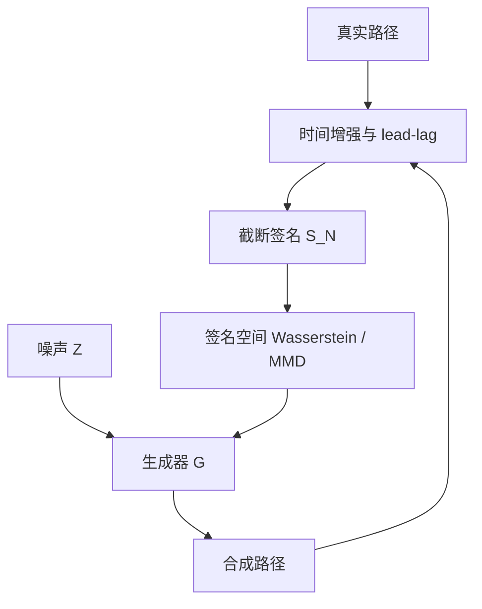

# Sig-Wasserstein GAN

    
路径空间上的概率测度，在适当正则下被期望签名唯一确定；于是把 Wasserstein 距离搬到截断签名上，对抗训练比较的是过程的特征，而不是逐点对齐的轨迹。

    <footer>—— Chevyrev and Lyons, Characteristic functions of measures on geometric rough paths, 2016；生成实现见 Ni, Szpruch, Wiese et al., Sig-Wasserstein GANs, 2021</footer>

普通 GAN 把时间序列当成欧氏向量：判别器看的是逐坐标或卷积局部图案。金融市场的「像」，首先是路径泛函的分布——二次变差、杠杆、领先滞后——而不是某一天的点值对齐。[Path Signature](/quant/path-signature-features) 把一条（加时间、做 lead-lag 的）路径压成迭代积分坐标；Chevyrev 与 Lyons 证明期望签名在相当一般的条件下扮演特征函数。Sig-Wasserstein GAN 把生成器的输出路径与真实路径的期望签名对齐，用签名空间里的 Wasserstein 型损失替代像素级对抗。本篇写这一距离为何比逐点 GAN 更贴过程，截断与增强如何改变可识别的动态；评估协议见 [生成式回测的评估](/quant/generative-backtest-eval)，线性读签名做交易见 [Signature Trading](/quant/signature-trading)。

## 问题

设 $X$ 为 $[0,T]$ 上的路径（或离散采样后的折线）。生成器 $G_\theta$ 把噪声 $Z$ 映成路径 $\widehat{X}=G_\theta(Z)$。要 $\mathrm{Law}(\widehat{X})$ 接近 $\mathrm{Law}(X)$。逐点 $L^2$ 或逐点判别会惩罚时间微移：同一条波动聚集路径错开半个窗口，损失可以很大，而交易相关的泛函几乎不变。反过来，两条边际相似、依赖结构全错的路径，逐点损失可以很小。

签名 $S(X)$ 的坐标是迭代积分。截断到阶 $N$ 后，$S_N(X)$ 是有限维向量。期望 $\mathbb{E}[S_N(X)]$ 捕获到 $N$ 阶的路径矩。Chevyrev–Lyons 的特征函数定理说：在紧集、适当衰减的矩条件下，期望签名决定路径测度。于是「分布近」可以改写成「期望签名近」，而不要求路径在同一时钟上点对点重合。

Wasserstein 距离在欧氏签名空间上可算、可反传（对截断签名几乎处处）。GAN 的判别器不必再学「这是不是真序列」，而可以退化成对签名坐标的线性或浅层函数——理论上甚至只需匹配期望签名。实践中仍常保留一个弱判别器，或用签名 MMD，以避免只匹配均值而忽略签名的随机波动。

### 为何不是对原序列做 WGAN-GP

WGAN 要求 Lipschitz 判别器。对变长、不规则采样的金融路径，卷积判别器的 Lipschitz 约束与填充约定纠缠，模式崩塌时仍能骗过局部纹理检查。签名先把路径映到固定维的张量代数，时钟差异被时间增强部分吸收，lead-lag 把离散采样的二次变差写进交叉积分。判别发生在这个特征空间，生成器梯度指向的是「改路径使签名矩对齐」，而不是「改某一个 tick 的价格去骗卷积核」。

期望签名唯一决定测度，是截断趋于无穷、路径足够正则时的定理。有限 $N$ 只匹配有限阶矩。$N$ 太小，生成器可以在高阶振荡上作弊；$N$ 太大，签名维数爆炸，经验期望在小样本上极度嘈杂。阶数是偏差-方差，不是「越大越真」。

## 方法

**路径预备。** 原始价格不可直接签：平移、尺度会污染低阶项。常见流水线是：对数收益或对数价格、拼接时间坐标 $t$、再做 lead-lag 变换（把路径变成 $(X_{t^-},X_{t^+})$ 以捕捉离散二次变差）。没有时间增强，时间重参数化会混进树状等价类；没有 lead-lag，折线近似的二次变差信息弱。这些变换必须对真假路径一视同仁，写进数据管道而不是网络内部的私有预处理。

**生成器。** 可以用 Neural SDE、LSTM、或卷积解码从噪声生成离散路径，再计算截断签名。损失是

$$
W\bigl(\mathbb{E}[S_N(X)],\mathbb{E}[S_N(G_\theta(Z))]\bigr)
$$

的经验版，或带协方差的二次形式（Sig-MMD）。纯匹配期望签名相当于匹配特征均值；若下游关心尾部路径泛函，应加签名的二阶矩或在原空间加分位数惩罚。条件生成把宏观或波动状态拼进 $G_\theta$，条件也必须进入签名比较的分组里，否则条件被平均掉。

**截断与基。** 维数 $d$ 的路径，阶 $N$ 的签名维数是 $(d^{N+1}-1)/(d-1)$。lead-lag 后 $d$ 至少是 2 或 3，阶 4–5 已经很重。对数签名降低冗余，但不改变「阶数选择」这一建模决策。对多资产，$d$ 再升，通常先降维到因子路径再签名，或用签名核随机傅里叶特征，而不是把全市场逐券签到高阶。

### 对抗项何时还需要

若只最小化 $\|\bar S_{\mathrm{real}}-\bar S_{\mathrm{fake}}\|_2$，生成器可以产出签名均值正确、样本路径病态的「平均市场」。加一个在签名空间或浅层路径特征上的 Wasserstein 判别器，能匹配更多的签名分布形状。Chevyrev–Lyons 给的是识别性，不是有限样本最优检验。工程上 Sig-WGAN 往往是「签名特征 + WGAN 损失」，而不是定理的字面算法。把判别器做得很深，又会退回普通 GAN 的不稳，签名的归纳偏置被浪费。

## 机制

签名坐标按阶数分层：一阶是增量，二阶含面积（Levy 面积）与二次变差的交叉项，更高阶编码更细的振荡与先后顺序。匹配低阶，生成器先学会漂移与波动水平；匹配到二、三阶，才开始被迫产生杠杆（价跌与波动升的先后）和粗糙的短时依赖。这与手工做「先匹配均值方差、再匹配 ACF、再匹配杠杆相关」的 stylized facts 清单是同一件事的代数化，但梯度是端到端的。

Wasserstein 相对 Jensen–Shannon 的好处在此仍然成立：支撑不重叠时仍有梯度。签名空间里假样本一开始就可能与真样本的凸包不相交（尤其高阶坐标尺度巨大），必须对签名做标准化或用对数签名。尺度若不统一，损失会被最高阶坐标主导，生成器只顾着压高阶噪声，低阶的波动聚集反而没学到。

### 与 VAE Market Generator 的接口

[VAE](/quant/market-generator-vae) 在数据空间重建，潜变量可编码、可插值。[Neural SDE](/quant/neural-sde) 把 $G$ 限制为扩散，签名损失可以作它的训练目标——Kidger 等人把 Neural SDE 写成无穷维 GAN，签名是一种具体的判别特征。Sig-WGAN 不强制潜空间可逆，也不强制半鞅。三者可以叠：SDE 生成器 + 签名 W 损失，或 VAE 解码后再用签名 MMD 微调。不要并列三套生成器却用三套不同的窗口与归一化，却声称在比较算法。

Chevyrev–Lyons 论文写的是粗糙路径上测度的特征函数，不是 GAN。Ni–Szpruch–Wiese 一线把该距离接到生成对抗训练。出处应分开写：识别性归特征函数一文，训练配方归 Sig-WGAN 一文。

## 边界与工程取舍

截断签名对时间网格敏感。同一条潜在连续路径，5 分钟采样与日采样的 $S_N$ 不是同一对象。生成器输出频率必须与训练签名的频率一致，下游回测也必须用同一频率。把日频生成器的样本插值到分钟再做执行仿真，签名匹配不能为微观结构背书。

高阶签名对异常值极度敏感：一个错价 tick 会污染整段迭代积分。输入必须先清洗，否则生成器学会复制脏数据的签名。无套利、正价格、利率下界等硬约束仍要在生成器结构或投影里施加，签名损失不管这些。

计算上，每次反传都要扫一遍截断签名。路径长、阶数高时，应截断在仍能区分真假的最低阶，并用 mini-batch 的经验期望；batch 太小，高阶经验均值的方差会吞掉信号。条件、多资产、订单簿，签名维数很快不可行，应回到因子路径或核方法。

签名 MMD 为零（在给定阶）只说明该阶矩对齐，不说明策略回测可迁移。生成器可以匹配到阶 4 仍缺少真实市场的一个跳跃日；对冲网络会在这一日子上暴露。评估必须含下游任务，见评估篇。

Lead-lag 不是可选项装饰。对分段线性路径，普通签名的二次变差项退化；lead-lag 把「先买后卖」的离散面积写进二阶坐标。比较 Sig-WGAN 与普通 WGAN 时，若只有一方做了 lead-lag，比较的是预处理，不是损失。

## 小结

- Chevyrev–Lyons：期望签名在正则条件下决定路径测度；有限截断则只对齐有限阶路径矩。
- Sig-WGAN 在截断签名上做 Wasserstein/MMD，让生成器对齐过程特征，而不是逐点轨迹。
- 时间增强与 lead-lag 是识别动态的一部分，须对真假路径共用。
- 阶数与标准化决定偏差-方差；只匹配期望签名可能忽略尾部路径形状。
- 生成频率、清洗与硬约束不能由签名损失代劳；下游评估仍独立于训练损失。
- 出处：Chevyrev and Lyons, *Characteristic functions of measures on geometric rough paths*, 2016；Ni, Szpruch, Wiese, Liao and Xiao, *Sig-Wasserstein GANs for Time Series Generation*, 2021。
