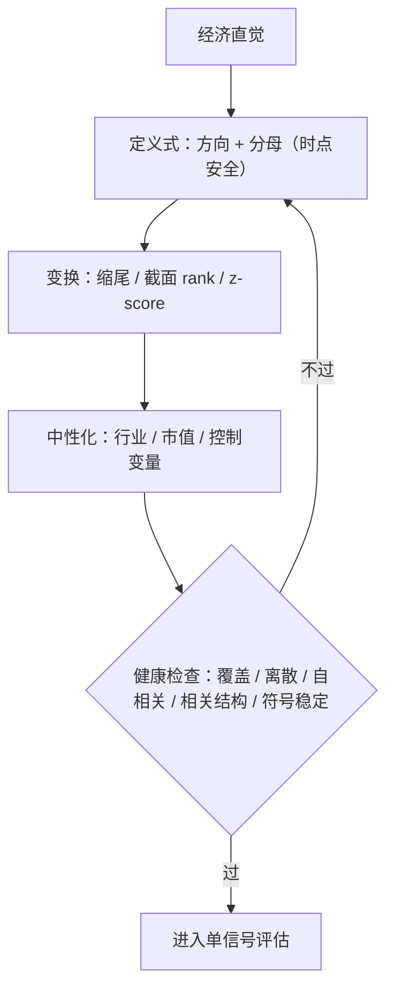
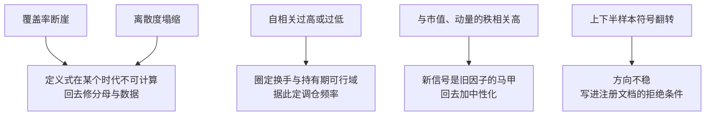

# 信号构建：从直觉到可计算量

一个直觉只有在你能写出它的相反情形时，才值得变成一行代码。

<footer>—— 据 Jegadeesh and Titman (1993) 的动量设计与 Sloan (1996) 的应计构造口径整理</footer>

[上一课](/quant/data-acquisition-audit)用五项审计把原始数据收拾成两枚时间戳齐全、宇宙完整的分析面板。本课把立项时那句经济直觉翻译成一个可计算的量：先定义式，再变换，再中性化，最后在沙盒里做单变量健康检查——健康检查不碰收益，只看信号自己。截面变换与中性化的工具在[特征：滞后、截面 rank](/quant/cs-rank-features)、[行业中性](/quant/industry-neutral)诸课备好，本课各用一次。

## 问题

直觉到定义式是错得最多的一跳。「盈利质量差的公司未来收益低」听起来完整，落到代码里立刻分裂成十几个版本：应计用总资产还是收入标准化（[应计异常](/quant/accruals-anomaly)）？预期盈利用季节随机游走还是分析师一致预期？极端值截不截？行业要不要剔？每个版本都是一个假说，而不是同一假说的实现。区别在于：这些选择是否在注册文档里被声明（上一课的合同），以及每个选择是否改变了你度量的对象（本课的问题）。变换不是中性装饰：rank 扔掉幅度信息，z-score 被极端值牵着走，中性化直接改写问题——「盈利意外」与「剔除行业动量后的盈利意外」是两个假设。

## 方法

四步，每步一个工件。**定义式**：写出方向与分母。本单元案例取 $SUE_{i,q}=\left(E_{i,q}-E^{\mathrm{exp}}_{i,q}\right)/\sigma_i$，预期项用季节随机游走带漂移，标准差只用可得历史——时点纪律从定义式就开始。**变换**：重尾财务量先缩尾再截面 rank 或 z-score；rank 对重尾与单位选择稳健，代价是扔掉幅度。选哪个取决于假设需要次序还是幅度，不是哪个 IC 高。**中性化**：行业与市值中性，或在 [Fama-MacBeth 回归](/quant/fama-macbeth)里把已知因子作控制变量；中性化是问题的一部分，必须在注册文档里，不是评估阶段的旋钮。**沙盒健康检查**：不碰收益，只看五样——随时间的覆盖率曲线、截面离散度、信号自相关（它预示换手）、与市值和行业的秩相关、上下半样本的符号稳定性。检查不过，回到定义式，不许直接去翻收益。

SUE（标准化盈利意外）就是用「实际盈余减去预期盈余，再除以这只股票自己的历史盈余波动」的手段来回答「这次惊喜有多大」。除以波动是为了横向可比：盈余多出 1 亿元，对市值百亿的公司是家常便饭，对市值五亿的公司就是大事件。

Jegadeesh 与 Titman 的动量取「过去 12 个月、跳过最近 1 个月」：跳过的那一段是买卖价差弹跳造成的短期反转，不属于动量假设。信号定义里的每一项都要能说出是为什么——哪一项是在给微观结构噪声让路。

缩尾（winsorize）就是把极端值拉回分位点：比如把低于 1% 分位、高于 99% 分位的信号值分别改成分位点上的取值。盈余意外这类重尾财务量里，一家公司的一次并购可以让它的取值是其余股票的几十倍；不缩尾就做 z-score，均值和标准差全被这一只票拽偏，整张截面的分数跟着失真。

### 健康检查清单的位置

rank 变换可以类比成比赛只记名次不记成绩：冠军领先 0.01 秒还是 10 秒，榜单上一视同仁。极端值因此伤不到排名，代价是「赢了多少」的幅度信息被扔掉——z-score 正好相反，保留幅度但会被极端值牵着走，所以才要先缩尾。

## 机制

健康检查为什么能不碰收益就拦住大半错误：覆盖断崖说明定义式在某个时代不可计算（分母不稳或审计漏项）；截面离散度塌缩说明信号在大多数股票上没有区分度，IC 的分母会吃掉一切；自相关的过高过低直接圈定换手与持有期的可行域；与已知因子的秩相关揭示「新信号」是不是市值或动量的马甲；上下半样本符号翻转是最便宜的可证伪性预演——注册文档里的拒绝条件在这里先小规模兑现一次。方向与符号约定在代码里一次性冻结（[XAlpha：假设到代码](/quant/xalpha-hypothesis-code)的口径）：多空写反是沙盒里最便宜也最贵的事故——便宜因为查得出，贵因为查不出时它伪装成反向 alpha。

IC（信息系数）衡量信号好坏：拿「信号今天给股票排的名次」和「下期收益的实际名次」算相关系数，越接近 1 越准。「分母吃掉一切」的意思是：若信号在大多数股票上取值几乎相同，名次基本靠抽签，IC 无论正负都只是噪声——离散度检查就是在提前排掉这种情况。

自相关可以理解成「信号本月的取值和它上月取值的相似程度」。初学者容易以为换手率是下单以后才考虑的事——实际上定义式和变换一旦定下，信号翻新的速度就定了：自相关 0.9 的信号一个月几乎不变，可以低频调仓；自相关接近 0 的信号每周都在重排名次，交易成本会跟着换手一起爆炸。

## 边界

沙盒纪律是单变量的：交互项与机器学习组合属于后面的建模课，[正则线性模型](/quant/regularized-linear-alpha)一类方法不改变本课义务——每个输入仍要过同样的定义式与检查。变换与中性化的每一步选择都要回注册文档对账：沙盒里顺手多试的每种变体都是一次试验，计入 N。最后，健康检查全绿不等于信号有效，它只说明这个量「可以进入评估」；值不值钱由评估课的 IC、换手与成本会师回答。

## 小结

- 直觉到定义式是最大的自由度跳变：方向、分母、预期模型都要在注册里声明。
- 变换与中性化改变度量的对象，是假设的一部分，不是评估阶段的旋钮。
- 沙盒健康检查不碰收益：覆盖、离散、自相关、相关结构、符号稳定。
- 每个未注册的变体计一次试验；符号约定在代码里冻结。
- 出处：Jegadeesh and Titman (1993) 的跳月设计动机；Sloan (1996) 的应计构造；截面变换见站内 rank 与中性化诸课。
