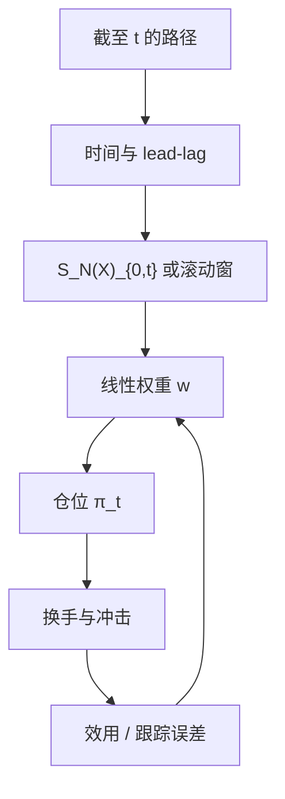

# Signature Trading

    
把可交易策略写成路径签名的线性泛函：仓位是截止目前轨迹的迭代积分的权重和，动量、面积与领先滞后不再是各写各的因子，而是同一张量代数里的坐标。

    <footer>—— Lyons 签名的通用逼近；交易实现见 Kalsi–Lyons–Pérez Arribas 及后续 Signature Trading 框架</footer>

中低频策略大量是路径泛函：过去一段的收益、价量先后、波动路径的形状。手工因子是在猜哪些积分重要。[Path Signature](/quant/path-signature-features) 给出系统展开：线性读截断签名，在紧集上能逼近连续策略。Signature Trading 把这一展开当成仓位公式，而不是当成分类器的边角特征。本篇写仓位如何因果地读到 $t$、lead-lag 如何避免未来函数、均值方差或风险约束如何加在权重 $w$ 上，以及过拟合高阶坐标为何比普通多因子更隐蔽；执行与冲击仍见 [Almgren–Chriss](/quant/almgren-chriss)，样本协议见 [生成式回测评估](/quant/generative-backtest-eval) 与 [CPCV](/quant/cpcv)。

## 问题

在 $t$ 时刻，可交易仓位 $\pi_t$ 只能依赖 $[0,t]$ 上的观测路径 $X|_{[0,t]}$（及静态信息）。连续情形下，$\pi_t=\ell(S(X)_{0,t})$，最简单的 $\ell$ 是线性：$\pi_t=w\cdot S_N(X)_{0,t}$。由于 Chen 拼接，新数据到来只需张量乘更新签名，仓位可以流式计算。问题转化为估计 $w$：在历史测度上最大化某效用，或最小化跟踪误差（对冲）、或拟合专家仓位。

若不做时间增强，$\pi_t$ 对走完同一形状但耗时不同的路径可能相同，时钟套利与持有期对不齐。若不做 lead-lag，离散折线的二次变差弱，短滞后反转类信号进不了低阶。若把整段 $[0,T]$ 的签名在期初就用来下 $t=0$ 的仓，那是未来函数。Signature Trading 的合法性不来自「用了签名」，而来自**截断点必须是 $t$**。

### 线性已经很宽，非线性要交税

通用性定理说线性读签名已够逼近连续泛函，前提是 $N\to\infty$ 且路径在紧集。有限 $N$、有限样本下，再套深度网络读签名，容量立刻大于可识别的市场结构。优先顺序应是：低阶线性 → 稀疏正则 → 再考虑对 $w$ 做浅层非线性或对通道做因子压缩。把签名向量送进梯度提升再搜索上百超参，等于回到普通过拟合，只是特征更贵。

「签名策略能表达动量」不是实证发现，是一阶坐标的定义。实证要回答的是：在扣除成本与样本外切开之后，$w$ 的哪些阶仍显著，而不是演示训练集上的因子暴露。

## 方法

**通道。** 典型：$(\,t,\,\log P,\,V\,)$ 或再加已实现波动代理。多资产先做残差或主成分路径，避免 $d$ 爆炸。每条通道的尺度在训练窗上冻结，测试窗沿用，禁止全样本标准化。

**目标。** 均值方差：在 $\pi_t=w\cdot S_N(X)_{0,t}$ 下优化 $w^\top\mu_S-\frac\gamma2 w^\top\Sigma_S w$，其中 $\mu_S,\Sigma_S$ 是签名特征对未来收益的协方差——注意未来收益的窗口与签名窗口不能重叠泄漏。换手惩罚应对 $\Delta\pi$ 收费，否则高阶坐标会高频抖动。对冲任务：$\pi$ 跟踪目标 delta，损失是跟踪误差加成本，这与 [Deep Hedging](/quant/deep-hedging-buehler) 可衔接：深度对冲的特征 $I_t$ 可以就是 $S_N$。最优执行里，签名读订单簿或价格路径，输出下单速率，见粗糙路径执行的 Kalsi–Lyons–Pérez Arribas 一线。

**因果实现。** 用 $S(X)_{0,t}$ 或滚动窗 $S(X)_{t-L,t}$。滚动窗放弃从远古拼来的 Chen 结构，换平稳性。持有期 $\Delta$ 的标签必须是 $t$ 之后的收益。lead-lag 构造只用 $t$ 及以前的已实现点：lead 不是「未来的领先」，而是把当前点与刚过去的点组成二维路径，以恢复离散二次变差。命名容易误导，实现必须审查。

### 与因子模型和 RNN 策略

线性签名在固定 $N$ 下是一组确定的非线性路径特征（对原价格非线性，对签名线性）。截面多因子是股票特征的线性；时间序列动量是单通道一阶的特例。RNN 策略用隐状态，样本外要防梯度与状态漂移。签名 $w$ 可做统计检验、稀疏、衰减；这是它在研究管道里比黑盒策略更可审计的原因。绩效上并不保证更强：市场若主要是跳跃新闻，低阶扩散型积分帮不上忙。

## 机制

二阶交叉项编码「谁先动」：价格先跌、波动后升，与相反顺序，Levy 面积符号不同。这比先算两个指标再交叉更干净。交易若在这一层有稳定的 $w$，对应的是对领先滞后结构的暴露，而不是对某根均线参数的暴露。高阶项编码更曲折的振荡，样本内几乎总能降损失，样本外对应微观噪声。正则（阶数惩罚、群组 lasso 按阶）应把高阶当奢侈品。

流式更新使盘中计算可行：每根新 bar 一次张量乘。但 $w$ 通常日频或更慢才重估。把 $w$ 也做成每 bar 学习，等于在签名特征上再套一层自适应，过拟合通道加倍。生产应冻结 $w$ 于再平衡日，盘中只更新 $S$ 与 $\pi$。

### 生成器与策略的循环

若用 [Sig-WGAN](/quant/sig-wasserstein-gan) 生成路径再训 $w$，生成器已经按签名矩对齐，策略又是签名线性，两边共用同一组坐标，样本内会极度乐观：策略在利用生成器显式匹配过的方向。必须在真实留出路径上评估 $w$，生成器只许出现在压力或增广，且评估协议按生成式回测篇切开。反过来，用签名策略当探针去打生成器，是检测伪影的正确用法。

Lead-lag 的「lead」若被实现成使用 $t+1$ 的价格去构造 $t$ 的特征，整个方法作废。代码审查应打印 $t$ 时刻特征所依赖的最大时间戳。

## 边界与工程取舍

成本会吃掉高阶抖动。报告应含换手、冲击后的效用，以及把 $N=1$ 动量当作强基线。$N=4$ 赢 $N=1$ 若只发生在无成本、未切开的样本上，不采用。多资产签名的 $w$ 解释困难，应提供按阶、按通道对的能量分解，而不是只报组合夏普。制度切换时滚动窗比长 Chen 拼接更稳；2008 年的面积项不应还在驱动 2026 年的仓位，除非模型明确要超长期记忆。

签名不替代执行层：$\pi_t$ 是目标仓位，变成限价仍要排队与冲击。深度对冲在摩擦环境里可能学到无交易区，线性签名策略通常要额外加死区，否则理论连续 $\pi$ 会在价差上磨。不要把 Signature Trading 写成「Lyons 证明了可盈利」：定理是逼近能力，盈利是市场与成本的实证，且受过拟合管辖。

Kalsi–Lyons–Pérez Arribas 的执行论文与后来的均值方差 Signature Trading 框架问题不同：一个是路径依赖的最优执行控制，一个是统计套利式的线性签名仓位。引用时按问题选文，不要合成一篇不存在的「签名交易圣经」。

通道里混入未公开的未来宏观修正、或用全样本 PCA 做路径压缩，泄漏与普通因子研究完全相同。签名代数不提供防泄漏。

## 小结

- Signature Trading 用截止 $t$ 的截断签名之线性泛函作为仓位，统一动量、面积与领先滞后。
- 时间增强、lead-lag 与严格的时间截断是因果性条件；滚动窗换平稳性、弃远古拼接。
- 有限样本下优先低阶线性加换手惩罚；高阶与深度读头极易过拟合。
- 与签名生成器共用坐标时，禁止用合成路径上的夏普当结论。
- 逼近定理保证表达力，不保证扣除成本后的样本外利润。
- 出处：Lyons 签名与通用逼近；Kalsi, Lyons and Pérez Arribas, 最优执行与签名；后续线性签名均值方差交易框架。Chevyrev–Lyons 期望签名用于测度而非单条策略。
