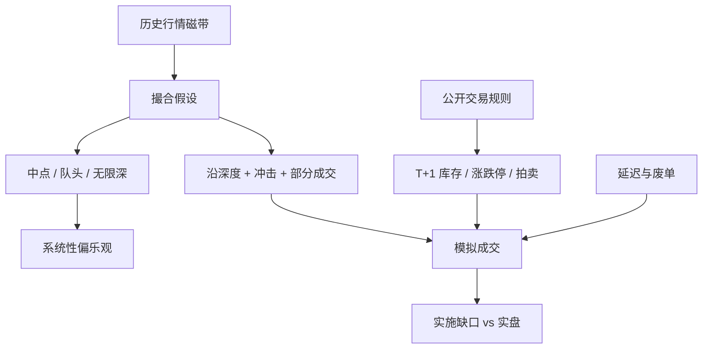

# 模拟器偏差

回测是对一条已经实现的路径做反事实；你假设自己的订单不会改写这条路径，也不会改写当时的队列与对手方反应。

<footer>—— 据 Lopez de Prado 对回测过拟合与路径依赖的讨论，以及 Almgren–Chriss 对冲击使价格偏离历史轨迹的设定整理</footer>

训练策略的环境几乎总是模拟器：历史报价、假设的成交规则、一个冲击函数。部署的环境是交易所主机、其他代理人与你自己的延迟。两者之差是 sim-to-real。机器人文献里它表现为摩擦与感知噪声；交易里它表现为：历史成交价不是你的可成交价、队列位置不可复原、冲击被设成零或设成错误的函数、延迟与废单没有进状态。Lopez de Prado 强调回测过拟合来自尝试次数；即使只尝试一次，模拟器与实盘的分布偏移也会单独毁掉期望。本篇把偏差写成可列清单的机制，而不是一句「滑点没加够」。它紧挨[交易 MDP 的陷阱](/quant/trading-mdp-pitfalls)与[执行 RL](/quant/rl-execution)，并决定[净边缘](/quant/net-edge)在纸面上是否可翻译。

## 问题

历史磁带给出的是当时参与者已经博弈完的均衡路径。你在回测里插入额外的买卖，是反事实：价格、深度、取消本应不同。若模拟器按中点或按当时成交价给你全部填成，等于假设无限深度且你不是信息。若按当时可见 BBO 吃进，仍假设你排在队头、且吃完后没有人撤掉后面的量。A 股还有涨跌停与集合竞价：历史收盘可能是封死的涨停价，模拟器若仍按该价成交，是在虚构对手盘。

第二类偏差是时间同步。特征用的时钟、订单到达主机的时钟、行情到达你的时钟，三者不是同一个。回测常用「K 线收盘瞬间下单并立刻成交」。实盘里，你在收盘后才算完信号，订单在下一会话的开盘集合竞价才可能成交，而且 9:20 后不能撤。第三类是对象缺失：模拟器没有账户前端检查、没有 T+1 可卖量、没有融券库存、没有北向额度。策略在模拟器里合法，在规则里废单。问题是测量每一类偏移对奖励的一阶影响，而不是用一个全局滑点常数去「保守一点」。

### 成交假设是最大的自由度

常见成交模型从松到紧：当时收盘价、中点、当时 BBO 的对手价、沿深度扫簿加一个临时冲击、再加永久冲击、再加随机部分成交。每紧一档，同一信号的夏普可以掉一半。Novy-Marx 与 Velikov（2016）证明高换手异常对成本假设敏感；执行模拟器是同一敏感性的微观版。没有唯一正确的模型，但必须宣布：用的是哪一档、校准数据是谁的成交回报、外推到更大 ADV 占比时是否允许线性。Almgren–Chriss 把临时与永久冲击分开，是为了让轨迹优化有定义；把两者都设为零，优化器会选择瞬时成交，这是模拟器在替你做错误的最优。

用自己实盘的成交回报去校准冲击，会得到更相关的参数，但也有选择偏差：只有活下来的策略才有成交，只有当时选中的名字才有样本。校准集不能与要评价的策略搜索共用同一段自我安慰。

## 方法

最低限度的模拟器应分层。行情层：点-in-time 的 BBO 或 L2，时间戳与交易所主机一致的口径，涨跌停、停牌、拍卖状态是一等字段。撮合层：按公开规则做价格优先、时间优先；集合竞价按最大成交量原则一次性撮合，而不是用连续竞价去「模拟」开盘。库存层：T+1 可卖量、资金前端、融券余量、合约乘数。冲击层：至少临时冲击随参与率上升，永久冲击进入后续中点；参与率用当时 ADV 或当时可见深度，不用全样本平均成交量。延迟层：特征计算耗时、到主机的单向延迟、行情落后。每一层关掉或打开，应能单独报告对实施缺口的贡献。

验收用实盘对照，而不是用模拟器内的夏普。冻结策略，小规模真实下单，比较：预测填成率与真实填成率、预测滑点与实现滑点、废单原因码。差距按会话分段——开盘集合竞价、连续竞价、收盘集合竞价、涨跌停日——因为偏差在制度边界上最大。Bailey 等人的过拟合概率针对策略搜索；这里的偏差在零搜索时也存在，必须单独列为模型风险。

### 不可复原的队列与隐藏量

没有 L3，模拟器无法知道你挂在第几位。常见的偷懒法是假设「新单排在当时深度之后」或「市价立刻吃到当时深度」。前者对限价偏悲观或偏乐观取决于随后的撤单，后者对市价偏乐观。隐藏量与冰山使可见深度不是可成交深度。方法是给出填成的上下界：乐观界假设你在队头且隐藏量对你有利，悲观界假设可见深度在你到达前被撤光。策略若只在乐观界存活，不能部署。这比点估计一个填成率更诚实，因为识别集本来就不含位置。

## 机制

模拟器偏差进入期望的方式是系统性的，不是零均值噪声。中点成交假设把价差的一半记成收益；实盘作为 taker 付这一半，作为 maker 则承担逆向选择与不成交。历史路径不因你的买卖而弯曲，等于把永久冲击设为零，容量被高估。忽略延迟，等于让你在信息事件的同一毫秒与主机上的所有人同时反应；实盘里你排在后面。忽略涨跌停，等于在锁定价上创造了无限流动性。这些偏差都偏向让回测更好看，因此不能用「平均一下就无偏」来辩解。

过拟合与模拟器偏差会相乘。搜索会挑在该模拟器里最占便宜的规则：例如专吃中点假设、专吃开盘价的瞬时成交、专吃无 T+1 的日内回转。换一个更紧的模拟器，优势消失。Lopez de Prado 要求记录尝试次数；这里还要记录模拟器版本。换冲击函数等于换数据集，先前的 p 值不作数。

用随机推演价格再训练，并不自动更接近实盘。若推演仍无其他代理人、无队列、无制度，只是给了同一错误 $P$ 更多样本。多样性来自机制，不来自对错误模型做蒙特卡洛。

### A 股制度是模拟器的一等公民

上交所《交易规则》写明：股票默认交收前回转受限；开盘 9:15–9:25 集合竞价，9:20–9:25 与收盘 14:57–15:00 不接受撤单；涨跌幅限制价格为前收盘价乘以 $(1\pm$ 比例$)$。模拟器若用连续竞价去填开盘、允许在不可撤单时段改单、或在涨停价无限成交，则与公开规则直接冲突。北向交易还有额度与前端持仓检查，见[沪深港通](/quant/stock-connect)。合规的模拟器首先是规则引擎，其次才是冲击函数。把规则当成事后过滤，策略已经在非法动作上做过优化。

## 边界与工程取舍

没有完整的市场重放。L3 昂贵且不回溯全部历史；即使有，你的反事实订单仍会改变随后的全部消息。目标不是完美模拟器，而是偏差方向已知、分层可关、并能被小规模实盘证伪的模型。对慢因子、低换手，中点加有效价差可能够用；对执行 RL 与日频统计套利，不够。

不要用模拟器里的强化学习对抗同一模拟器里的历史回放，再把差值叫 alpha。不要为了让曲线好看而关闭涨跌停。不要把券商回报里的「平均滑点 3bp」套到小盘、封板与开盘拍卖。Arnott、Harvey 与 Markowitz 主张回测协议先于策略；模拟器版本、成交假设与制度日历应写进该协议，与代码一起冻结。

纸面夏普对模拟器参数的导数，是比夏普本身更有用的诊断。若把临时冲击乘以 2 夏普就过零，容量叙述不能建立在当前那一档假设上。

## 小结

- 回测是反事实：历史路径不含你的额外订单、队列与对手方反应。
- 成交假设、延迟、制度库存是三类可分开测量的偏差，不能收成一个滑点常数。
- 偏差通常系统性抬高纸面表现，因此与过拟合相乘。
- A 股模拟器必须实现集合竞价、不可撤单时段、涨跌停与 T+1，而不是事后过滤。
- 验收以冻结策略的实盘填成与滑点为准。
- 出处：Lopez de Prado, *AFML*, 2018；Almgren and Chriss, *Journal of Risk*, 2000/2001；Novy-Marx and Velikov, *RFS*, 2016。
