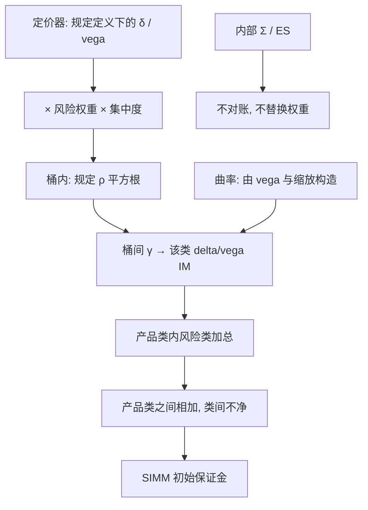

# SIMM 的 Delta 与 Vega

    
非清算初始保证金用敏感性乘公开风险权重，在桶内与桶间用规定相关加总；delta、vega 与曲率是三张不同的加权表，不是把内部 VaR 改个名字。

    <footer>—— ISDA, Standard Initial Margin Model (SIMM) Methodology，公开版本</footer>

[SPAN 与 SIMM](/quant/span-simm) 一文对照清算网格与非清算敏感性法的分工。本篇只把 SIMM 的**敏感度聚合**写开：风险类别、桶、集中度、delta 保证金、vega 保证金、曲率项，以及为什么同一套希腊字母在 SIMM 与 [SA-CCR](/quant/sa-ccr-ead) / FRTB SA 里会得到三个不可互换的数。UMR 下双边要对账的是这套公开参数，不是你的 $\Sigma$。它补的是公式结构，不是再讲一遍 SPAN 扫描点。

## 问题

非清算 OTC 的初始保证金要在对手方违约后的保证金期内覆盖潜在损失，且双方必须算得几乎同一个数。内部模型各家不同，无法对账。ISDA SIMM 的解是：各方用自己的定价器出规定定义下的敏感性，然后乘同一张行业校准的权重与相关表，按同一套平方根聚合得到 IM。问题立刻变成敏感性定义必须唯一：利率是哪条曲线的哪一个顶点、vega 是对数正态还是正态、信用是 CS01 还是跳跃、商品是哪一个期货合约。定义差一个桶，对账差一截保证金，争议按最低转移额放大成运营事件。

第二问题是非线性。纯 delta 对期权不够；SIMM 用 vega 覆盖波动，用曲率项（由 vega 与规定缩放构造）覆盖价格的二阶，而不是对每笔期权做全定价网格。深度障碍、数字、缺口产品若不能被这三项抓住，会漏，这与 FRTB 用剩余风险附加是同一逻辑。SIMM 不另收 DRC 式跳跃违约资本，信用类靠信用 delta / vega 与合格/非合格分表，跳违约的残差仍可能在。

### 产品类之间不净额

公开方法论把组合先切成产品类（利率外汇、信用、股权、商品等，版本号以当时 ISDA 文本为准），各类 IM 相加，类间相关为零。一笔股票期权用利率对冲，经济上降风险，SIMM 上利率产品类与股权产品类的保证金仍分开付。这是对账可行性对分散化的税：跨资产对冲在非清算 IM 上可以是现金占用增加。同一产品类内，再按风险类（利率、信用合格、信用非合格、股权、商品、外汇）收集敏感性并聚合；版本演进里风险类与产品类的切法以公开文件为准，实施必须钉版本号。

SIMM 权重校准的目标分位与地平线是行业与监管约定的 IM，不是银行账簿 97.5% ES。用内部 ES 去证明 SIMM「太贵」或「太便宜」，测度不同。可验证的是敏感性是否完整、分桶是否与对手一致。

## 方法

对每个风险因子 $k$ 收集敏感性 $s_k$（delta）或 vega 名义。加权敏感度 $WS_k=RW_k\cdot s_k\cdot CR_k$，其中 $RW$ 是该桶该因子的风险权重，$CR\ge 1$ 是集中度上调：单名或单桶暴露超过阈值则放大，防止相关矩阵把集中头寸当成可分散。桶内保证金

$$
K_b=\sqrt{\sum_{k\in b}WS_k^2+\sum_{k\neq l}\rho_{kl}WS_k WS_l},
$$

$\rho$ 为桶内规定相关（可按同名 / 不同名、同期限再分）。桶间再用 $\gamma_{bc}$ 做一层平方根：

$$
\mathrm{IM}^{\Delta}=\sqrt{\sum_b K_b^2+\sum_{b\neq c}\gamma_{bc}S_b S_c},
$$

$S_b$ 为桶内加权敏感度之和的符号处理（有的版本对 $S_b$ 取与 $K_b$ 相容的截断，避免相关项把保证金收到负）。这是 FRTB 敏感性法的近亲：先桶内、再桶间，相关是表不是估计。

**Vega。** 对带期权性的风险类，另集波动敏感度 $\nu_k$，乘 vega 风险权重（往往与隐含波动水平、剩余期限的监管表有关），再走与 delta 同构的桶内 / 桶间聚合，得到 $\mathrm{IM}^{V}$。vega 的单位必须与权重的单位一致：按波动点还是按百分比、按对数正态还是正态，公开定义写死。利率与外汇的 vega 分桶方式与 delta 的顶点网格不必相同，映射表是对账的第二战场。

**曲率。** 用 vega 与一个规定的曲率缩放（含 $\lambda$ 一类对并行上移的系数）构造曲率风险暴露，再按正负部分与相关聚合。直觉：delta+vega 线性化之后，剩下的凸性用「与 vega 成比例的并行冲击」来收费，避免对每个微笑做有限差分网格。对无期权的线性组合曲率近零。对香草期权这通常够用；对障碍与路径依赖，曲率项仍可能远小于真缺口，须另设限额，见 [缺口风险](/quant/gap-risk)。

### 集中度、合格信用与基差

集中度阈值按风险类与桶定义，超过则 $CR$ 升。这让「相关矩阵承认分散、实际是同一发行人」的结构变贵，是对名字集中的标准化补丁。信用区分为合格（指数与满足条件的单名）与非合格，相关与权重不同；把高收益单名塞进合格桶是对账与合规双重失败。信用基差、曲线陡峭若没有对应顶点，会漏。利率基差（OIS/LIBOR 残余、跨曲线）在 SIMM 里有单独因子或被吸收进顶点定义，取决于版本——升级 SIMM 时基差敏感性会从「漏」变成「有」，IM 跳跃与市场无关。

外汇 delta 对货币对、股权对发行人 / 地区桶、商品对商品类型，切法与 [SA-CCR 对冲集](/quant/sa-ccr-ead) 相似但参数不同。不要共用一张内部桶映射去喂三套监管公式而不做差异测试。校准周期：ISDA 定期重估 $RW$ 与 $\rho$，版本切换是双边项目，不能单方面用新权重。

## 机制

机制是**线性（加曲率修正）的监管协方差**：把希腊字母当成因子暴露，用行业 $\Sigma_{\mathrm{SIMM}}$ 算一次马氏距离式的保证金。快、可加、可对账；代价是（1）产品类零相关税，（2）参数不是你的组合条件相关，（3）未被希腊字母张成的风险为零。危机里真相关升到 1 时，SIMM 的 $\rho$ 仍是表上的数，可能不够；集中度与权重的定期校准是滞后补丁，不是条件模型。这与 SPAN 网格在清算所政策下即时加档不同：SIMM 更稳、更慢。

Delta 与 vega 分开聚合再相加（另加曲率、以及信用基相关等附加模块，以公开文本为准），意味着价格冲击与波动冲击在 SIMM 里不当成同一情景的联合——不像蒙特卡洛一次抽 $(\Delta S,\Delta\sigma)$。对「跌价且波动暴涨」的缺口产品，分开加总可能低于联合尾部。这是敏感性法的结构边界，不是权重没校准好。对账失败的首因几乎总是敏感性：漏顶点、错币种、把 vega 算成前台日历惯例而非 SIMM 惯例。

曲率由 vega 派生，不是独立的全定价二阶差分。前台若对障碍用非平滑 δ/vega，SIMM 输入会跳，保证金跟着跳。对账应比较敏感性快照，而不是先比较最终 IM 再倒推。

### 与内部模型、FRTB、资本 EAD 的关系

内部 IM 模型（若监管允许替代）可以对冲产品类并吃条件相关，但双边 UMR 的默认语言仍是 SIMM。FRTB SA 同样是敏感性 × 权重 × 相关，但流动性期限、DRC、RRAO 与校准目标都不同，不能把 FRTB 资本当 IM。SA-CCR 的 EAD 用名义与监管 δ，不读 vega 表；同一期权可以在 SIMM 里很贵（vega+曲率）、在 SA-CCR 里只按 δ 与名义附加。三套数字并排监控：融资看 SIMM，信用资本看 SA-CCR 或 [IMM](/quant/imm-eepe)，市场风险资本看 FRTB。优化其中一套去压占用，往往会在另一套上冒出来。

## 边界与工程取舍

不要用内部 $\Sigma$ 替换 SIMM 相关「更风险敏感」——那就不再是标准模型，对手无法对账。不要为降 IM 而把结构拆到产品类的缝里（假拆分、关联方簿记），这是规避而不是配置。不要假设集中度阈值以下相关矩阵已经「承认对冲」：同桶高相关仍可能让 $K_b$ 接近加权绝对值之和。奇异风险必须另有名义或缺口限额。版本号、敏感性定义文档、曲线分桶表应与 CSA / IM 协议引用的 SIMM 版本锁死。

计算上 SIMM 是解析平方根，延迟来自敏感性生成。全组合重估出 CS01、PV01、vega 的成本与 CVA 引擎同量级时，应对顶点做增量与缓存，但对账日必须用约定时点的全量快照。舍入与过滤阈值须双边一致，否则每日争议。

SIMM 是现金与合格抵押的占用，进融资成本，不进市场风险 VaR。策略若大量依赖非清算期权，只报夏普不报 IM，会把保证金当免费杠杆。

## 小结

- ISDA SIMM 用公开权重与相关把 delta、vega、曲率聚合成非清算 IM，目标是双边可复现，不是内部尾部测度。
- 桶内 / 桶间平方根加集中度上调；产品类之间保证金相加，跨资产经济对冲可以增加占用。
- Vega 与曲率补非线性，但仍覆盖不了无法用希腊字母张成的缺口与障碍。
- 对账失败首因是敏感性定义与版本，不是权重「不公平」。
- 与 SPAN、SA-CCR、FRTB SA 参数和对象都不同，不可互换验证。
- 出处：ISDA *SIMM Methodology* 公开版本与校准文件；非清算保证金框架见 BCBS–IOSCO；资本侧对照 FRTB 敏感性法与本站 [SPAN 与 SIMM](/quant/span-simm)。
