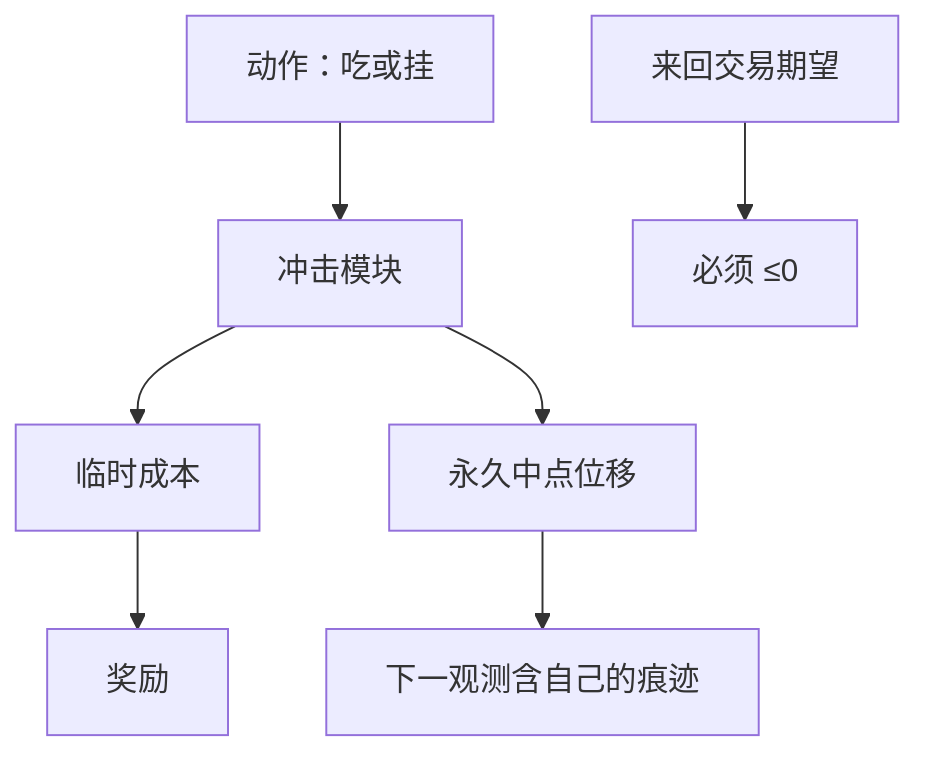

# 模拟器冲击模型

强化学习会去采集模拟器里被写错的那一项。若冲击太弱，智能体学会瞬时吃完；若冲击可被来回交易套利，智能体学会做自己的做市商。

<footer>—— 据 Gatheral 对冲击模型无动态套利的要求；对照 Almgren–Chriss 把临时与永久冲击分开的设定</footer>

[部分可观测与延迟成交](/quant/pomdp-fills)处理了观测与回报。[模拟器偏差](/quant/sim-to-real-trading)已经列出成交假设从松到紧的阶梯。本课的缺口是专门针对 **RL 训练用的冲击模块**：它如何把偏差写进政策，以及哪些函数形式会制造虚假最优。强化学习课序在本课收束。不重写 Almgren–Chriss 的最优轨迹推导，只要求模拟器里的冲击满足：对自己的量有弹性、临时项衰减、永久项不提供免费午餐。

## 问题

RL 的环境就是模拟器。冲击函数 $I(q,\mathrm{state})$ 若恒为零，最优是立刻成交，延迟预算与容量课的全部权衡消失。若只有与量无关的常数滑点，智能体不会学会避开浅簿，只会学会少交易——或在奖励塑造下学会把交易藏进标记噪声。若永久冲击非线性且允许来回交易抽取，Gatheral 意义上的动态套利出现，政策会在模拟器里印钞。缺口是把冲击模块当成必须验证的生产模型，写入[模型风险清单](/quant/model-risk-inventory)，而不是当成训练超参。

自己的历史 TCA 校准是局部弹性，拥挤课时已警告。RL 若用该局部弹性去优化比历史更大的 $q$，是在外推。必须对参与率凸化，或硬限制动作使 $q$ 不超过校准支撑。

### 临时、永久、以及「别人的反应」

临时冲击：吃完后簿恢复一部分，衰减时间应短于回合。永久冲击：中点留下一截，进入随后观测，这才能让 POMDP 的 $o$ 含有自己的痕迹。缺第三项「别人的反应」（撤单、跟风）时，限价的填成概率仍偏乐观。本课不要求建一个完整代理人市场，但要求：至少临时+永久；并报告在没有反应项时填成上界。乐观界不能单独部署。

集合竞价的冲击不是连续速率的积分。模拟器必须在拍卖段换成批量出清，否则 RL 会学到在开盘用连续吃单去「优化」一个不存在的轨迹。

## 方法

冲击模块接口：输入本步成交量、方向、当时深度或 ADV、协议类型；输出临时成本、永久中点位移、以及可选的深度消耗。校验：无交易时价格路径与历史一致（或一致的统计）；小量时成本接近有效价差；来回交易不能产生正期望；参与率升高时成本凸。把 RL 关掉，用固定 POV 走一遍，成本应与 TCA 同量级。

训练时对冲击参数做敏感性：$\Lambda$ 放大 50%，政策应变得更慢。若政策不变，说明奖励没接到冲击，或动作根本走不到约束。这是单元测试。sim-to-real：小规模真单的实现缺口应落在模拟器压力参数下的区间内，而不是落在最乐观参数上。

### 冲击偏差如何表现为「假 alpha」

冲击过弱 → 政策过激进 → 实盘缺口爆炸。冲击过强且不可套利 → 政策过保守，看起来像失败的 RL，其实是校准。可套利冲击 → 政策在模拟器里高夏普，实盘接近零或为负。第三种最危险，因为研究会过关。检查来回交易期望是上线门槛。

## 机制

RL 优化的是模拟器测度下的值函数。冲击函数定义了动作如何改写随后状态与奖励。偏置的 $I$ 等于偏置的 $P$ 与 $R$。POMDP 滤波再好，滤的也是错的生成过程。这与另类数据回填同构：环境被事后改写成更好交易的世界。纠正办法同样是 vintage：冲击参数用更早的样本校准，在更晚的样本上做策略评估，且评估环境不得弱于训练环境。

不要把经验 [Kyle lambda](/quant/kyle-lambda) 直接当永久冲击塞进模拟器。lambda 含信息，执行冲击应尽量是机械的。混用会让智能体学会「不要与知情者成交」——它没有这个观测。

### 评估环境不得弱于训练环境

训练用凸冲击、评估用零冲击，政策会看起来稳健，其实没有经过更严的世界。应反过来：评估用压力参数，训练用基准参数，过关再收紧训练。

## 边界

真实市场的冲击有非线性、有公告状态、有拍卖。任何参数化都是错的，目标是偏差方向已知、对部署保守。多智能体模拟超出本课。加密链上冲击是 AMM 曲线或订单簿，函数形式不同，但无套利检查同样适用。

经验 Kyle lambda 含信息，不宜直接当永久冲击。执行冲击应尽量机械；否则智能体被要求躲开它看不见的知情者。

## 小结

- RL 会采集冲击函数的错误；冲击是生产模型，要进清单。
- 至少临时+永久；来回交易期望必须非正。
- 校准支撑外的量必须凸化或截断动作。
- 拍卖段不得用连续冲击。
- 评估环境不得弱于训练环境；真单缺口对照压力参数。
- 出处：Almgren and Chriss；Gatheral 对冲击与无动态套利；sim-to-real 见 Lopez de Prado 对回测路径依赖的讨论；经验冲击见 Cont, Kukanov and Stoikov。
