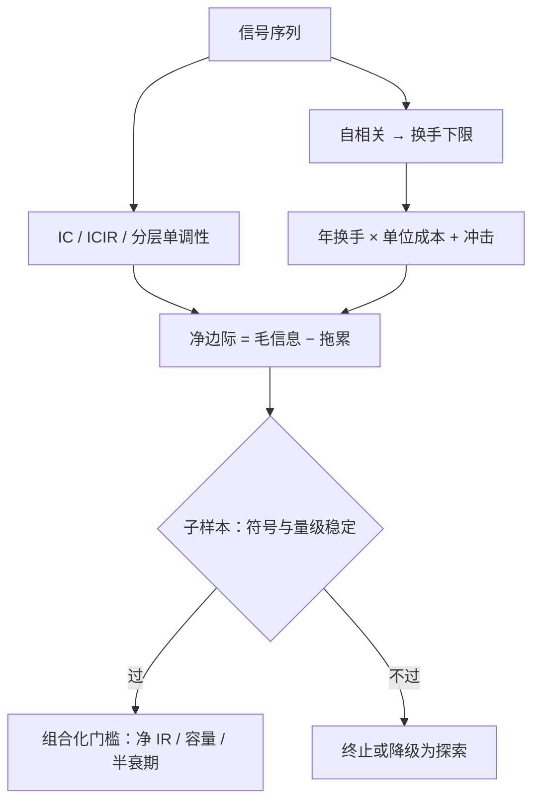

# 单信号评估：IC、换手与成本会师

信息比率近似等于信息系数乘以广度的平方根——手艺与运气的区别，就藏在这两个量的分解里。

<footer>—— 据 Grinold (1989) 的主动管理基本定律；Grinold and Kahn《主动投资组合管理》整理</footer>

[上一课](/quant/signal-construction-sandbox)把直觉翻译成通过健康检查的可计算量。本课是全单元的会师：IC 与分层收益度量信号质量，换手与成本度量它的可实现性，两侧第一次落进同一张数字表。度量工具在 [IC / IR 与因子择时](/quant/ic-ir-timing)与 [IR / Sharpe / Sortino](/quant/ir-sharpe) 备好，成本侧的[买卖价差成本](/quant/spread-cost)与[线性与平方根冲击](/quant/sqrt-impact)备好；本课把它们接成一次完整评估。

## 问题

健康检查通过只说明信号「是个东西」，不说明它值钱。值不值钱由四组数共同决定：预测质量（IC 多高、稳不稳）、实现载体（分层收益是否单调、两端谁贡献）、实现成本（换手多少、每单位换手付多少）、可扩展性（容量多大）。文献里只报告第一组的研究随处可见，也因此实盘失效得随处可见：IC 0.05、年换手百分之几百的信号，在中位价差面前是负的。会师的意思是：四组数放进同一张表，缺一组别下结论。

## 方法

评估表按序产出。**IC 序列**：每个截面期算 Spearman 秩相关 $\mathrm{IC}_t=\mathrm{corr}(s_{i,t},r_{i,t+h})$，报告均值、标准差（ICIR）与 t 值；重叠持有期按[标签、预测期与重叠](/quant/label-horizon-overlap)修正序列相关。经验锚点：主动管理的 IC 常年在 0.05 量级（Grinold 与 Kahn 的口径），再低要先怀疑度量噪声。**分层收益**：十分组多空看单调性与两端贡献；PEAD 的收益集中在公告后窗口，按事件对齐比按日历对齐诚实。**换手与衰减**：信号自相关给出换手下限，衰减曲线见[因子衰减与换手](/quant/factor-decay-turnover)；年换手 $\tau$ 乘单位成本 $c$ 是年度拖累。**成本会师**：净信息比约为毛信息比减拖累折算；再平衡发生在「多持有一天的衰减」小于「等待省下的成本」处，框架见[持有期与换手](/quant/holding-horizon)。**子样本稳定性**：上下半样本、分年度、分市场状态各跑一遍，门槛是符号与量级稳定，不是每段都显著。**门槛**：为组合化立准入线——例如净 IR 不低于 0.5、容量不小于目标规模、衰减半衰期不短于持有期——门槛本身写进注册文档。

Grinold 与 Kahn 的量级感：IC=0.05、每年 100 次独立下注，IR 约等于 0.5——比直觉低得多。广度按独立下注次数计，不按持仓只数计：高度重叠的持有期不增加广度。

### 会师表的读法

对案例：毛侧 IC 0.04、ICIR 0.35、分层单调，看起来活着；成本侧年换手两倍多，拖累把净 IR 压到门槛附近。毛指标活着不等于净指标达标——缩水后还站不站得住，是下一课的清算。

## 机制

IC 与收益的桥是 Grinold 的预测方程：信号 z 分数乘以 IC 与波动，得到条件预期收益；$\mathrm{IR}\approx\mathrm{IC}\sqrt{\mathrm{BR}}$，广度 BR 是每年独立的下注次数。会师的机制含义：IC 决定每次下注的边际，换手与成本决定下注频率的定价——高频下注的便宜 IC 会被 $\tau c$ 吃光；衰减曲线给出最优频率的内点，太慢吃不满衰减前的信号，太快为同一份信息重复付费。子样本稳定性检验的是「会师表」在时间上是否同一张表：参数漂移的信号进组合后无法被风险模型覆盖。容量把会师推到极限：冲击随参与率凸增（平方根律），容量估计按[实盘容量估计](/quant/live-capacity-estimate)的口径做，不能用中位价差外推。

## 边界

IC 是单调性度量，看不见非线性与尾部：只在极端十分位有效的信号要靠分层与分段暴露补。成本模型是估计不是事实，市场状态一变（价差放大、深度坍缩）拖累项重写，评估须附[费用、滑点敏感性](/quant/cost-sensitivity)。子样本稳定也不担保未来：它排除的是最粗的脆弱性，机制环境改变仍会让衰减加速。门槛是入场券不是保证书：净指标达标只说明这个信号**作为独立下注**成立；它与既有持仓的相关、拥挤与对冲残差，本课刻意不回答——那是下一单元的事。

## 小结

- 评估是四组数的会师：IC/ICIR、分层单调性、换手乘成本、容量；缺一不可。
- IC 的经验量级 0.05；IR 与广度的关系由基本定律给出，成本把频率的红利收回。
- 再平衡发生在边际衰减小于边际成本节省之处。
- 子样本稳定性看符号与量级；门槛（净 IR、容量、半衰期）写进注册文档。
- 毛指标活着不等于净指标达标；缩水判定留给多重检验课。
- 出处：Grinold (1989) 基本定律与 Grinold–Kahn 预测方程；成本与冲击见站内价差、平方根律诸课。
