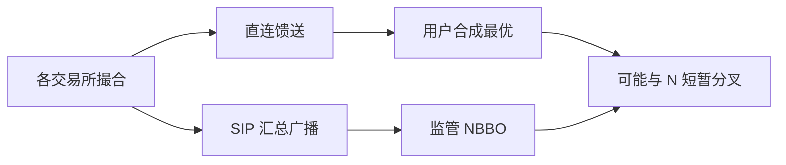

# SIP vs 直连行情

全国行情汇总会出一条受监管的 SIP；各交易所另售直连馈送。两者的价格最终都会打印，但到达时刻与中间状态不同。研究用 SIP 当「市场」，交易用直连当「可交易」，中间的差是制度，不是噪声。

<footer>—— 据 Reg NMS 下 SIP 的制度角色；对照 Hasbrouck 对微观结构数据来源与延迟的讨论</footer>

附录「交易所与数据源对照」从馈送契约起。[市场分割与 NBBO](/quant/market-fragmentation)已经说明保护报价要被拼成全国最优。本课的缺口是两条管道：SIP（证券信息处理器）汇集各所报价与成交再广播；直连（direct feed）从单一场所或一簇场所直达用户。Ding、Hanna 与 Hendershott 等经验工作表明 SIP 相对直连存在延迟，NBBO 在两条管道上会短暂分叉。本课写对象差异与研究选择，不写如何利用延迟跨所交易。后课时钟与对时是测量分叉的前提。

## 问题

SIP 的制度功能是给公众一个统一的、受保护的行情与成交磁带。直连的功能是给延迟敏感用户本所（及购买的多所）的更快增量。内容不是简单的「SIP 是直连的延迟版」：汇总、容量节流、不同字段、成交与报价的打包，都会改变你看到的状态。用 SIP 的 NBBO 去标记直连成交的有效价差，中点可能已过时，ES 被系统性扭曲。用直连合成的「快 NBBO」去评价监管执行质量，对照的又不是受保护的那一条。缺口是声明：这项研究的行情契约是 SIP、直连还是两者都存。

碎片化课问设计；本课问你磁盘上的字节来自哪根管子。没有声明的「我们用 TAQ」仍可能是 SIP 磁带。直连 L3 与 SIP 的 L1 不可互相替代去重建队列。

### 延迟、完整与成本是三件事

直连更快，但不自动更完整：你没买的场所就没有。SIP 更慢，但在制度上覆盖保护报价。研究全国质量，SIP 或官方磁带往往更合适；研究本所队列，必须直连。两者都买时，分叉时间序列本身是对象：锁定交叉在直连上出现、在 SIP 上尚未出现的占比。这是后课 NBBO 构造的输入。

A 股没有美国式的 SIP vs 十几家直连。对照应改成：交易所官方行情 vs 行情商转发 vs 经纪商推送。延迟结构类似，法律保护报价的含义不同。

## 方法

元数据：每条报价/成交记录 `source ∈ {SIP, direct, broker}`、场所、时间戳类型。分析有效价差时，中点与成交必须同源，或明确做跨源对照实验。对照实验：同一成交，分别用 SIP 中点与直连合成中点算 ES，报告差的分布。差的中位若达到一个 tick，任何「市场变便宜了」的结论都依赖源。

容量：SIP 在高峰可能合并或延迟更多。样本应含压力日。只在平静日比较两条管道，会低估分叉。与[延迟预算](/quant/latency-budget)对齐：低频因子研究用 SIP 日度质量足够；中频执行研究需要声明是否看到直连。

### 成交磁带与报价馈送可以不是同一源

有人用直连报价、用 SIP 成交（或 TAQ）。时间对齐更难，方向分类会混。合法设计是：报价与成交同一源，或成交用官方成交回放、报价用直连并接受两者时钟已校准。混源而不校准，Lee–Ready / EMO 的输入先坏。

## 机制

SIP 是汇总后再广播，物理上多一跳，且要等各所到达汇总点。直连少一跳，但全国最优需要用户自己拼，拼的完整取决于买了哪些所。制度把保护绑定在 SIP 的 NBBO 上时，直连上的「更优」报价可能尚未成为保护报价。于是出现经济上可成交、监管上未保护的价格。暗池中点若钉 SIP 中点，锚更慢；若钉直连中点，锚更快但与监管参照分叉。市场设计课的中点协议在这里落到具体馈送。

分叉不是 [Kyle](/quant/kyle-model) 的知情优势本身。它可以来自物理延迟。要把信息与管道延迟分开，必须先对时，下一课开始。

### 压力日才是分叉的识别样本

平静日两条管道几乎重合，会得出「用 SIP 就够」的假结论。容量节流与汇总延迟在高峰出现。对照必须含压力日，并按成交强度分层。

## 边界

欧洲、新兴市场的「官方合并行情」与 SIP 法律地位不同。加密各所无全国 SIP，只有各所直连与聚合网站，聚合网站更接近未受监管的 SIP 模仿。本课不提供共址或购买哪些直连的清单。下一课把时间戳字段从源里拆出来。

用直连报价配 SIP 成交而不校准时钟，方向分类会先坏。同源或成对校准，是方法而不是偏好。

## 小结

- SIP 提供覆盖与监管参照，直连提供本所速度与深度；不是单纯快慢。
- 有效价差的中点必须与成交声明同源，或做跨源对照。
- 分叉在压力日更大；平静日比较会低估。
- 混用报价源与成交源会先毁掉方向分类。
- 中点协议钉哪一条管道，决定锚的时钟。
- 出处：Reg NMS 与 SIP 的公开制度说明；Ding, Hanna and Hendershott 等对 SIP 延迟的经验工作；Hasbrouck 对数据源的处理。
