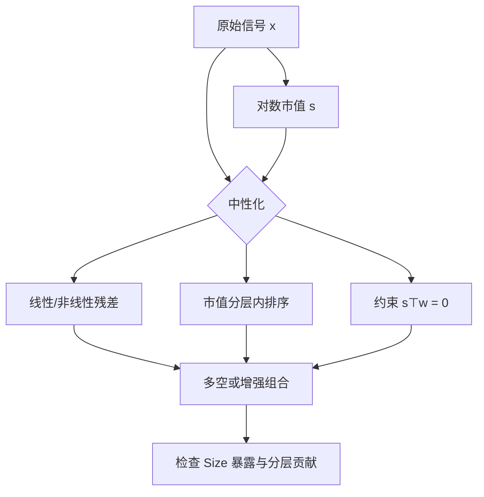

# 市值中性

小市值不是一个风格那么简单，它是流动性、特质波动、财报质量和可交易性叠在一起的标签；不把市值钉住，很多因子只是在复读规模溢价。

<footer>—— 对照 Fama–French 规模因子与 Barra Size / Non-linear Size</footer>

[上一课](/quant/industry-neutral)把板块配置从选股信号里剥离：行业内排序、对行业哑变量回归取残差、组合层行业暴露约束。缺口对称地落在市值上：非流动性、特质波动、盈利、应计、换手几乎都与规模相关。不做市值中性，因子检验很容易复读规模溢价与微盘噪声。本课要求在控制规模之后信号仍有增量，否则只是用不同名字交易同一组小盘。不重写行业分类与行业内排序。

## 问题

小盘组合的平均收益、偏度、最大回撤和容量，与大盘完全不在一个量级。A 股尤其明显：微盘股的壳价值、炒作弹性、停牌与涨跌停，会把任何「高换手、高波动、低价格」规则推到市值最下端。若不中性化，多空排序的多头腿会自然滑向小票，空头腿滑向巨头；表观 IC 很高，实盘却过不去冲击成本。

规模与其他描述子的关系通常是非线性的。对数市值与账面市值比、Amihud 非流动性、特质波动的相关，在最小的一截里陡增。只做一次线性回归，残差里仍可能残留「特别小」的暴露。Barra 因此同时放 Size 与 Non-linear Size（对数市值立方，再对 Size 与行业正交），就是承认线性控制不够。

### 规模如何污染因子检验

设 $s_i=\log(\mathrm{ME}_i)$。原始信号 $x$ 若 $\mathrm{Corr}(x,s)\neq 0$，按 $x$ 排序的多空组合对规模因子的回归 beta 就不会是零。Fama–French 的 $2\times 3$ 独立排序已经是一种粗糙的市值控制：价值溢价在小盘、大盘里分别计算，再平均。它控制的是分组，不是连续暴露；组内仍可以一边倒向更小的股票。更严的检验是：在每一市值分位内排序，或把 $x$ 对 $s$（及 $s^3$、行业）回归后用残差排序。

「去掉最小 20% 市值再回测」是样本截断，不是市值中性。截断减少了微盘噪声，但留下的股票里，信号仍可能与市值单调相关。两者要分开报告。

## 方法

线性残差化。截面回归 $x_i = a + b s_i + e_i$，用 $e_i$ 做因子。加权常用市值或根号市值，使大盘在拟合里有更大发言权，避免回归被几千只微盘主导。这与 Fama–MacBeth 第一阶段的精神一致：先拿走共同差异，再看剩余。

分层排序。先按市值分成 $N$ 组，组内按 $x$ 分位做多空，再对 $N$ 组收益等权或按组上市值加权。等权组平均更接近「每一规模层都有一票」；按层内市值加权更接近可投资的大盘中性。Fama–French 对价值用的就是这种双重排序思想。

组合约束。优化时限制 $s^\top w = 0$，或限制组合加权平均市值对数等于基准。与行业中性相同：信号残差为零并不自动让持仓市值中性，因为权重还取决于波动、协方差与约束松紧。

### 非线性与流动性纠缠

只对 $s$ 线性正交，常常不够。可在同一回归加入 $s^2$ 或 Barra 式的立方项，或在市值两端分别拟合斜率。更麻烦的是流动性：Amihud 非流动性、买卖价差、成交额与市值高度共线。市值中性之后，流动性因子往往大幅变弱，说明相当部分「流动性溢价」是规模的代理。Novy-Marx 与 Velikov（2016）讨论异常的交易成本时，反复强调低价、小盘、高换手信号在成本后衰减最快——那正是未做市值/流动性中性的典型下场。

A 股「市值中性」还要决定用总市值还是自由流通市值。因子定义、指数加权与冲击成本模型若三套口径，中性化会在优化器里来回撕。

## 机制

市值中性改变的是你声称在买的风险。规模本身可能是风险（小公司更脆弱、信息更少），也可能是错误定价（关注度低、机构约束）。控制市值之后仍显著的信号，才更像独立的定价特征。Alquist、Frazzini、Israel 与 Moskowitz 等对规模溢价的再评估表明：如何处理微盘、如何加权、是否考虑成本，会让规模本身从「稳健」变成「脆弱」。对衍生因子更是如此——你必须先声明规模已被控制，再谈质量或低波动。

从协方差角度看，市值是一个强统计因子：第一主成分与市值加权市场组合接近，但等权或小盘组合会再分离出一条规模维。基本面风险模型把这条维写成 Size；统计 PCA 也会把它吸收进前几主成分。组合若在这条维上暴露很大，风险预测会被规模波动主导，选股 alpha 的跟踪误差分解会失真。

### 中性化的代价

市值中性通常降低表观收益。小盘侧的高均值被拿掉后，因子夏普往往下降，这是预期中的；若下降之后不再显著，应承认该因子没有独立信息。另一代价是换手：市值排名缓慢，原始信号若靠「一直买小票」续命，中性化后必须在大盘里频繁调仓才能维持分数。大盘内部的可预测性往往更弱、更贵（反转更快或机构博弈更强）。

对空头而言，市值中性意味着必须做空部分真正的大盘股。融券、出借与指数对冲成本在大盘上更高或更制度性（期指升贴水）。只在中证 500、中证 1000 内部做相对市值中性，和在全 A 对冲到中证 800，是不同策略。

## 边界与工程取舍

市值中性不能替代流动性约束。同样市值的两只股票，成交额可以差一个数量级。生产环境里更常见的是：市值中性 + 流动性下限 + 行业中性，再交给风险模型收紧风格。顺序有影响：先丢流动性差的股票再中性化，与先中性化再截断，残差分布不同。应把筛选规则写进研究说明，并在同一套规则下比较。

指数增强场景里，「市值中性」常被理解成对基准的市值因子暴露为零，而不是对等权截面为零。两者差在基准本身已偏大盘。用等权残差去增强一个市值加权指数，会系统性偏小；这不是 alpha，是基准错配。

验收不要只看回归系数 $b$。看组合加权平均对数市值、Barra Size 暴露、以及按市值五分位的收益贡献。若最下分位仍贡献大部分利润，中性化只做了表面功夫。

## 小结

- 市值与大量特性共线；不做市值中性，因子检验很容易复读规模溢价与微盘噪声。
- 方法包括对对数市值（及非线性项）回归取残差、市值分层内排序、以及组合层规模暴露约束。
- Fama–French 的双重排序是分组控制；Barra 的 Size 与 Non-linear Size 是连续、行业纯化后的风格因子。
- 线性中性往往不够，且市值与流动性纠缠；截断微盘不等于中性化。
- 中性化后收益下降、换手上升、空头落到大盘，是常见且合理的代价；若显著性消失，应放弃该因子的选股叙事。
- 指数增强必须对基准中性，而不是对等权截面中性。
- 出处：Fama and French, *Common Risk Factors in the Returns on Stocks and Bonds*, Journal of Financial Economics, 1993；MSCI Barra 风格因子（Size, Non-linear Size）；Novy-Marx and Velikov, *A Taxonomy of Anomalies and Their Trading Costs*, Review of Financial Studies, 2016。
