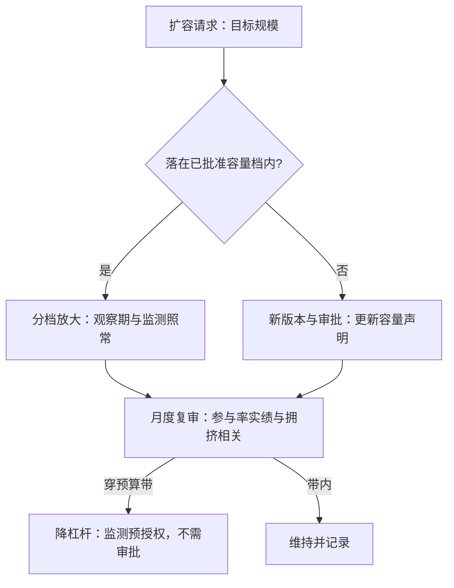

# 容量治理

规模不是业绩的中性放大器：资金自己参与价格形成，规模本身改变收益的生成过程。

<footer>—— 据 Perold 与 Salomon, Financial Analysts Journal, 1991 整理</footer>

[上一课](/quant/sl-versioning-approval)把批准写成对声明的一致性核对，声明里分量最重的一项是容量曲线。研究侧容量怎么算——冲击核、过零点、发表后缩水——已在[策略容量与衰减](/quant/strategy-capacity-decay)写清；本课写它的治理面：容量从研究报告里的一个数字，变成带限额、触发器与扩容流程的治理对象。衰减怎么治是下一课，本课只管「跑多大」。

## 问题

容量声明最常见的死法是「批准后无人再读」：审批时引用了曲线，募资与配置却在另一条线上推进，规模涨过零点时没有任何机制报警。反过来也有对面的错：把容量当成上线前的门槛，上线后再也不看拥挤相关与参与率的漂移——而自身交易会改写后续 IC，[容量课的机制](/quant/strategy-capacity-decay)不因上线而失效。缺口因此是双侧的：扩容没有流程，占满没有触发器。治理要回答的不是「容量是多少」，而是「谁在什么条件下允许把规模推到哪一档，超了之后先发生什么」。

## 方法

台账容量字段的活用分三层。**声明层**：过零曲线 $\mu_{\mathrm{net}}(A,h)$、参与率上限、冲击核半衰期与拥挤态假设，缺一项即不可审计，审计时退回而不是替作者补。**限额层**：硬限额写进执行层——单日参与率、名义敞口、换市场前重检——超限是拒单不是警告；软预算走月度复审，读参与率实绩与同策略生态位的滚动相关。**流程层**：扩容即新版本，按 $\mu_{\mathrm{net}}(A)$ 分档放大、每档设观察期，与[三级台阶](/quant/paper-to-live-staging)的放大口径一致；缩容不需审批——监测穿带即预授权降杠杆。扩与缩的不对称要钉死：扩容错误的损失是线性的，缩容错误的损失只是少赚，所以两个方向的门槛必须不同。

## 机制

容量治理之所以必须是治理而不是研究结论，根源在三个耦合。其一，容量是状态的函数：拥挤态变了，同一条曲线的过零点就变了，所以声明要随[拥挤相关预算带](/quant/live-drift-monitor)联动复审，而不是一年一签。其二，多策略共享冲击核：两个策略各自的参与率都在限内，加总却可能占满同一批流动性，因此参与率要策略层与组合层双记账，组合层限额归风险团队写入。其三，加权口径的诚实性：把宇宙悄悄换成等权微盘，容量曲线可以好看一倍以上，Hou–Xue–Zhang 的复制缩水就是这类口径游戏的样本证据——治理上，声明宇宙与实盘宇宙不一致，按违规持仓处置，不做学术讨论。

一个常用的粗校验：若声明的参与率、核半衰期与拥挤态三项缺一，容量曲线不可审计；审计动作是退回重写，而不是替作者补假设——补出来的曲线会在最需要它的时刻失真。

## 边界

容量曲线的校准只能用自己的成交做：别人的执行数据里没有你的冲击，借来的半衰期会把容量估错一个量级，校准过期要触发复审。本课不写冲击模型的谱系与执行细节——那是交易执行深钻的主题；也不重算过零点——数学在[容量与衰减](/quant/strategy-capacity-decay)里。容量治理管的是「自己吃自己」的速度上限；别人吃掉它的速度，是下一课衰减治理的对象，两课共享同一条拥挤相关预算带，但读数与动作不同。

## 小结

- 容量治理分声明、限额、流程三层：曲线可审计、硬限进执行层、扩容即新版本。
- 扩容与缩容门槛不对称：扩要审批与观察期，缩由监测预授权。
- 参与率在策略层与组合层双记账；声明宇宙与实盘宇宙不一致按违规处置。
- 拥挤相关预算带联动复审，容量声明不是一年一签的静态数字。
- 出处：Perold–Salomon, *FAJ*, 1991；容量曲线与冲击核见[策略容量与衰减](/quant/strategy-capacity-decay)；发表后缩水见 McLean–Pontiff, *JF*, 2016 与 Hou–Xue–Zhang, *RFS*, 2020。
