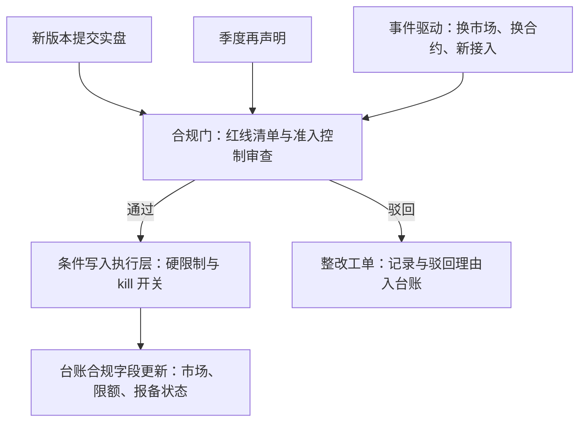

# 合规审查

订单在进入市场之前，必须先经过风险控制：错单、超限与坏参数在自家闸门拦住，远比在市场里事后处置便宜。

<footer>—— 据 SEC Rule 15c3-5（市场准入规则，2010）与 MiFID II RTS 6 的要求整理</footer>

[上一课](/quant/sl-decay-governance)解决了「跑多大、何时停」的统计面；一个版本过了判据，不等于过了法律与市场规则这一面。本课写合规审查——生命周期上独立于判据的一扇门：程序化报备、行为红线、持仓限额、准入控制与记录义务。门的输出不是一份法律意见书，而是写进执行层的硬限制和台账里的合规字段。

## 问题

合规后置的代价结构是极端不对称的：事前审查是一次评审的成本，事后处置是被认定违规、被问询、被迫清仓退出——退出成本远高于评审成本，还附赠声誉损失。常见的失守点有三类。灰区没人预先表态：盘口的报撤频率、跨市场同时挂撤的外观，策略团队觉得「不是那个意图」，监管的认定却按**外观标准**——订单模式呈现出来的样子，不以内部意图辩护。控制停在文档层：合规制度写满一页，执行层没有硬限制，毫秒级的世界里文档挡不住任何东西。记录不全：被问询时「为什么下这单」答不上来，因为答案本该在台账到版本的指针链上。

## 方法

门开三个时点。**上线前**：新版本送审两份清单。行为红线清单——自成交外观、幌骗与层化外观、报撤比上限、持仓与集中度限额、程序化交易的报备状态；准入控制清单——全策略与单策略的 kill 开关、错单阈值、信用与额度检查，这层是 15c3-5 市场准入逻辑的直接落地。**周期性**：季度再声明，确认宇宙、市场、报备状态与限额仍然有效，与[版本有效期复审](/quant/sl-versioning-approval)同期走，不另设节奏。**事件驱动**：换市场、换合约、接新交易所、改执行算法，任一发生即重审，不等季度。

输出写成机器可执行的形态：限额进执行层的拒单逻辑，行为阈值进订单网关的检查；台账合规字段同步更新，记录「本版本获批运行的市场、限额与报备状态」。审查者独立于开发者，与模型验证同一条 SR 11-7 原则。

## 机制

合规门起作用的机制，是把「不该发生的事」从行为准则变成物理约束。行为准则依赖人在压力下的自觉，物理约束不依赖：报撤比超限的订单发不出去，比事后解释撤单率为什么高便宜得多。这解释了为什么输出必须进执行层而不是进制度文档。第二个机制是记录与指针链的耦合：审计时每一个订单都要能沿「仓位 → 版本 → 判据 → $N$」反查，合规字段是这条链上法律侧的一环——链断了，合规审查做得再好也无法自证。第三个机制是三个时点的分工：上线前门管存量风险，周期门管环境漂移（规则改了、限额调了），事件门管未预期的变化；三者共用同一套清单，差别只在触发条件。

行为红线的判定用外观标准：监管看的是订单模式呈现的样子，不以策略团队的内部意图辩护。评审时该问的是「这个模式看起来像什么」，而不是「我们想做什么」。

## 边界

合规审查不判断策略的经济好坏——该不该跑、跑多大，是前几课判据与容量的事；门只裁决合不合法、合不合规则。各司法辖区的具体规则差异巨大：程序化报备的形式、做空与借券的约束、税与交易成本的处理，属于各市场制度课的对象，本课只立「门」的结构与输出的形态。合规通过也不豁免监测：行为漂移会在运行期出现——参数改动让报撤比悄悄超标、规模涨过限额——所以硬限制要持续生效，监测读数里也要有合规侧的线。被驳回的版本走整改工单，驳回理由入失败清单，与版本审批同一去向。

## 小结

- 合规是独立于判据的门，三个时点：上线前、季度再声明、事件驱动重审。
- 输出必须是机器可执行的：限额进拒单逻辑，阈值进订单网关，文档不挡毫秒。
- 行为红线按外观标准判定；台账合规字段是「仓位到判据」反查链上法律侧的一环。
- 审查者独立于开发者；驳回理由入失败清单，$N$ 不清零。
- 出处：SEC Rule 15c3-5（2010）；MiFID II RTS 6（算法测试与 kill 功能）；独立验证原则据 Federal Reserve SR 11-7（2011）整理。
