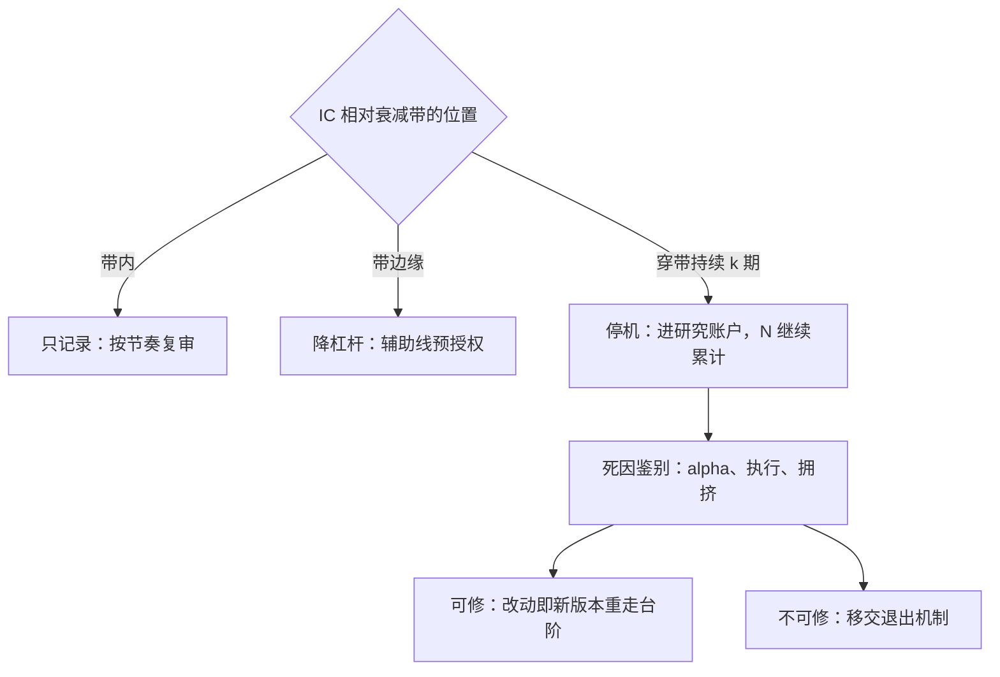

# 衰减治理

异象被写成论文之后，收益平均要缩水一截：可预测性被套利资本消耗，也被「公开」这件事本身消耗。

<footer>—— 据 McLean 与 Pontiff, Journal of Finance, 2016 整理</footer>

[上一课](/quant/sl-capacity-governance)把容量变成治理对象，管的是自己吃掉信号的速度；本课管别人吃掉它的速度。衰减的实证与容量账在[策略容量与衰减](/quant/strategy-capacity-decay)，监测侧「怎么听」——原假设带预扣预算的顺序检验——在[实盘漂移监测](/quant/live-drift-monitor)。本课写衰减进了台账之后的治理：预算怎么立、三档动作怎么触发、确认衰减之后的去向。

## 问题

衰减治理最常见的两种死法，是把两种「坏」混为一谈。把回撤当衰减，会在系统性坏年停掉仍然有效的风险溢价；把衰减当回撤，会在信号真死的时候硬扛到预算外。两者都源于同一缺失：**衰减预算不写在批准记录里**。原假设若默认「IC 永远等于回测」，McLean–Pontiff 一类的发表后缩水会让所有公开来源的信号迟早报警，报警失去信息量。第二层缺口在动作侧：穿带之后去留靠临时开会，结论由会议室里的职位分布决定，而不是由判据决定——监测的统计纪律到此断线。

## 方法

台账衰减字段在上线时就定死三样。**预期衰减带**：发表折扣或拥挤折扣后的预期均值，加减冻结期标准误的若干倍，或一条允许随时间缓降的斜坡；斜坡的斜率本身是假设，复审时重新校准。**复审节奏**：月度读数、季度重校，复审次数进 $N$ 的账——允许无限次「再看一眼」，就会在噪声里找到继续持有的理由，这与[回测过拟合](/quant/backtest-overfitting)是同一道算术在时间上的重演。**耗尽判据**：预指定统计量穿带且持续 $k$ 期，由[顺序检验](/quant/cusum-mosum)给出受控的错误率，看图做不到。

三档动作与带的位置绑定。带内只记录；带边缘降杠杆，走辅助线的预授权；穿带确认则停机、进研究账户——但停机不等于退役，下一步是死因鉴别：alpha 漂移、执行漂移还是拥挤漂移，[监控闭环](/quant/live-monitoring-handoff)已把这条分诊线预写好。可修的改动即新版本重走台阶；确认不可修的，移交退出机制，那是后面专门的一课。

## 机制

衰减要预扣而不能事后再议，根本原因是顺序检验的错误率只在「原假设含衰减预算」时受控：预算带就是原假设的形状，事后改带等于移动球门。预扣还改变了组织行为——衰减写成数字后，去留之争变成「读数在带内的哪一格」，而不是「谁更相信这个策略」。拥挤与衰减在机制上耦合：别人吃掉信号的过程会先表现在拥挤相关上，所以衰减治理直接读[容量课的同一条预算带](/quant/sl-capacity-governance)，但容量课看的是规模该多大，本课看的是信号还剩多少，两线共用读数、分开动作。

McLean–Pontiff 的样本里，异象收益在样本外约缩水 26%，正式发表后缩水更深；衰减预算若按零衰减设，监测迟早全部误报——预算带是原假设，不是乐观预测。

## 边界

衰减预算不是自我实现的预言：预算定的缩水率本身是假设，季度重校可能把它调宽也可能调窄，调带本身要留痕并计一次复审。本课的口径只适用于有对手方的 alpha 信号；纯风险溢价类持仓的「衰减」是风险价格随周期波动，不适用同一套停机逻辑，混用会导致在折价最深处清仓溢价。检验细节——统计量选型、带宽计算、$k$ 的选择——不在此重复，见[漂移监测](/quant/live-drift-monitor)与[CUSUM/MOSUM](/quant/cusum-mosum)。确认衰减后的清仓怎么走，属于退出机制课。

## 小结

- 衰减预算写进批准记录：预期带、复审节奏、耗尽判据三者缺一不可。
- 原假设必须含预扣衰减，顺序检验的错误率才有意义；复审次数计进 $N$。
- 三档动作绑定带的位置：记录、预授权降杠杆、停机鉴别，去留不进会议室。
- 停机不等于退役：死因分诊在前，可修即新版本，不可修才移交退出。
- 出处：McLean–Pontiff, *JF*, 2016；顺序检验见 Brown–Durbin–Evans, *JRSS-B*, 1975 与[CUSUM/MOSUM](/quant/cusum-mosum)；衰减与容量的耦合见[策略容量与衰减](/quant/strategy-capacity-decay)。
