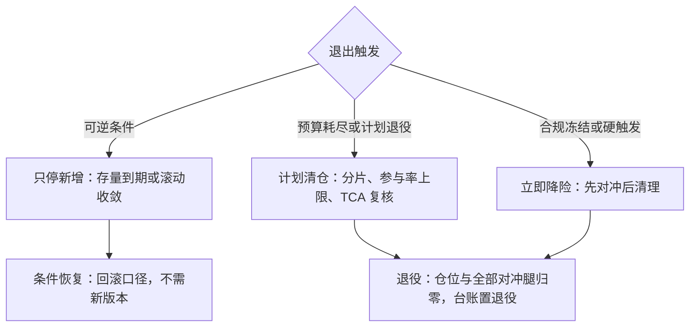
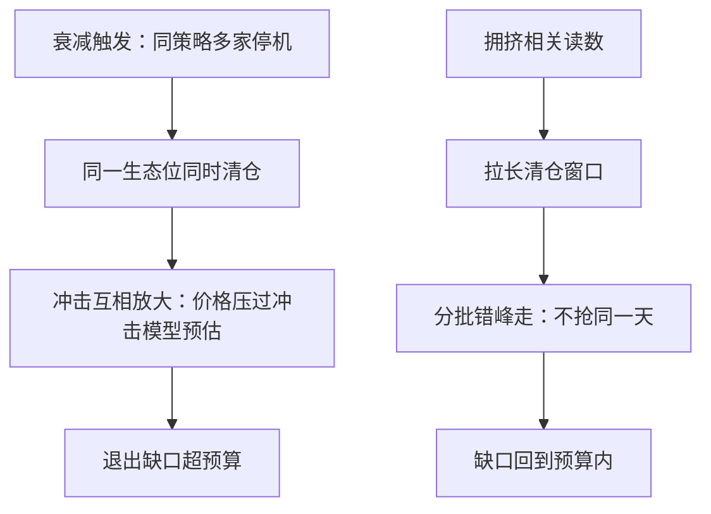

# 退出机制

进入的规则写满一页，退出的规则常常一行没有——直到不得不退出的那天，才发现退出本身就是一笔没有模型的交易。

<footer>—— 据 Federal Reserve SR 11-7 的持续监测原则与本课程前几课口径整理</footer>

[上一课](/quant/sl-compliance-review)的合规门裁决能不能进、要不要冻结；本课写冻结之后钱怎么出来、策略怎么死、死成什么状态。退出机制就是台账状态机上「实盘/暂停 → 退役」那条边的完整定义：触发、分级、清仓、退役的完成标准。它的核心立场只有一句：退出计划在上线时预写，退出时刻只执行。

## 问题

停机不是清仓，这是第一层缺口：[监测状态机](/quant/live-monitoring-handoff)停的是信号——不再新开仓，存量持仓怎么办没有任何预案，于是「暂停」无限期化，半仓挂账无人认领，归因从此算不清。第二层缺口是退出自身的市场冲击：拥挤策略退出时往往不止你在退，同一生态位上的对手在同一时刻同向清仓，冲击互相放大——[容量课的拥挤预算带](/quant/sl-capacity-governance)反过来读，就是退出时的踩踏预警。第三层缺口是激励：退出时刻的在场者——当期奖金、沉没成本、「再等一个季度」——全部反对退出，临场决定的结果几乎必然偏晚。

直觉类比：拥挤策略一起退出像剧场起火——每个人单独看都走得很理性，加总起来却把出口堵死。容量课的拥挤预算带读数高，等于开场时就知道这个剧场出口窄；退出要拉长窗口、分批走，不是跑得更快，而是别和所有人挤同一个门。

## 方法

退出计划作为批准的一部分在上线时入台账，写四样：清仓窗口、参与率上限、对冲腿与衍生品的处置、每级的触发条件。执行分三级。**只停新增**：信号停，存量自然到期或按滚动规则收敛，用于可逆条件——判据临时穿带但死因未明。**计划清仓**：按冲击模型分片、限参与率、用 TCA 复核缺口，用于预算耗尽或计划退役。**立即降险**：合规冻结或硬触发时先对冲后清理，对冲腿本身进限额。退役完成有硬定义：台账状态置退役、现货仓位为零、全部衍生品腿平掉、归因拆分与退出缺口入档——缺一项不算退役，只算「正在退」。

术语翻译：TCA（交易成本分析）是把每笔成交价与「什么都没做时的中间价」相比，量出这笔交易付了多少隐性成本。清仓时用它复核缺口，就是边退边对账——一旦发现实际冲击超出预估，就放慢分片节奏，而不是硬按原计划砸完。

## 机制

退出要预写而临时不议，机制在于把退出从「当下的裁决」变成「既定判据的执行」。临场时激励清一色偏向持有，预写计划让推迟退出变成一个需要明说、留痕、有人负责的动作——不作为从此有成本。分级的存在是因为退出的可逆性不同：只停新增可逆，回滚口径即可恢复；计划清仓半可逆，重进场有门槛与冲击；立即降险不可逆，所以批准层级也不同——前两级监测预授权，第三级与合规冻结联动执行。拥挤退出还带外部性：同策略生态位上的同时清仓会放大冲击，因此清仓窗口要参考拥挤相关读数，宁可拉长窗口分批走，不抢同一天。

退役最常见的残留是被遗忘的对冲腿：到期日在两年后的深度虚值期权、名义未平的远期。退出完成的定义必须包含全部衍生品腿，否则资本占用与归因永远算不清。

## 边界

退出不是免费期权：频繁停启本身有成本——重进场的冲击与门槛、税、以及团队对判据的钝化，所以「停」与「退」的判据故意不同，停可逆、退不可逆。清仓执行的分片算法与 TCA 细节是交易执行深钻的对象，本课只定窗口与参与率这两个治理参数。退出缺口要进策略全周期账：上线前预估的进出场往返成本本来就是容量与预期收益的一部分，[容量课](/quant/strategy-capacity-decay)的净收益曲线若没算退出腿，过零点本身就偏乐观。退役后的卷宗怎么沉淀成组织记忆，是下一课知识管理。

常见误区：初学者容易把「停」当成免费动作——先停了再说，想清楚再回来。实际上重进场有冲击成本与门槛，税和团队对判据的钝化也都在记账。所以停与退的判据故意不同：停可逆、退不可逆，频繁停启本身就是一笔没进模型的交易。

## 小结

- 退出计划上线时入台账：窗口、参与率、对冲腿处置、各级触发条件。
- 三级退出按可逆性分：只停新增可逆、计划清仓半可逆、立即降险不可逆，批准层级随之不同。
- 退役完成有硬定义：状态置退役、仓位与全部衍生品腿归零、归因与缺口入档。
- 拥挤退出有外部性：参考拥挤相关拉长窗口，不与同生态位对手抢同一天。
- 出处：停机与预授权口径见[实盘监控与研究再触发](/quant/live-monitoring-handoff)；持续监测与退役原则据 Federal Reserve SR 11-7（2011）整理；往返成本与容量见[策略容量与衰减](/quant/strategy-capacity-decay)。
