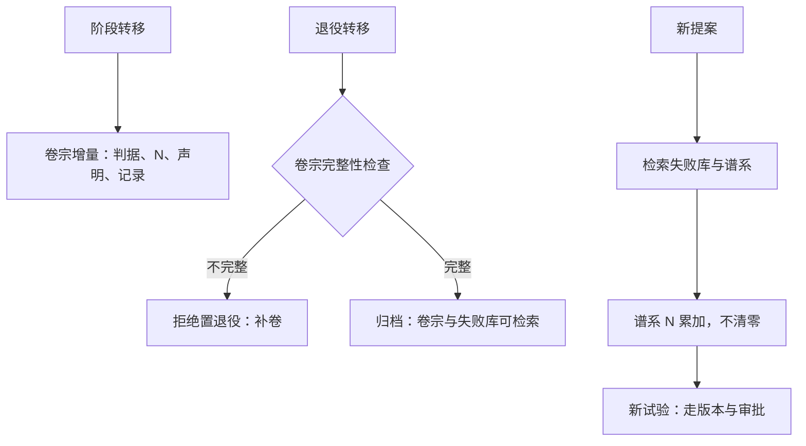
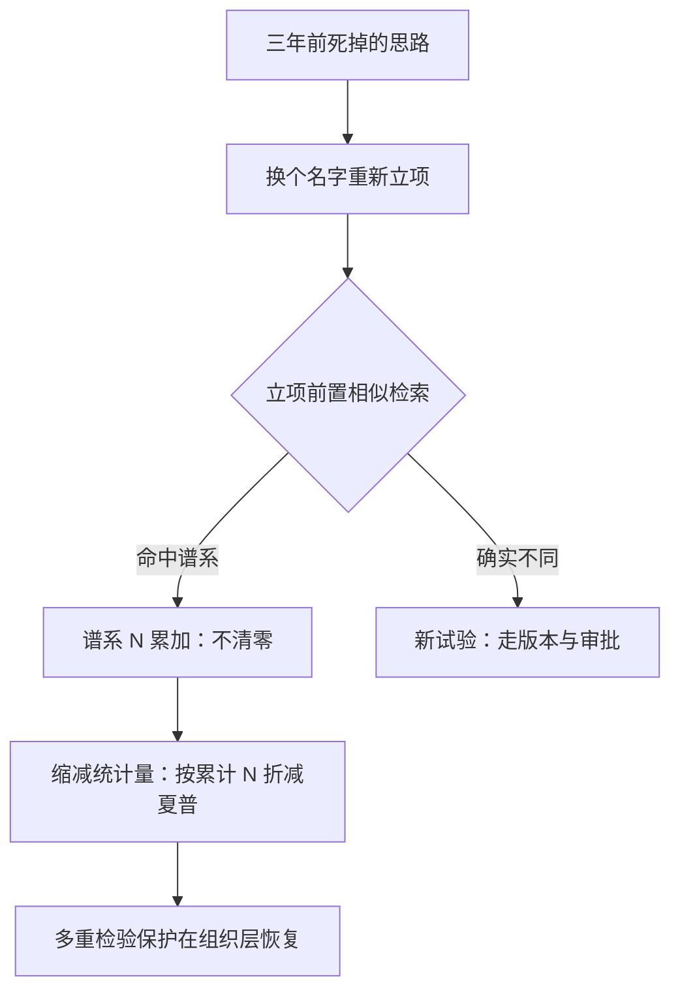

# 知识管理

负结果若不可检索，组织就会一遍遍把钱花在同一口井上：内部知识的幸存者偏差，与样本的幸存者偏差同样致命。

<footer>—— 据 Arnott, Harvey and Markowitz, *Journal of Financial Data Science*, 2019 与内部复盘规范整理</footer>

[上一课](/quant/sl-exit-mechanism)把策略死成台账里的一行，退役完成。本课写这一行如何变成组织的记忆。研究复盘课已经立了四件沉淀物——假设台账、失败清单、可复现快照、带迁移条件的一页案例；本课把它们接进生命周期：每一次阶段转移都产生必须沉淀的对象，知识管理是生命周期的闭环，不是额外的文档工作。

## 问题

组织遗忘有三个具体机制。人走了知识走：判据为什么那样设、当年否掉的方案是什么，只活在离开者的脑子里。信号换包装再来：三年前死掉的思路改个名字重新立项，$N$ 从零起算——多重检验保护在组织层面失灵，回测过的[过拟合算术](/quant/backtest-overfitting)对团队内部同样成立。成功被讲述、失败失踪：内部案例库里全是活下来的策略，新人的「历史经验」自带虚高的夏普，与数据里的幸存者偏差同构。三者共同的缺口是：把个体经验变成可检索的共享资产，并且让检索行为本身进治理——查过失败库是立项的前置条件，而不是美德。

直觉类比：只看公司里活下来的策略学做研究，像只采访中奖者学买彩票——样本里全是赢家的故事。失败库的作用是把「没中的彩票」也摆上货架，新人的历史先验才不至于自带虚高的夏普。

## 方法

知识资产与台账同构：**一策略一卷宗**，随阶段转移增量成卷——判据引用、$N$ 与累计范围、容量与衰减声明、批准与驳回记录、复盘、退出案例；退役转移是卷宗完整性的强制检查点，不完整不允许置退役状态。**失败库按死因索引**：判据未过、漂移、拥挤、合规、操作，死因必须落在判据上——「效果不好」不是索引项，[复盘课的口径](/quant/research-postmortem)照搬。**立项前置检查**：新提案必须附相似检索结果——查过什么、为何不同；检索记录本身入卷宗，让「不知道已有失败」不再是无责借口。**谱系 $N$ 累计**：同谱系的重复试验累加，检索是计数的入口，$N$ 从此不清零。

术语翻译：谱系 $N$ 就是「这个思路加上它的变体总共被认真试过几次」的计数。同一想法改参数、改宇宙、改名字都算同谱系——计数跟着思路走而不是跟着立项书走，$N$ 不清零，多重检验的账才算得对。

## 机制

知识库必须挂在台账上而不是靠自觉归档，原因是制度由状态机强制而非由记忆维持：阶段转移是天然的归档触发器，人在最掌握上下文的时刻被要求写下来，拖延的空间被状态机没收。检索前置改变的是提案的先验：带着「已有三次失败」的先验去设计试验，与从零自信出发，是两个不同的研究。谱系累计则是组织层面的多重检验防线——它与[缩减统计量](/quant/deflated-sharpe)的个体层面防线互补：个体防止一次试验里挑最好的，组织防止同一口井被反复挖。复盘的三条制度——复盘免责、案例同权、快照双冻结——在这里成为入库标准：免责保证写真话，案例同权保证失败入库与成功同等待遇，双冻结保证卷宗在多年后仍可复现。

跨团队 $N$ 累计的最小实现：卷宗对外只暴露谱系标签、判据引用与死因三元组，参数与快照留在权限内——计数可见而细节不可见，多重检验的保护与策略保密可以同时成立。

## 边界

知识库不自动产生智慧：入库门槛太高则无人入库，太低则检索被噪声淹没——一页案例的强制格式是折中，写不完一页的失败通常还没落到判据上。保密与共享有张力：只共享谱系与死因的元数据，不共享参数，是本课给的解，代价是偶尔错过「参数不同但机制相同」的判同——这个错要认。不复述复盘的写作格式与免责条款设计，那是[复盘课](/quant/research-postmortem)的内容。知识管理管的是生命周期产生的记忆；团队里谁写、谁审、谁在会上用这些卷宗，是下一课团队流程的对象。

常见误区：初学者容易以为知识库越全越好、什么都要往里放。入库门槛太高则没人写，太低则检索被噪声淹没——写不完一页的失败通常还没落到判据上。知识管理的目标是可检索的好先验，不是归档数量的大赛。

## 小结

- 一策略一卷宗，随阶段转移增量成卷；退役转移强制卷宗完整性检查。
- 失败库按死因索引，死因必须落在判据上；负结果可检索才没有内部幸存者偏差。
- 立项前置相似检索，检索记录入卷宗；谱系 $N$ 累计、永不清零。
- 复盘免责、案例同权、快照双冻结，是卷宗可信的三个制度前提。
- 出处：Arnott, Harvey and Markowitz, *JFDS*, 2019；沉淀物四件与复盘制度见[研究复盘](/quant/research-postmortem)；多重检验保护见[缩减夏普](/quant/deflated-sharpe)。
