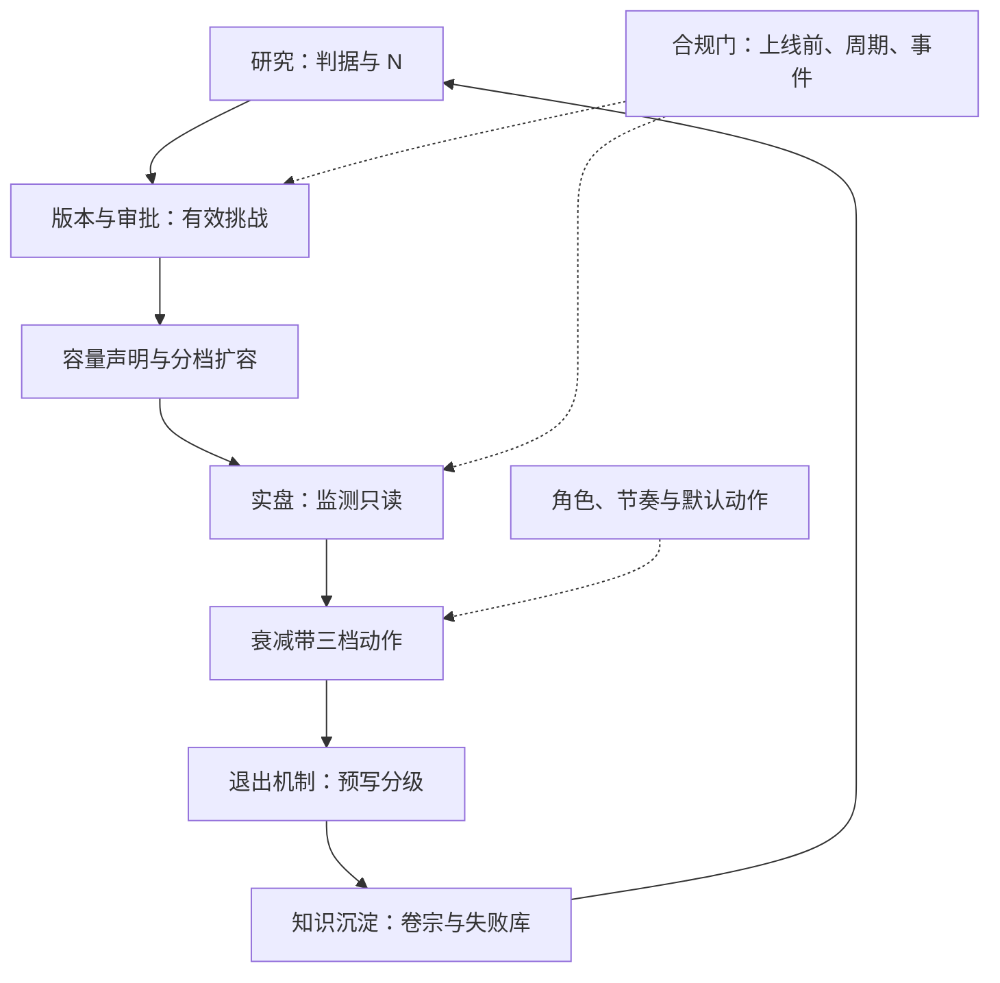

# 生命周期治理收束

治理做得好不好，只在两处现形：钱停得下来的时候，和理由查得到的时候。

<footer>—— 据 Federal Reserve SR 11-7（2011）与本课程各课口径整理</footer>

[上一课](/quant/sl-team-cases)把规则绑定到岗位与节奏，三个案例走完了从立项到退役的全流程。本课程到此收束：本课把九课收成一张图与一组不变量，交代哪些部分刻意留给了相邻课程。判据怎么设、监测怎么听，是主干课与风险课的对象；本课程回答的始终是治理面——策略从想法到退役，每一步凭什么、谁批准、记在哪。

## 问题

收束要回答的问题是：九课合起来，治理到底保证了什么？答案不是「策略更赚钱」——治理不创造 alpha，判据不过就是不进。治理保证的是一组**可回答性**：这个仓位此刻凭什么在跑（台账与审批）、它最多能跑多大（容量）、它预期还剩多少（衰减带）、它碰没碰红线（合规门）、停了之后怎么出来（退出）、死了之后留下什么（知识）。这些问题的答案必须在任何时刻都可查、可审计、可复现——这就是治理的全部产出，也是它区别于经验管理的地方。

## 方法

把九课折成一条主线：**台账**立状态机与指针链；**版本与审批**填「凭什么进」，判据挂边、有效挑战；**容量**填「跑多大」，声明三层、扩容即版本；**衰减**填「还剩多少」，预算预扣、三档动作；**合规**立独立于判据的门，输出进执行层；**退出**预写分级、退役有硬定义；**知识**让每一次死亡可检索、$N$ 不清零；**团队**给全部规则配岗位、节奏与默认动作。贯穿九课的不变量七条：追加不改写；单一事实来源；监测只读；判据挂边不挂人；$N$ 永不清零；实盘仓位必可沿指针链反查；退出预写。

## 机制

不变量为什么是这七条：每一条都堵一个已知的失效模式。追加不改写堵历史重写——审计要求昨天批准过的东西今天还查得到原样；单一事实来源堵清单漂移——两份清单等于没有清单；监测只读堵球门移动——穿带后的任何改动都是新试验；判据挂边堵人治——批准是核对不是恩典；$N$ 不清零堵多重检验复活——换包装不算新信号；指针链反查堵黑箱持仓——答不出「凭什么」的仓位按违规处置；退出预写堵临场偏晚——把推迟退出变成需要明说的动作。七条合起来的机制是一个：让「治理失效」在失效发生的时刻就被发现，而不是在亏损或问询到来时才暴露。SR 11-7 的相称性原则在此收尾：门的深度随策略的规模与复杂度调节，小策略走窄门，但**没有免门的政策**——相称性调节强度，不删除义务。

自检只需三个问题：随机挑一个实盘仓位，五分钟能否答出它凭什么在跑？随机挑一个已退役策略，能否查到它死于哪条判据、第几次试验？随机挑一条硬限额，能否确认它此刻在执行层生效？三个「能」，就是本课程全部内容的落地测试。

## 边界

本课程刻意没有覆盖的三块，都在知识树的紧邻位置：数据管线与版本化是量化数据工程课的对象，本课只引用其哈希；回测与成交模拟是回测框架课的对象，判据的数字从那里来；多人协作、代码评审与委员会流程的工程细节是研究协作课的对象，本课只定了职责边界。治理本身也有成本：每道门都消耗研究速度，门无限多则组织瘫痪——这正是相称性原则存在的理由。最后一点边界要说诚实：治理的输出是「可回答」与「可停」，不是「一定赚」；台账记得再干净，救不了一个没有 alpha 的信号——判据与统计，仍然是一切的前一课。

## 小结

- 九课一条主线：台账、版本与审批、容量、衰减、合规、退出、知识、团队，各答一个可回答性问题。
- 七条不变量贯穿全程：追加不改写、单一来源、监测只读、判据挂边、$N$ 不清零、仓位可反查、退出预写。
- 相称性原则收尾：门的深度随规模与复杂度调节，不删除义务。
- 本课程的落地测试是三个「五分钟能否答出」；治理保证可回答与可停，不保证赚钱。
- 出处：治理框架据 Federal Reserve SR 11-7（2011）整理；衰减证据见 McLean–Pontiff, *JF*, 2016；容量口径见[策略容量与衰减](/quant/strategy-capacity-decay)；监测与复盘分别见[实盘漂移监测](/quant/live-drift-monitor)与[研究复盘](/quant/research-postmortem)。
