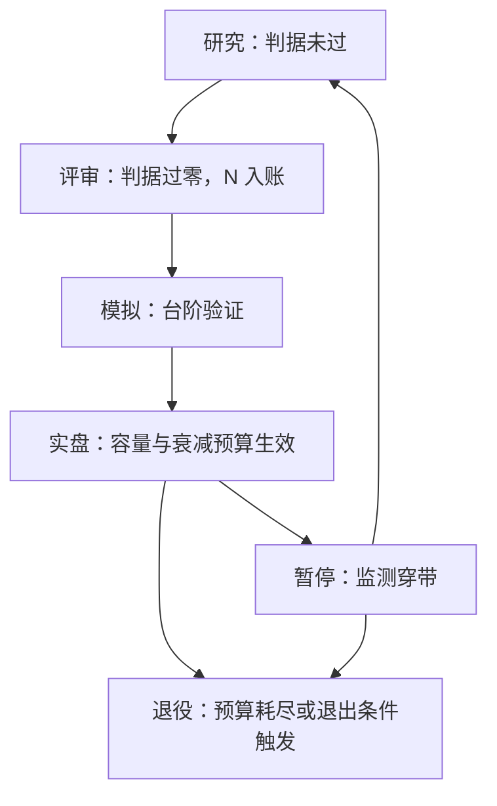
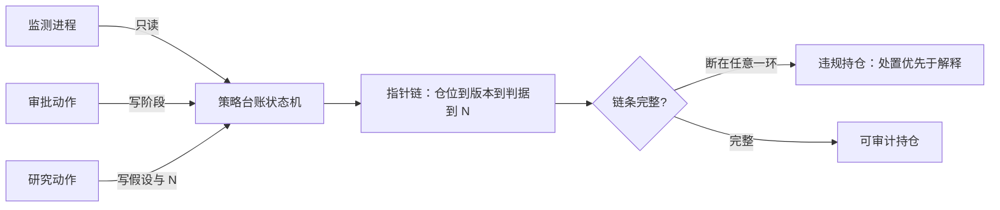

# 策略台账体系

模型风险的管理从识别与清单开始：一个模型只有先被登记、写明用途并指定责任人，后面的验证与控制才有落点；策略同理。

<footer>—— 据 Federal Reserve SR 11-7（2011）的治理框架整理</footer>

[上一课](/quant/rk-reporting-map)把风险体系收在报告上：每个数字有血缘、每个例外有归因，签字把「知情」变成「负责」，并声明风险体系为策略服务——策略自己从生到退怎么管，是下一课程的主题。本课是「策略生命周期治理」的第一课：先把策略台账立起来。后面各课的版本与审批、容量与衰减治理、合规审查、退出与沉淀，都默认台账存在，只对它读写。

## 问题

没有台账的团队长什么样：同一个信号被三个人在不同季度重复研发，各自的 $N$ 都从小计起；实盘某个仓位出了问题，从仓位反查不到是哪个版本的哪条判据批准的；停机的策略没人认领，半年后换个名字重新上线。缺口不是缺一个更好的监控——[监测只读](/quant/live-drift-monitor)已经解决「听」，缺的是所有治理动作共读共写的**共享状态**：这个策略现在是谁的、在哪个阶段、凭什么进的、谁批的、容量与衰减预算是多少、$N$ 计到几。

台账因此不是一份文档，而是一台状态机：每个策略一个全局 id，每个 id 在任一时刻恰有一个生命周期阶段。文档会过期、会有两份互相矛盾；状态机不允许——阶段转移只能由预定义事件触发，触发即留痕。

直觉类比：文档像白板上的字，谁都能改、改了不留痕，两块白板还会互相矛盾；状态机像电梯——只沿预定义的楼层移动，每次移动都刷卡留痕。台账要的是电梯不是白板：阶段只能沿转移边走，走一步记一步。

## 方法

字段取最小必要集：策略 id；当前版本（指向代码提交、配置与数据快照的哈希，不复制内容）；阶段——研究、评审、模拟、实盘、暂停、退役；owner 与批准人指针；准入判据与冻结日期（两轴过零之类的[准入口径](/quant/econ-vs-stat-sig)）；试验计数 $N$ 及其累计范围；容量曲线声明；衰减预算带；退出的预写条件。写入规则三条：追加不改写；阶段只能沿转移边移动；每条转移记录触发事件与时间戳。

谁读谁写同样要钉死：监测进程对台账只读；审批动作写阶段；研究动作写假设与 $N$。任何在实盘花钱的仓位，都必须能沿「仓位 → 版本 → 判据 → $N$」的指针链反查回台账；链条断在任意一环，即为违规持仓，处置优先于解释。

术语翻译：哈希指针存的是内容的一枚「指纹」而不是内容本身——代码或数据哪怕改动一个字节，指纹就对不上。台账因此可以很轻，也骗不了人：想伪造「当时用的是哪份代码」，得先伪造指纹。

## 机制

台账起作用的方式，是把治理动作变成幂等操作。停机脚本重复执行只会命中同一个状态；两个团队同时申请上线同一信号，台账在 id 级撞名即可发现。SR 11-7 对模型要求治理清单与控制，同一逻辑对策略成立：清单让「这个策略还该不该在跑」成为任一时刻都能回答的问题，而不取决于谁在场。指针引用（哈希）而不是复制，保证台账轻、且不与代码库和数据快照漂移——漂移的清单比没有清单更危险，因为它看起来可信。

阶段转移绑定判据而不是绑定人，是台账与项目管理工具的分界。工单系统里状态可以随意拖动；台账里「模拟 → 实盘」的边上挂着判据引用，拖不上去——除非触发事件真的发生。于是「谁批准的」变成一条可审计记录，而不是会议室记忆。

台账里最先腐烂的通常不是阶段，而是容量声明与 $N$：前者因为扩容走了非正式渠道，后者因为「只是试一下」没入账。字段必须有唯一写入方，否则宁可不设。

## 边界

台账不替代监测：监测在[实盘漂移监测](/quant/live-drift-monitor)里是只读的顺序检验，台账只是它停机时写入的对象。台账也不替代审批记录本身——批准的论证、反对意见与有效期，属于下一课的版本与审批。$N$ 的跨团队累计口径（同一信号不同人各试过几次算几个）牵涉知识管理，留到后面统一处理。数据管线本身的版本化是数据工程课的主题，本课只引用其哈希。

常见误区：初学者容易以为有了台账就有了治理。台账只回答「现在是什么状态」，不回答「该不该转移」——判据在版本与审批课，读数在监测课。台账是共用的记账本，不是决策者本身；把它当决策者，治理会重新退回人治。

## 小结

- 台账是所有治理动作共读共写的状态机，不是文档：每个策略一个 id，任一时刻恰有一个阶段。
- 阶段转移只能由预定义事件触发并留痕；判据挂在转移边上，不挂在人身上。
- 实盘仓位必须能沿「仓位 → 版本 → 判据 → $N$」反查回台账，断链即违规。
- 监测只读、审批写状态、研究写假设与 $N$；字段有唯一写入方才允许存在。
- 出处：治理清单与控制原则据 Federal Reserve SR 11-7（2011）整理；监测只读与停机工单闭环见[实盘漂移监测](/quant/live-drift-monitor)与[实盘监控与研究再触发](/quant/live-monitoring-handoff)。
