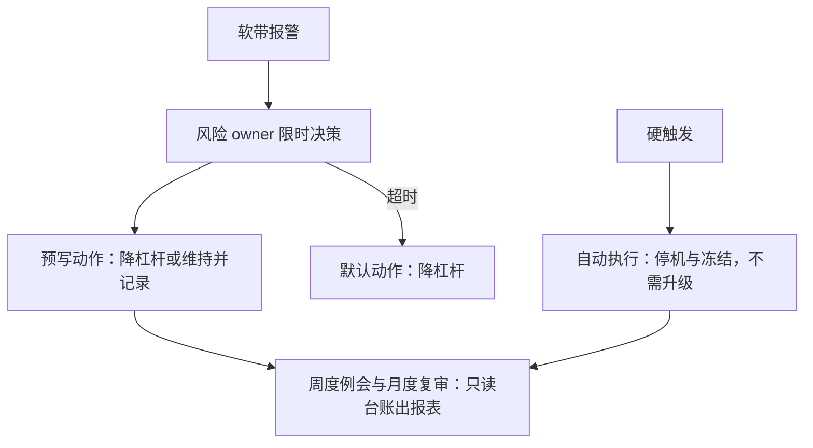

# 团队流程与案例

治理最终写在岗位与会议节奏里：谁在哪个阶段有一票、多久复审一次、超时升级到谁——流程没有载体，就只是一堆文档。

<footer>—— 据 Federal Reserve SR 11-7 的治理原则整理</footer>

[上一课](/quant/sl-knowledge-management)把生命周期的沉淀变成可检索的卷宗。至此规则都在了——台账、版本、容量、衰减、合规、退出、知识——本课写让规则跑起来的东西：角色怎么切、会议怎么开、升级怎么走，然后让三个综合案例把全流程走一遍。本课也是收束前的彩排：看完这三个案例，前八课的接口应该全部对上。

## 问题

规则清楚而流程失灵的样子，每个团队都见过几种。批准找不到人：唯一有签字权的 owner 休假，新版本冻在评审站一周。报警无人处置：监测软带报警发进群，没人知道自己有没有处置权，也没有处置时限。复盘会开成追责会：从此没人把真死因写进卷宗，失败库静悄悄腐烂。三者共同的缺口：每条规则没有绑定到**岗位、节奏与升级路径**。规则说「穿预算带降杠杆」，流程必须回答「谁执行、几小时内、不执行会怎样」。

## 方法

角色最小集六种：研究（提案与假设）、组合管理（配置与扩容请求）、独立风险（判据复算、监测 owner、停机预授权）、执行（硬限制与清仓）、合规（门与记录）、台账管理员——最后一项通常是风险团队内的一个职能。节奏三档：周度监测例会，只读台账出报表；月度容量与衰减复审；季度合规再声明与版本有效期复审。升级路径预写并配**默认动作**：硬触发自动执行，不需升级；软带边缘给 owner 限时决策窗；超时按预写默认降杠杆——把「不作为」变成有成本的选择。每个台账字段挂一行「谁写、谁审、谁读」，空字段的岗位即暴露流程缺口。

## 机制

三个综合案例（综合自常见模式，非真实机构）。**案例一，拥挤降档**：月度复审发现某策略与已部署池的滚动相关穿拥挤预算带——容量与衰减共用这条带——软带预授权降杠杆三成；下周监测例会确认衰减带同步走边；死因鉴别判拥挤成立，处置是新版本缩宇宙、加拥挤惩罚重走台阶，而不是直接退役。**案例二，合规事件门**：执行参数改动让报撤比外观越限——没有人事先送审，因为「只是执行侧改动」；事件门触发重审，处置是硬限制收紧进订单网关、版本升版、缺送的记录补全，合规字段的变更全程留痕。**案例三，执行漂移**：穿带停机工单生成后，死因鉴别发现 IC 稳定而实施缺口扩大——alpha 没死，执行漂了；处置落在执行侧配置的新版本上，信号版本不动，恢复后 $N$ 不清零。

最小组织的红线只有一条：判据复算与监测 owner 不得由提案人兼任。其余角色都可以合并，这条合并不了——激励独立是有效挑战的底座（SR 11-7）。

## 边界

委员会不是治理本身：会议只处理台账无法自动化的判断——跨策略权衡、灰区裁量、带外特例；凡能预写的都应预写在台账与状态机里，会议室不做统计。流程重则无人报真话：追责导向的升级路径会系统性扭曲 $N$ 与死因记录，[复盘免责](/quant/research-postmortem)同样适用于运行事件——只追流程缺口，不追如实上报的人。小团队可以一人多角，但独立复核与监测 owner 的红线不松；六个角色是为职责建模，不是为编制建模。三个案例是教学模式下的典型路径，真实事件的分叉远多于此，判据与状态机才是处理分叉的依据。

## 小结

- 每条规则绑定岗位、节奏与升级路径；台账字段挂「谁写、谁审、谁读」，空岗即缺口。
- 升级路径配预写默认动作：软带给时限，超时降杠杆；硬触发自动执行不进会议室。
- 案例表明三类处置走不同的门：拥挤走版本重审、执行改动走事件门、执行漂移修执行侧。
- 独立复核与监测 owner 不得兼任提案人，激励独立是流程红线的底线。
- 出处：治理原则与有效挑战据 Federal Reserve SR 11-7（2011）整理；案例涉及的机制分别见[容量治理](/quant/sl-capacity-governance)、[衰减治理](/quant/sl-decay-governance)、[合规审查](/quant/sl-compliance-review)与[研究复盘](/quant/research-postmortem)。
