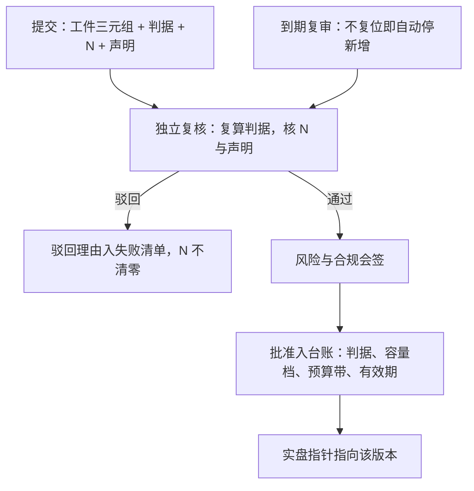

# 版本与审批

有效挑战是贯穿的原则：审查者必须独立于开发，并且有能力、有动力提出实质性反对，否则审批只是签字。

<footer>—— 据 Federal Reserve SR 11-7（2011）关于有效挑战的表述整理</footer>

[上一课](/quant/sl-registry)把策略台账立成状态机：每个策略一个 id，阶段转移挂在判据上。但把一个版本送过转移边的组织动作——谁评、谁批、批的到底是什么、批准管多久——还没有定义。本课写版本与审批：版本是台账里「不可变工件」的落地形式，审批是对「判据与声明仍然成立」的独立复核。后课的容量与衰减治理，都以「批准的是哪条曲线、哪个预算带」为起点。

## 问题

没有版本纪律的实盘会自己长出第六课要禁止的一切：参数被顺手改过但没升版，实盘跑的东西与台账登记的对不上；批准记录只写「委员会同意」，没人知道批准基于哪份回测、哪条容量声明；出了事想回滚，却找不到当时跑的究竟是哪个工件。缺口因此有两层：**版本**要回答「此刻在跑的是什么」，**审批**要回答「凭什么让它跑」。二者缺一，台账的指针链在第一环就断。

把改动分类是第一道纪律：影响信号生成、宇宙选择、或执行侧冲击假设的任何代码与参数变化，必须升版并重走判据；纯文案、监控阈值微调走轻量变更单。分类标准预先写死，否则「只是调个参数」会成为永久漏洞。

## 方法

一个版本是三元组的哈希：代码提交、数据快照、配置。三者都不可变，版本号递增即可，不必语义化。提交包至少附四样：判据引用（挂到台账转移边）、当前 $N$ 与累计范围、容量曲线声明、衰减预算带。审批流三站：研究者提交；独立复核——复核者不在提案人汇报线上，复算判据而不是复述结论，这正是 SR 11-7 要求的独立性、能力与激励；风险与合规会签。批准记录入台账，且批准的对象是「在某判据、某容量档、某衰减预算下运行至某有效期」，不是「这个策略好」。

回滚走同一套机制：台账把实盘指针指回旧版本即可，旧工件因不可变而仍然可复现；回滚同样留痕。[研究-模拟-实盘隔离](/quant/research-sim-prod)的口径在这里继续成立：回滚是默认动作，与晋级共用指标带，不该比晋级更难。

## 机制

独立复核为什么不能省：研究者对自己的策略有系统性乐观，这一点无法靠自觉抵消；更关键的是，[多重检验折价](/quant/multiple-testing-factors)只有在复算时才可见——复核者要核的不是「回测夏普多高」，而是这已是同谱系第几次试验、[缩减后的统计量](/quant/deflated-sharpe)还剩多少。批准记录里的有效期是审批与持续监测的接口：SR 11-7 的验证不是一次性证书，用途或环境变了就要复审；过期不复审即自动降级，防止「十年前批过的策略」永远挂在实盘。

批准记录里最该写清的是驳回理由：驳回理由进入失败清单，同一思路换个包装再来时，$N$ 才不会清零——这是审批对多重检验保护的直接贡献。

## 边界

审批不创造信息，它核对的是判据与声明的一致性：判据本身要过不过，在研究阶段的[统计与经济显著性](/quant/econ-vs-stat-sig)里已经定过。轻量通道与升版通道要真的分开，否则两头堵：小事走全套审批，研究会被官僚拖死；大事走轻量通道，版本纪律形同虚设。紧急停机不需要审批——监测状态机已经预授权，事后补记录即可；审批管的是「往回送」，不是「停下来」。审批记录的论证写作与归档格式，是研究复盘课的对象，本课只保证指针不断。

## 小结

- 版本是不可变工件三元组的哈希；影响信号、宇宙或冲击假设的改动必须升版。
- 审批是独立复核判据与声明，不是对人的信任；独立、有能力、有激励三条件缺一不可。
- 批准的对象是判据、容量档、预算带与有效期，批准记录入台账并可审计。
- 回滚是指针回拨，与晋级同样容易；过期不复审自动降级。
- 出处：有效挑战与持续验证原则据 Federal Reserve SR 11-7（2011）整理；多重检验保护见[因子多重检验](/quant/multiple-testing-factors)与[缩减夏普](/quant/deflated-sharpe)，回滚默认见[研究-模拟-实盘三级台阶](/quant/paper-to-live-staging)。
