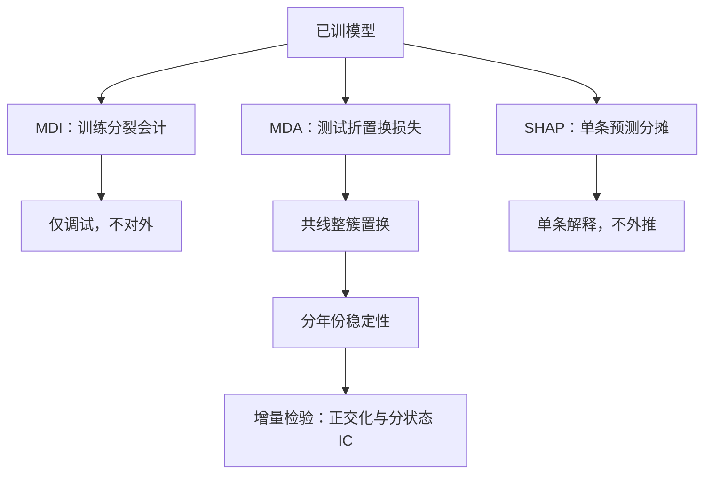
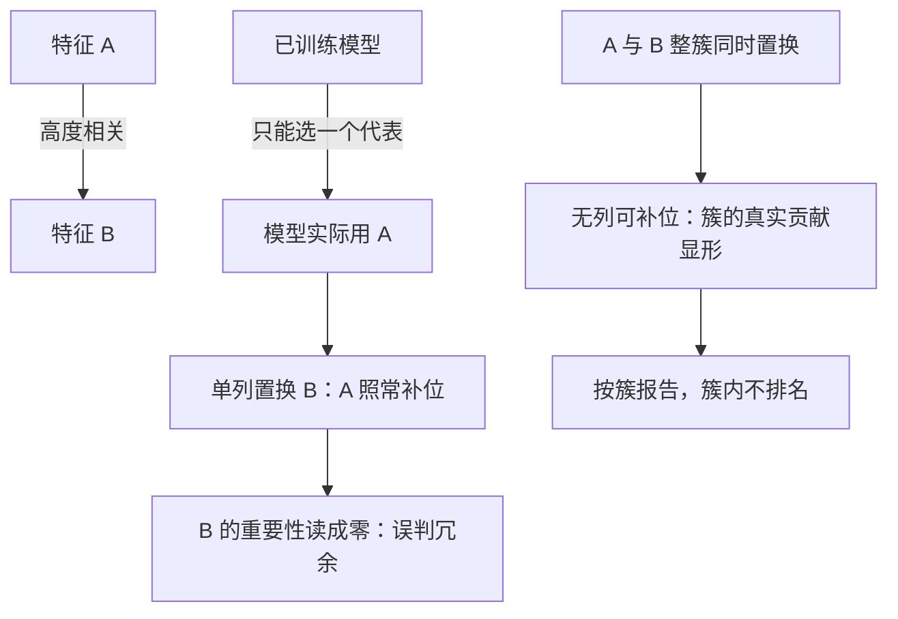

# 特征重要性的陷阱

重要性回答的是「模型用了什么」，不回答「市场是什么」；把前一个问题的答案填进后一个问题，是特征工程里最常见的一次范畴错误。

<footer>—— 据 Breiman, *Statistical Science*, 2001；López de Prado, *Advances in Financial Machine Learning*, Wiley, 2018 整理</footer>

[上一课](/quant/slm-oos-protocol)把「数字什么时候算数」钉在协议上；协议通过之后，最常见的下一步是打开模型看哪些特征重要。置换重要性的操作细节——怎么做、置换在哪层——在[MDA 特征重要性](/quant/mda-importance)已收。本课管读法：三种重要性的分工、共线下的不可归因、以及时间不稳定本身是信息。陷阱的代价不是浪费一次讨论，而是把整个特征淘汰和因子立项的决策建在一个范畴错误上。

## 问题

树与提升自带 gain 排序，SHAP 工具一键可出，于是「看重要性」变成默认动作。三个陷阱连续发生：把训练分裂会计（MDI/gain）当成样本外事实；把共线簇里某个代表的高分当成该族的贡献；把单期排序当成稳定结构。不这么做会错在哪：用 gain 淘汰特征，淘汰的是偏向高基数与早分裂的会计假象；用单列重要性立项，共线让归因随机，下一年换一个代表，因子「失效」其实是归因错了对象。

直觉类比：gain 排序像公司里「谁的报销单金额大」——高基数特征像报销单最多的部门，天然占便宜，但未必真创造价值。它是会计记录，不是业绩考核，更不能当裁员（淘汰特征）的依据。

## 方法

先分清三种计算的口径。MDI/gain：训练时分裂带来的损失下降，便宜、有偏，只配当调试线索。MDA：样本外把一列置换后的损失上升，条件于已训练模型；共线特征要整簇置换，单列置换会在相关列补位时把真信号读成零——操作与管道隔离见[MDA 特征重要性](/quant/mda-importance)。SHAP：把单条预测的增量按合作博弈分摊到特征，解释最细，但同样条件于模型而非总体（[SHAP 因子归因](/quant/shap-factor-attribution)）。读法纪律两条：一切重要性只在协议的测试折或袋外样本上算；共线族以簇为单位报告，簇内不排名。

术语翻译：MDA（置换重要性）就是「把某一列数据随机打乱、再看模型损失涨多少」——涨得越多，模型越离不开这一列。它考的是已训练好的模型，不是市场：模型换了，考出来的榜单就换人。

## 机制

为什么共线使「唯一归因」不成立：相关特征彼此可替代，模型任意选一个代表——第 2 课说过 LASSO 的选择近乎随机——置换单列时另一个补位，重要性平摊甚至互相抵消。簇级报告不是精确化，是承认归因的分辨率下限。为什么重要性换模型就变：它是模型条件量，不是总体条件量；换模型族、换样本期，排序都可能整体换人。由此得出正向的用法：把分年份 MDA 排序的波动本身当作信号质量信息——一条只在特定年份簇里重要的特征，与一条十年稳定在簇内的特征，是两种不同的立项对象。要回答「有没有超出模型的边际信息」，用正交化或分状态 IC 的检验，Freyberger-Neuhierl-Weber 一类的非线性增量检验是这一步的正确工具，再看一遍 importance 不是。

常见误区：初学者容易把「重要性排名变了」当成「因子失效了」。排名变可能只是共线族换了发言人。先问归因对象对不对（簇还是列），再用正交化或分状态 IC 检验边际信息，最后才轮到讨论失效。

Breiman 在《统计建模的两种文化》（*Statistical Science*, 2001）里区分数据建模与算法建模：随机森林的重要性属于后者——它描述算法的行为。两种文化各答各的问题；用森林的重要性回答「哪个因子有溢价」，等于用温度计的刻度回答水为什么烧开。

## 边界

重要性不是因果、不是风险溢价证明、也不是容量估计：发表口径的显著性折价（Harvey-Liu-Zhu）与换手拥挤各自另算，本课程不承担。MDA 在损失函数上要对齐用途——截面排序用 IC 口径，组合决策用扣费效用口径，口径错则重要性错（MDA 课的口径表）。本课与上一课的关系是单向的：协议不通过，任何重要性都没有读者；协议通过之后，重要性才从「模型说明书」降级为「线索」——它提出假设，增量检验裁决假设。

## 小结

- 三种重要性三口径：gain 只调试、MDA 对外、SHAP 细看单条；共线以簇报告。
- 重要性是模型条件量：换模型、换年份都会换人，归因有分辨率下限。
- 分年份排序的波动本身是信号质量信息，不是噪声。
- 「有没有边际信息」由正交化与分状态 IC 裁决，不由 importance 裁决。
- 出处：Breiman, *Statistical Science*, 2001；López de Prado, *Advances in Financial Machine Learning*, Wiley, 2018，第 8 章；Freyberger, Neuhierl and Weber, *RFS*, 2020。
