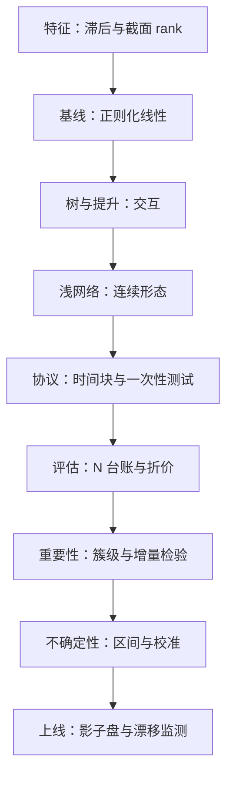

# 统计学习与市场收束

低信噪比的世界里，稀缺的不是模型，是数字的含义；这门课从头到尾只做了一件事——让每个数字自称的含义成立。

<footer>—— 据 Gu, Kelly and Xiu, *Review of Financial Studies*, 2020；López de Prado, *Advances in Financial Machine Learning*, Wiley, 2018 的口径整理</footer>

[上一课](/quant/slm-uncertainty)把点预测补成被检验的预测分布，纪律单元四课过完。本课程到此收束：本课把方法轴与纪律轴合成一张地图，标出各课的接缝、与其他课程的分工，以及带得走的那一条流程。

## 问题

八课下来每课都守一段边界，真正上手时问题从来是整链：数据、特征、模型、协议、评估、监测、不确定性、仓位。失败的方式恰恰是「只取一段」：拿第 4 课的网络、丢第 6 课的协议；拿第 2 课的 $\lambda$、丢第 5 课的台账；拿第 3 课的交互、用 gain 排序立项。每一段单独都对，连起来错——因为链的强度由最松的一格决定，而最松的一格几乎总是在纪律侧。

## 方法

一条主线按读序回链。特征按滞后与截面 rank 统一（[特征：滞后、截面 rank](/quant/cs-rank-features)）；模型按容量递增立基线——正则化线性先行（[正则化与市场数据](/quant/slm-regularization-market-data)），树与提升次之（[树模型与梯度提升](/quant/slm-trees-boosting)），浅网络最后（[神经网络的截面应用](/quant/slm-nn-cross-section)），每一档必须在协议内打败上一档才升级；协议把全部选择关进时间块（[样本外协议](/quant/slm-oos-protocol)、[嵌套交叉验证](/quant/nested-cv)）；评估报 $N$ 台账与折价（[过拟合次数与试错](/quant/backtest-overfitting)、[Probability of Backtest Overfitting](/quant/pbo)、[Deflated Sharpe](/quant/deflated-sharpe)）；重要性以簇为报告单位（[特征重要性的陷阱](/quant/slm-feature-importance-pitfalls)）；预测带分布与校准（[不确定性量化](/quant/slm-uncertainty)）；上线后由监测接管（[实盘漂移监测](/quant/live-drift-monitor)）。数据流水线与运维的对应账在金融 ML 工程组（[失败模式与收束](/quant/fml-map)），另类数据的入口账在另类数据工程组（[案例与收束](/quant/alt-case-map)）。

## 机制

统摄全课程的量是信噪比。它决定容量的上限——噪声方差压倒一切，所以基线从最简模型起步；它决定样本外 $R^2$ 的量级——千分位，所以评估必须用排序口径与组合口径；它决定区间的宽度——噪声底主导，所以不确定性量化从测噪声开始；它也决定重要性的分辨率——共线加低信噪比，所以归因只能到簇。协议之所以高于模型，是因为在这个信噪比下，「数字的含义」比「数字的大小」更稀缺：一个含义成立的千分位，胜过一万个含义不明的样本内拟合。

收束的口径：Gu-Kelly-Xiu（2020）贡献了「统一协议下的模型竞赛」——方法轴按它的模型谱系展开；López de Prado（2018）贡献了「协议先于模型」的工程化——纪律轴按它的审计要求展开。两份文献的分工，就是本课程两根轴的分工。

## 边界

本课程不覆盖的部分要指名：因果与结构解释在经济学栏；高频统计的估计量谱系与本栏高频统计课程相接；定价理论的检验与因子溢价的经济学在资产定价课程；数据存储、点时库与执行工程归金融 ML 工程与数据工程各课。方法会过时，纪律不会：模型族可以整格替换——把网络换成任何下一代学习器——七段流程里除了模型那一格，其余格子的义务一条都不变。读到这里，方法轴与纪律轴应当被当成一台机器的两个仓：少装任何一个，另一个都会空转。

## 小结

- 整链九格：特征、基线、树、网络、协议、评估、重要性、不确定性、监测；链强由最松一格决定。
- 信噪比统摄全课：定容量上限、定 $R^2$ 量级、定区间宽度、定归因分辨率。
- 协议高于模型：含义成立的千分位胜过含义不明的样本内拟合。
- 模型格可替换，纪律格的义务不随模型变；相邻课程的分工已逐格指名。
- 出处：Gu, Kelly and Xiu, *Empirical Asset Pricing via Machine Learning*, *RFS*, 2020；López de Prado, *Advances in Financial Machine Learning*, Wiley, 2018。
